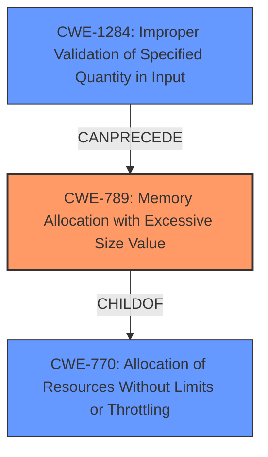

# Raw Analyzer Response for CVE-2022-35922

# Summary
| CWE ID  | CWE Name                                                                                                                                                                                                                                                                                                                                                                                                                      | Confidence | CWE Abstraction Level | CWE Vulnerability Mapping Label | CWE-Vulnerability Mapping Notes |
| :-------- | :---------------------------------------------------------------------------------------------------------------------------------------------------------------------------------------------------------------------------------------------------------------------------------------------------------------------------------------------------------------------------------------------------------------------- | :----------- | :----------------------- | :-------------------------------- | :-------------------------------- |
| CWE-789   | Memory Allocation with Excessive Size Value                                                                                                                                                                                                                                                                                                                                                                                    | 1          | Variant                 | Primary                             | Allowed                           |
| CWE-770   | Allocation of Resources Without Limits or Throttling                                                                                                                                                                                                                                                                                                                                                                          | 0.8          | Base                    | Secondary                           | Allowed                           |
| CWE-1284  | Improper Validation of Specified Quantity in Input                                                                                                                                                                                                                                                                                                                                                                              | 0.7          | Base                    | Secondary                           | Allowed                           |

## Evidence and Confidence

*   **Confidence Score:** 0.9
*   **Evidence Strength:** HIGH

## Relationship Analysis
The primary CWE is CWE-789 (Variant), which is a child of CWE-770 (Base). CWE-770 describes allocating resources without limits, which directly leads to CWE-789 when the resource is memory and the size value is excessive. CWE-1284 (Base) can precede CWE-789, since the excessive size value is received as input, but is not validated. The abstraction levels guided the selection, with CWE-789 being the most specific and relevant variant.

## Vulnerability Chain
The vulnerability chain starts with **untrusted input** specifying the size of a WebSocket dataframe. This **unvalidated size** leads to **unbounded memory allocation**, which causes an **out-of-memory (OOM) process abort**, resulting in a **denial of service (DoS)**.
  - **Root Cause:** Lack of input validation on dataframe size.
  - **Weakness 1:** **CWE-1284**: Improper Validation of Specified Quantity in Input
  - **Weakness 2:** **CWE-770**: Allocation of Resources Without Limits or Throttling
  - **Weakness 3:** **CWE-789**: Memory Allocation with Excessive Size Value
  - **Impact:** Denial of Service

## Summary of Analysis
The initial analysis correctly identifies **untrusted websocket connections can cause an out-of-memory (OOM) process abort**. The provided evidence strongly supports mapping this to CWE-789, Memory Allocation with Excessive Size Value, as the primary weakness. The "CVE Reference Links Content Summary" explicitly states that the library did not impose limits on the size of dataframes it would attempt to allocate, which aligns perfectly with the description of CWE-789.

The graph relationships influenced the selection by showing how CWE-789 is a specific type of CWE-770 (Allocation of Resources Without Limits or Throttling), providing more context. CWE-1284 Improper Validation of Specified Quantity in Input is included because the size of the dataframe comes from an untrusted source, but is not validated.

The selected CWEs are at the optimal level of specificity because CWE-789 is a Variant that accurately describes the vulnerability, while CWE-770 and CWE-1284 provide additional context about the root cause.

Relevant CWE Information:

# Enhanced Context (25 CWEs)

## CWE-1289: Improper Validation of Unsafe Equivalence in Input
**Abstraction Level**: Base
**Similarity Score**: 0.76
**Source**: dense

**Description**:
The product receives an input value that is used as a resource identifier or other type of reference, but it does not validate or incorrectly validates that the input is equivalent to a potentially-unsafe value.
**Rationale:** This is not the core issue. The issue is with the size of the input.

## CWE-617: Reachable Assertion
**Abstraction Level**: Base
**Similarity Score**: 0.76
**Source**: dense

**Description**:
The product contains an assert() or similar statement that can be triggered by an attacker, which leads to an application exit or other behavior that is more severe than necessary.
**Rationale:** This is not applicable because the process abort is due to the memory allocation failure, not an explicit assertion.

## CWE-404: Improper Resource Shutdown or Release
**Abstraction Level**: Class
**Similarity Score**: 0.74
**Source**: dense

**Description**:
The product does not release or incorrectly releases a resource before it is made available for re-use.
**Rationale:** This isn't the issue; the issue is allocating excessive resources.

## CWE-799: Improper Control of Interaction Frequency
**Abstraction Level**: Class
**Similarity Score**: 0.74
**Source**: dense

**Description**:
The product does not properly limit the number or frequency of interactions that it has with an actor, such as the number of incoming requests.
**Rationale:** The vulnerability is related to the size of a single interaction, not the frequency of interactions.

## CWE-664: Improper Control of a Resource Through its Lifetime
**Abstraction Level**: Pillar
**Similarity Score**: 0.74
**Source**: dense

**Description**:
The product does not maintain or incorrectly maintains control over a resource throughout its lifetime of creation, use, and release.
**Rationale:** Too high-level; more specific CWEs are available.

## CWE-226: Sensitive Information in Resource Not Removed Before Reuse
**Abstraction Level**: Base
**Similarity Score**: 0.74
**Source**: dense

**Description**:
The product releases a resource such as memory or a file so that it can be made available for reuse, but it does not clear or "zeroize" the information contained in the resource before the product performs a critical state transition or makes the resource available for reuse by other entities.
**Rationale:** This isn't the issue; the problem is allocating excessive memory.

## CWE-789: Memory Allocation with Excessive Size Value
**Abstraction Level**: Variant
**Similarity Score**: 0.73
**Source**: dense

**Description**:
The product allocates memory based on an untrusted, large size value, but it does not ensure that the size is within expected limits, allowing arbitrary amounts of memory to be allocated.

## CWE-703: Improper Check or Handling of Exceptional Conditions
**Abstraction Level**: Pillar
**Similarity Score**: 0.73
**Source**: dense

**Description**:
The product does not properly anticipate or handle exceptional conditions that rarely occur during normal operation of the product.
**Rationale:** This is too generic.

## CWE-668: Exposure of Resource to Wrong Sphere
**Abstraction Level**: Class
**Similarity Score**: 0.73
**Source**: dense

**Description**:
The product exposes a resource to the wrong control sphere, providing unintended actors with inappropriate access to the resource.
**Rationale:** This is not the core issue.

## CWE-691: Insufficient Control Flow Management
**Abstraction Level**: Pillar
**Similarity Score**: 0.73
**Source**: dense

**Description**:
The code does not sufficiently manage its control flow during execution, creating conditions in which the control flow can be modified in unexpected ways.
**Rationale:** Too high-level; more specific CWEs are available.

## CWE-1284: Improper Validation of Specified Quantity in Input
**Abstraction Level**: base
**Similarity Score**: 4.33
**Source**: graph

**Description**:
CWE-1284: Improper Validation of Specified Quantity in Input

**Mapping Guidance**:
- Usage: Allowed
- Rationale: This CWE entry is at the Base level of abstraction, which is a preferred level of abstraction for mapping to the root causes of vulnerabilities.

## CWE-476: NULL Pointer Dereference
**Abstraction Level**: base
**Similarity Score**: 4.33
**Source**: graph

**Description**:
CWE-476: NULL Pointer Dereference
**Rationale**: Not applicable because the process abort is due to the memory allocation failure, not a NULL pointer dereference.

## CWE-770: Allocation of Resources Without Limits or Throttling
**Abstraction Level**: base
**Similarity Score**: 4.33
**Source**: graph

**Description**:
CWE-770: Allocation of Resources Without Limits or Throttling

## CWE-190: