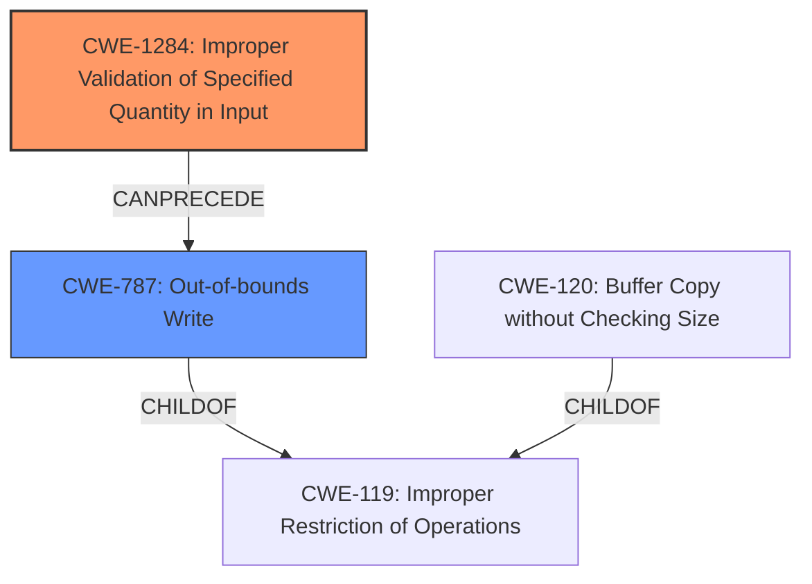

# Analysis for CVE-2022-35928

# Summary
| CWE ID | CWE Name | Confidence | CWE Abstraction Level | CWE Vulnerability Mapping Label | CWE-Vulnerability Mapping Notes |
|---|---|---|---|---|---|
| CWE-1284 | Improper Validation of Specified Quantity in Input | 0.9 | Base | Allowed | Primary CWE: The **root cause** is the **lack of password length validation** before reading it. |
| CWE-787 | Out-of-bounds Write | 0.8 | Base | Allowed | Secondary CWE: The **weakness** is a **buffer overrun**, which is a type of out-of-bounds write. |

## Evidence and Confidence

*   **Confidence Score:** 0.85
*   **Evidence Strength:** HIGH

## Relationship Analysis
The primary CWE, CWE-1284, is a base-level weakness describing the **improper validation of specified quantities in input**. It can lead to CWE-789 (Memory Allocation with Excessive Size Value), and the described vulnerability stems from a failure to validate the length of the password input. The secondary CWE, CWE-787, describes the resulting **out-of-bounds write** (or **buffer overflow**) that can occur due to the missing validation.

## Vulnerability Chain
The vulnerability chain starts with the **lack of input validation** (CWE-1284), which allows an overly long password to be read into a buffer without proper size checks, leading to a **buffer overflow (out-of-bounds write)** (CWE-787).

## Summary of Analysis
The analysis is based on explicit evidence from the vulnerability description, particularly the phrases "**Passwords lengths were not checked before being read**" and "**buffer overruns**". The retriever results also support this assessment, with CWE-1284 and CWE-119 (Improper Restriction of Operations within the Bounds of a Memory Buffer) being highly ranked.

The graph relationships were considered and influenced the final selection. CWE-1284 can precede CWE-787, which makes logical sense in the context of the vulnerability. The selected CWEs are at the optimal level of specificity because CWE-1284 accurately captures the root cause (missing input validation), while CWE-787 describes the direct consequence (buffer overflow).

I considered other CWEs, such as CWE-119 (Improper Restriction of Operations within the Bounds of a Memory Buffer), which is a more general class of weakness. However, CWE-1284 is more specific as it focuses on the **improper validation of specified quantities**, which is the root cause in this case, related to password length. CWE-119 is too general and discouraged because it could be misused.
CWE-327 (Use of a Broken or Risky Cryptographic Algorithm), CWE-319 (Cleartext Transmission of Sensitive Information), CWE-522 (Insufficiently Protected Credentials), and CWE-916 (Use of Password Hash With Insufficient Computational Effort) were not selected because they relate to cryptographic issues, which are not explicitly mentioned or implied in the provided vulnerability description.

Relevant CWE Information:

# Enhanced Context (25 CWEs)

## CWE-119: Improper Restriction of Operations within the Bounds of a Memory Buffer
**Abstraction:** Class
**Similarity Score**: 0.800
**Description**:
The product performs operations on a memory buffer, but it reads from or writes to a memory location outside the buffer's intended boundary. This may result in read or write operations on unexpected memory locations that could be linked to other variables, data structures, or internal program data.
**Mapping Guidance**:
- Usage: Discouraged

## CWE-1284: Improper Validation of Specified Quantity in Input
**Abstraction:** Base
**Similarity Score**: 0.816
**Description**:
The product receives input that is expected to specify a quantity (such as size or length), but it does not validate or incorrectly validates that the quantity has the required properties.
**Mapping Guidance**:
- Usage: Allowed

## CWE-327: Use of a Broken or Risky Cryptographic Algorithm
**Abstraction:** Class
**Similarity Score**: 0.660
**Description**:
The product uses a broken or risky cryptographic algorithm or protocol.
**Mapping Guidance**:
- Usage: Allowed-with-Review

## CWE-319: Cleartext Transmission of Sensitive Information
**Abstraction:** Base
**Similarity Score**: 0.659
**Description**:
The product transmits sensitive or security-critical data in cleartext in a communication channel that can be sniffed by unauthorized actors.
**Mapping Guidance**:
- Usage: Allowed

## CWE-522: Insufficiently Protected Credentials
**Abstraction:** Class
**Similarity Score**: 0.648
**Description**:
The product transmits or stores authentication credentials, but it uses an insecure method that is susceptible to unauthorized interception and/or retrieval.
**Mapping Guidance**:
- Usage: Allowed-with-Review

## CWE-916: Use of Password Hash With Insufficient Computational Effort
**Abstraction:** Base
**Similarity Score**: 0.505
**Description**:
The product generates a hash for a password, but it uses a scheme that does not provide a sufficient level of computational effort that would make password cracking attacks infeasible or expensive.
**Mapping Guidance**:
- Usage: Allowed

## CWE-823: Use of Out-of-range Pointer Offset
**Abstraction:** Base
**Similarity Score**: 0.002
**Description**:
The product performs pointer arithmetic on a valid pointer, but it uses an offset that can point outside of the intended range of valid memory locations for the resulting pointer.
**Mapping Guidance**:
- Usage: Allowed

## CWE-214: Invocation of Process Using Visible Sensitive Information
**Abstraction:** Base
**Similarity Score**: 0.645
**Description**:
A process is invoked with sensitive command-line arguments, environment variables, or other elements that can be seen by other processes on the operating system.
**Mapping Guidance**:
- Usage: Allowed

## CWE-532: Insertion of Sensitive Information into Log File
**Abstraction:** Base
**Similarity Score**: 0.644
**Description**:
The product writes sensitive information to a log file.
**Mapping Guidance**:
- Usage: Allowed

## CWE-863: Incorrect Authorization
**Abstraction:** Class
**Similarity Score**: 0.642
**Description**:
The product performs an authorization check when an actor attempts to access a resource or perform an action, but it does not correctly perform the check.
**Mapping Guidance**:
- Usage: Allowed-with-Review