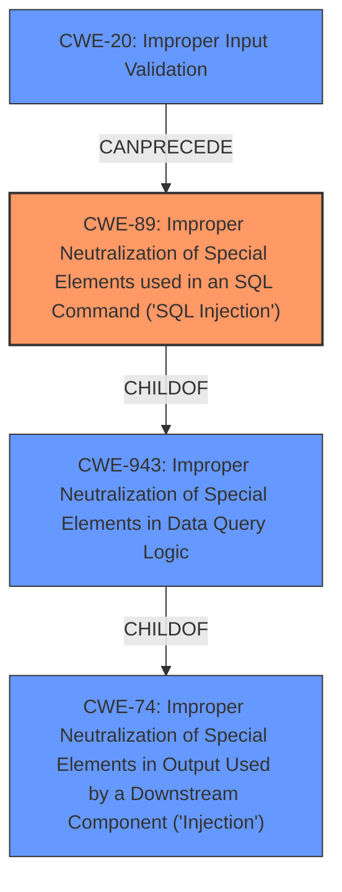

# Enhanced Analysis for CVE-2022-35942

# Summary
| CWE ID  | CWE Name                                                                       | Confidence | CWE Abstraction Level | CWE Vulnerability Mapping Label | CWE-Vulnerability Mapping Notes |
| :-------- | :----------------------------------------------------------------------------- | :--------- | :---------------------- | :------------------------------ | :------------------------------ |
| CWE-89  | Improper Neutralization of Special Elements used in an SQL Command ('**SQL Injection**') | 1.0        | Base                    | Allowed                       | Primary CWE                     |
| CWE-20  | Improper Input Validation                                                        | 0.7        | Class                    | Discouraged                     | Secondary Candidate             |

## Evidence and Confidence

*   **Confidence Score:** 0.85
*   **Evidence Strength:** HIGH

## Relationship Analysis
The primary relationship is that CWE-89 [Improper Neutralization of Special Elements used in an SQL Command ('**SQL Injection**')] is a specific type of **SQL injection** vulnerability that results from **improper input validation**. CWE-89 is a child of CWE-943 [Improper Neutralization of Special Elements in Data Query Logic], which is itself a child of CWE-74 [Improper Neutralization of Special Elements in Output Used by a Downstream Component ('Injection')]. CWE-20 [Improper Input Validation] can precede CWE-89, as the **improper input validation** is the root cause that leads to the SQL injection vulnerability. The Retriever Results and vulnerability description strongly support the selection of CWE-89 as the primary CWE due to the explicit mention of "**SQL injection**". While CWE-20 is related, it is a more general class of weakness.



## Vulnerability Chain
The vulnerability chain starts with **improper input validation** (CWE-20) on the `contains` LoopBack filter, which leads to the ability to inject arbitrary SQL commands (CWE-89). The impact is a potential breach of confidentiality and integrity of the database.
`Improper Input Validation` -> `SQL Injection` -> `Confidentiality and Integrity Breach`

## Summary of Analysis
The initial analysis identified **improper input validation** as the root cause leading to **SQL injection**. The evidence from the vulnerability description and CVE Reference Links Content Summary strongly supports this. The phrase "**Improper input validation on the `contains` LoopBack filter**" directly points to CWE-20, but the resulting "**SQL injection**" is more precisely captured by CWE-89.

The graph relationships confirm that CWE-89 is a more specific type of injection vulnerability, making it a better fit than the more general CWE-20. While CWE-20 is a contributing factor, CWE-89 directly addresses the **SQL injection** vulnerability.

The selection of CWE-89 is at the optimal level of specificity because it clearly defines the type of injection vulnerability. CWE-20 is too general and doesn't capture the specific nature of the **SQL injection**. The vulnerability description explicitly mentions "**SQL injection**", making CWE-89 the most appropriate choice.
I am confident in this mapping because the vulnerability description explicitly states the presence of "**SQL injection**" due to **improper input validation**, and the CWE specifications confirm that CWE-89 is the standard classification for this type of vulnerability.

Relevant CWE Information:

# Enhanced Context (25 CWEs)
The following CWEs were identified as potentially relevant to this vulnerability:

## CWE-1289: Improper Validation of Unsafe Equivalence in Input
**Abstraction Level**: Base
**Similarity Score**: 0.77

## CWE-807: Reliance on Untrusted Inputs in a Security Decision
**Abstraction Level**: Base
**Similarity Score**: 0.77

## CWE-74: Improper Neutralization of Special Elements in Output Used by a Downstream Component ('Injection')
**Abstraction Level**: Class
**Similarity Score**: 0.77

## CWE-184: Incomplete List of Disallowed Inputs
**Abstraction Level**: Base
**Similarity Score**: 0.77

## CWE-183: Permissive List of Allowed Inputs
**Abstraction Level**: Base
**Similarity Score**: 0.76

## CWE-138: Improper Neutralization of Special Elements
**Abstraction Level**: Class
**Similarity Score**: 0.76

## CWE-303: Incorrect Implementation of Authentication Algorithm
**Abstraction Level**: Base
**Similarity Score**: 0.75

## CWE-1390: Weak Authentication
**Abstraction Level**: Class
**Similarity Score**: 0.75

## CWE-639: Authorization Bypass Through User-Controlled Key
**Abstraction Level**: Base
**Similarity Score**: 0.75

## CWE-799: Improper Control of Interaction Frequency
**Abstraction Level**: Class
**Similarity Score**: 0.75

## CWE-116: Improper Encoding or Escaping of Output
**Abstraction Level**: Class
**Similarity Score**: 7097.94

## CWE-943: Improper Neutralization of Special Elements in Data Query Logic
**Abstraction Level**: Class
**Similarity Score**: 7017.93

## CWE-90: Improper Neutralization of Special Elements used in an LDAP Query ('LDAP Injection')
**Abstraction Level**: Base
**Similarity Score**: 6837.83

## CWE-1284: Improper Validation of Specified Quantity in Input
**Abstraction Level**: Base
**Similarity Score**: 6812.21

## CWE-190: Integer Overflow or Wraparound
**Abstraction Level**: Base
**Similarity Score**: 6771.31

## CWE-120: Buffer Copy without Checking Size of Input ('Classic Buffer Overflow')
**Abstraction Level**: base
**Similarity Score**: 4.33

## CWE-73: External Control of File Name or Path
**Abstraction Level**: base
**Similarity Score**: 4.33

## CWE-123: Write-what-where Condition
**Abstraction Level**: base
**Similarity Score**: 4.33

## CWE-770: Allocation of Resources Without Limits or Throttling
**Abstraction Level**: base
**Similarity Score**: 4.33

## CWE-22: Improper Limitation of a Pathname to a Restricted Directory ('Path Traversal')
**Abstraction Level**: base
**Similarity Score**: 4.33

## CWE-190: Integer Overflow or Wraparound
**Abstraction Level**: base
**Similarity Score**: 4.33

## CWE-131: Incorrect Calculation of Buffer Size
**Abstraction Level**: base
**Similarity Score**: 4.33

## CWE-471: Modification of Assumed-Immutable Data (MAID)
**Abstraction Level**: base
**Similarity Score**: 4.33

## CWE-1321: Improperly Controlled Modification of Object Prototype Attributes ('Prototype Pollution')
**Abstraction Level**: variant
**Similarity Score**: 3.88

## CWE-1284: Improper Validation of Specified Quantity in Input
**Abstraction Level**: base
**Similarity Score**: 3.42

CWEs Considered but Not Used:

*   CWE-94 [Improper Control of Generation of Code ('Code Injection')]: While **SQL injection** involves injecting code, the code is specifically SQL. CWE-89 is more precise.
*   CWE-90 [Improper Neutralization of Special Elements used in an LDAP Query ('LDAP Injection')]: This is specific to LDAP queries, not SQL.
*   CWE-923 [Improper Restriction of Communication Channel to Intended Endpoints]: This is related to communication channels, not **SQL injection**.
*   CWE-1321 [Improperly Controlled Modification of Object Prototype Attributes ('Prototype Pollution')]: This is related to Javascript prototype pollution, and not **SQL injection**.
*   CWE-790 [Improper Filtering of Special Elements]: While filtering might be a mitigation, the core issue is the lack of neutralization of special elements in SQL.
*   CWE-287 [Improper Authentication]: This is related to authentication, not **SQL injection**.


## CWE Relationship Analysis

Current CWEs represent these abstraction levels: .


### Vulnerability Chain Analysis

**Chain starting from CWE-89:**
- 89 (Improper Neutralization of Special Elements used in an SQL Command ('SQL Injection')) - ROOT


**Chain starting from CWE-807:**
- 807 (Reliance on Untrusted Inputs in a Security Decision) - ROOT


### CWE Relationship Diagram

```mermaid
graph TD
    classDef primary fill:#f96,stroke:#333,stroke-width:2px
    classDef secondary fill:#69f,stroke:#333
    classDef tertiary fill:#9e9,stroke:#333
```