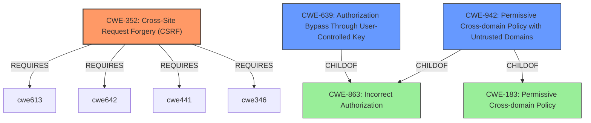

# Enhanced Analysis for CVE-2022-35943

# Summary
| CWE ID | CWE Name | Confidence | CWE Abstraction Level | CWE Vulnerability Mapping Label | CWE-Vulnerability Mapping Notes |
|---|---|---|---|---|---|
| CWE-352 | Cross-Site Request Forgery (CSRF) | 1.0 | Compound | Allowed | Primary CWE |
| CWE-942 | Permissive Cross-domain Policy with Untrusted Domains | 0.75 | Variant | Allowed | Secondary Candidate |
| CWE-639 | Authorization Bypass Through User-Controlled Key | 0.65 | Base | Allowed | Secondary Candidate |

## Evidence and Confidence

*   **Confidence Score:** 0.9
*   **Evidence Strength:** HIGH

## Relationship Analysis
The primary CWE is CWE-352 [Cross-Site Request Forgery (CSRF)]. The vulnerability description and CVE details explicitly mention the **bypass of CSRF protection**. CWE-352 is a compound CWE, indicating a combination of factors leading to the vulnerability. It requires CWE-346, CWE-441, CWE-642, and CWE-613. CWE-942 [Permissive Cross-domain Policy with Untrusted Domains] is a variant of CWE-863 and CWE-183 and can precede CWE-668. CWE-639 [Authorization Bypass Through User-Controlled Key] is a child of CWE-863.



## Vulnerability Chain
The vulnerability chain starts with an attacker controlling a subdomain, leading to a **bypass of CSRF protection** and potentially unauthorized actions.
  - **Root Cause**: Control over subdomain
  - **Weakness**: **Bypass of CSRF protection** (CWE-352)
  - **Potential Impact**: Unauthorized actions on behalf of the victim user

## Summary of Analysis
The initial analysis strongly pointed towards CWE-352 due to the explicit mention of CSRF **bypass** in the vulnerability description and CVE summary: "The vulnerability stems from the ability of SameSite attackers to **bypass CSRF protection**... The primary vulnerability is the inadequate CSRF protection in CodeIgniter Shield...". This is further supported by the high retriever score for CWE-352.

CWE-942 was considered because the attack involves cross-domain issues arising from subdomain control. However, it's more of a contributing factor rather than the primary weakness.

CWE-639 was considered since the attacker gains unauthorized access by exploiting the subdomain control, effectively bypassing authorization checks. However, it is not the most direct representation of the vulnerability.

The final decision is to assign CWE-352 as the primary CWE due to the direct evidence of **CSRF bypass**. The relationship analysis confirms that CWE-352 is a compound weakness, and the other CWEs are contributing factors. The selected CWE is at the appropriate level of specificity, representing the core vulnerability.

Relevant CWE Information:

# Enhanced Context (25 CWEs)

## CWE-807: Reliance on Untrusted Inputs in a Security Decision
**Abstraction Level**: Base
**Similarity Score**: 0.76
**Source**: dense

**Description**:
The product uses a protection mechanism that relies on the existence or values of an input, but the input can be modified by an untrusted actor in a way that bypasses the protection mechanism.
**Rationale**: This is a broad description, but not specific to CSRF.

## CWE-1289: Improper Validation of Unsafe Equivalence in Input
**Abstraction Level**: Base
**Similarity Score**: 0.75
**Source**: dense

**Description**:
The product receives an input value that is used as a resource identifier or other type of reference, but it does not validate or incorrectly validates that the input is equivalent to a potentially-unsafe value.
**Rationale**: Not the primary issue, but related to the subdomain control aspect.

## CWE-472: External Control of Assumed-Immutable Web Parameter
**Abstraction Level**: Base
**Similarity Score**: 0.75
**Source**: dense

**Description**:
The web application does not sufficiently verify inputs that are assumed to be immutable but are actually externally controllable, such as hidden form fields.
**Rationale**: Relates to the control over subdomains but not the core weakness.

## CWE-1390: Weak Authentication
**Abstraction Level**: Class
**Similarity Score**: 0.75
**Source**: dense

**Description**:
The product uses an authentication mechanism to restrict access to specific users or identities, but the mechanism does not sufficiently prove that the claimed identity is correct.
**Rationale**: Not directly relevant as CSRF is a separate issue from authentication.

## CWE-639: Authorization Bypass Through User-Controlled Key
**Abstraction Level**: Base
**Similarity Score**: 0.75
**Source**: dense

**Description**:
The system's authorization functionality does not prevent one user from gaining access to another user's data or record by modifying the key value identifying the data.
**Rationale**: The attacker's control over a subdomain enables them to bypass authorization, making this a secondary concern.

## CWE-603: Use of Client-Side Authentication
**Abstraction Level**: Base
**Similarity Score**: 0.74
**Source**: dense

**Description**:
A client/server product performs authentication within client code but not in server code, allowing server-side authentication to be bypassed via a modified client that omits the authentication check.
**Rationale**: Not applicable, the authentication process itself is not the primary target.

## CWE-303: Incorrect Implementation of Authentication Algorithm
**Abstraction Level**: Base
**Similarity Score**: 0.74
**Source**: dense

**Description**:
The requirements for the product dictate the use of an established authentication algorithm, but the implementation of the algorithm is incorrect.
**Rationale**: Authentication algorithm errors are not the primary cause.

## CWE-565: Reliance on Cookies without Validation and Integrity Checking
**Abstraction Level**: Base
**Similarity Score**: 0.74
**Source**: dense

**Description**:
The product relies on the existence or values of cookies when performing security-critical operations, but it does not properly ensure that the setting is valid for the associated user.
**Rationale**: Could be a contributing factor, but CSRF protection is the main issue.

## CWE-1391: Use of Weak Credentials
**Abstraction Level**: Class
**Similarity Score**: 0.74
**Source**: dense

**Description**:
The product uses weak credentials (such as a default key or hard-coded password) that can be calculated, derived, reused, or guessed by an attacker.
**Rationale**: Not directly related to the vulnerability.

## CWE-302: Authentication Bypass by Assumed-Immutable Data
**Abstraction Level**: Base
**Similarity Score**: 0.74
**Source**: dense

**Description**:
The authentication scheme or implementation uses key data elements that are assumed to be immutable, but can be controlled or modified by the attacker.
**Rationale**: Not the primary issue.

## CWE-79: Improper Neutralization of Input During Web Page Generation ('Cross-site Scripting')
**Abstraction Level**: Base
**Similarity Score**: 7787.58
**Source**: sparse

**Description**:
The product does not neutralize or incorrectly neutralizes user-controllable input before it is placed in output that is used as a web page that is served to other users.
**Rationale**: XSS can be a vector, but not the core weakness.

## CWE-942: Permissive Cross-domain Policy with Untrusted Domains
**Abstraction Level**: Variant
**Similarity Score**: 7417.19
**Source**: sparse

**Description**:
The product uses a cross-domain policy file that includes domains that should not be trusted.
**Rationale**: Relevant because the vulnerability exploits the fact that requests from subdomains are considered same-site


## CWE Relationship Analysis

Current CWEs represent these abstraction levels: .


### Vulnerability Chain Analysis

**Chain starting from CWE-942:**
- 942 (Permissive Cross-domain Policy with Untrusted Domains) - ROOT


**Chain starting from CWE-807:**
- 807 (Reliance on Untrusted Inputs in a Security Decision) - ROOT


### CWE Relationship Diagram

```mermaid
graph TD
    classDef primary fill:#f96,stroke:#333,stroke-width:2px
    classDef secondary fill:#69f,stroke:#333
    classDef tertiary fill:#9e9,stroke:#333
```