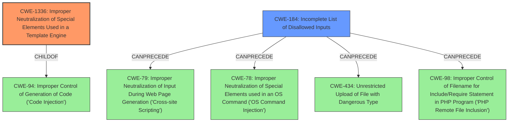

# Analysis for CVE-2022-35944

# Summary
| CWE ID | CWE Name | Confidence | CWE Abstraction Level | CWE Vulnerability Mapping Label | CWE-Vulnerability Mapping Notes |
|---|---|---|---|---|---|
| CWE-1336 | Improper Neutralization of Special Elements Used in a Template Engine | 0.9 | Base | Allowed | Primary CWE |
| CWE-184 | Incomplete List of Disallowed Inputs | 0.7 | Base | Allowed | Secondary Candidate |

## Evidence and Confidence

*   **Confidence Score:** 0.8
*   **Evidence Strength:** HIGH

## Relationship Analysis
The primary CWE is CWE-1336, which is a Base level CWE. It has a ChildOf relationship to CWE-94 (Improper Control of Generation of Code ('Code Injection')). CWE-184 (Incomplete List of Disallowed Inputs) is a secondary CWE with CanPrecede relationships to CWE-79, CWE-78, CWE-434, and CWE-98. This shows that an incomplete list of disallowed inputs can lead to various injection vulnerabilities. The choice of CWE-1336 is based on its direct relevance to template engine injection, while CWE-184 represents a broader weakness related to incomplete input validation.

## Vulnerability Chain
The vulnerability chain starts with a **Safe Mode restriction bypass**. This bypass allows an attacker to **introduce new PHP code** into a CMS template via a **specially crafted request**. This leads to **Unrestricted PHP Code Injection**, and finally **Remote Code Execution (RCE)**.

## Summary of Analysis
The initial assessment focused on identifying the root cause and the specific technology involved. The vulnerability description and CVE reference links clearly indicated a bypass of safe mode restrictions, leading to PHP code injection in CMS templates. This aligns perfectly with **CWE-1336 (Improper Neutralization of Special Elements Used in a Template Engine)**, which describes vulnerabilities where a product uses a template engine but fails to neutralize special elements, allowing attackers to inject arbitrary code. The evidence supporting this includes the "Vulnerability Description Key Phrases" highlighting a "**Safe Mode restriction bypass**" and the ability to "**introduce new PHP code**."

The graph relationships confirm that **CWE-1336** is a specific type of code injection (ChildOf CWE-94). The description of CWE-1336 explicitly mentions template engines like Twig, Jinja2, and PHP itself, making it a highly relevant match for the described vulnerability in October CMS.

I also considered **CWE-184 (Incomplete List of Disallowed Inputs)** because the safe mode bypass suggests that the list of disallowed inputs or operations was incomplete, allowing the attacker to circumvent the restriction. The CVE Reference Links Content Summary mentions the **"Safe Mode Bypass:"** as a weakness. While relevant, this is a secondary aspect compared to the direct template injection.

Other CWEs considered but not chosen:

*   **CWE-79 (Improper Neutralization of Input During Web Page Generation ('Cross-site Scripting'))**: While code injection can lead to XSS-like outcomes, the root cause here is the template engine's failure to neutralize special elements, not specifically the generation of a web page with un-neutralized input.
*   **CWE-94 (Improper Control of Generation of Code ('Code Injection'))**: This is a parent of CWE-1336. I chose CWE-1336 because it is more specific.

The selected CWEs are at the optimal level of specificity because they directly address the root cause (template injection) and a contributing factor (incomplete input validation). The evidence provided strongly supports these classifications, giving a high degree of confidence in the assessment.