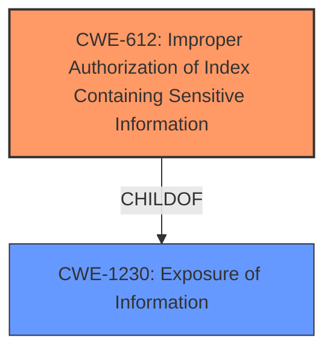

# Enhanced Analysis for CVE-2022-35980

# Summary
| CWE ID  | CWE Name                                                        | Confidence | CWE Abstraction Level | CWE Vulnerability Mapping Label | CWE-Vulnerability Mapping Notes |
| :------- | :-------------------------------------------------------------- | :--------- | :-------------------- | :------------------------------ | :------------------------------ |
| CWE-612 | Improper Authorization of Index Containing Sensitive Information | 1.0        | Base                  | Primary CWE                     | Allowed                       |

## Evidence and Confidence

*   **Confidence Score:** 1.0
*   **Evidence Strength:** HIGH

## Relationship Analysis
The primary relationship that influenced the decision was the ChildOf relationship of CWE-612 to CWE-1230 (Exposure of Information). This indicates that CWE-612 is a specific type of information exposure related to authorization issues with search indices. There were no relevant chain relationships for this vulnerability. The base abstraction level of CWE-612 was preferred for its specificity.



## Vulnerability Chain
The chain of root cause and weakness for this vulnerability starts with the **misconfiguration** leading to **improper authorization**, which results in **information disclosure.**

## Summary of Analysis
The initial assessment strongly supports CWE-612 (Improper Authorization of Index Containing Sensitive Information) as the primary CWE for this vulnerability. This assessment is primarily based on the vulnerability description and the CVE Reference Links Content Summary, which both highlight the **improper authorization** of access to data within OpenSearch due to the failure to apply security filters on aliased indexes.

The key evidence includes:

*   The **Vulnerability Description** states that requests to an OpenSearch cluster configured with advanced access control features will not be filtered when the query's search pattern matches an aliased index, leading to unauthorized access to sensitive information.
*   The **CVE Reference Links Content Summary** emphasizes the **improper authorization** of access to data due to the failure to apply security filters on aliased indexes. It also notes the vulnerability allows bypassing of DLS, FLS, and field masking.

The retriever results further support this selection, with CWE-612 having the highest similarity score. The mapping guidance for CWE-612 explicitly allows its use because it is at the Base level of abstraction.

Other CWEs considered but not used:

*   CWE-863 (Incorrect Authorization): While related, CWE-863 is a class-level CWE and less specific than CWE-612. The vulnerability is specifically related to the authorization of search indices, making CWE-612 a more precise fit.
*   CWE-200 (Exposure of Sensitive Information to an Unauthorized Actor): CWE-200 is a high-level class that describes the impact of the vulnerability (information disclosure) rather than the root cause (**improper authorization**). The mapping guidance discourages using CWE-200 when more specific CWEs are available.
* CWE-285 (Improper Authorization): This is a class-level CWE and too general. The problem is more specifically related to search indices.

Therefore, CWE-612 is the optimal level of specificity, accurately capturing the root cause of the vulnerability.

Relevant CWE Information:

# Enhanced Context (25 CWEs)

## CWE-612: Improper Authorization of Index Containing Sensitive Information
**Abstraction Level**: Base
**Similarity Score**: 0.74
**Source**: dense

**Description**:
The product creates a search index of private or sensitive documents, but it does not properly limit index access to actors who are authorized to see the original information.

**Mapping Guidance**:
- Usage: Allowed
- Rationale: This CWE entry is at the Base level of abstraction, which is a preferred level of abstraction for mapping to the root causes of vulnerabilities.


## CWE Relationship Analysis

Current CWEs represent these abstraction levels: .


### Vulnerability Chain Analysis

**Chain starting from CWE-200:**
- 200 (Exposure of Sensitive Information to an Unauthorized Actor) - ROOT


**Chain starting from CWE-1230:**
- 1230 (Exposure of Sensitive Information Through Metadata) - ROOT


### CWE Relationship Diagram

```mermaid
graph TD
    classDef primary fill:#f96,stroke:#333,stroke-width:2px
    classDef secondary fill:#69f,stroke:#333
    classDef tertiary fill:#9e9,stroke:#333
```