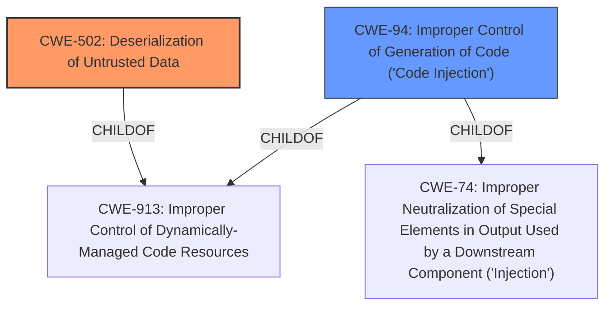

# Raw Analyzer Response for CVE-2022-36006

# Summary
| CWE ID  | CWE Name                                                                                                      | Confidence | CWE Abstraction Level | CWE Vulnerability Mapping Label | CWE-Vulnerability Mapping Notes |
| ------- | ------------------------------------------------------------------------------------------------------------- | ---------- | ----------------------- | ------------------------------- | ------------------------------- |
| CWE-502 | Deserialization of Untrusted Data                                                                             | 1.0        | Base                    | Primary                         | Allowed                         |
| CWE-94  | Improper Control of Generation of Code ('Code Injection')                                                     | 0.7        | Base                    | Secondary                       | Allowed-with-Review             |

## Evidence and Confidence

*   **Confidence Score:** 0.85
*   **Evidence Strength:** HIGH

## Relationship Analysis
The primary weakness is CWE-502, Deserialization of Untrusted Data, which is a Base level CWE. CWE-502 is related to CWE-913 (Improper Control of Dynamically-Managed Code Resources) as a ChildOf. CWE-94, Improper Control of Generation of Code ('Code Injection'), is also a child of CWE-74 and CWE-913. There isn't a direct relationship between CWE-502 and CWE-94, but they share a common parent. The abstraction levels influenced my decision to prefer CWE-502 at the Base level over Class level CWEs like CWE-138 or CWE-116.

## Vulnerability Chain
The vulnerability chain starts with the application's use of an unsafe method for parsing JSON payloads, leading to insecure deserialization (CWE-502). This allows an attacker to inject code, resulting in remote code execution.
  - **Root Cause:** Insecure deserialization of JSON payloads (CWE-502)
  - **Weakness:** Improper control of code generation (CWE-94)
  - **Impact:** Remote Code Execution

## Summary of Analysis
The initial assessment identified **remote code execution** resulting from specially crafted JSON payloads as the primary issue. The CVE Reference Links Content Summary confirmed the **root cause** was **insecure deserialization** within the Ruby on Rails based Arvados Workbench application, specifically an unsafe method for parsing JSON payloads. This aligns directly with CWE-502 (Deserialization of Untrusted Data). The use of `Oj.safe_load` or `Oj.strict_load` as a fix further supports this classification.

The retriever results listed CWE-502 as the top candidate, which reinforces this selection. Other CWEs considered, such as CWE-94 (Improper Control of Generation of Code), CWE-74 (Improper Neutralization of Special Elements in Output Used by a Downstream Component ('Injection')), and CWE-78 (Improper Neutralization of Special Elements used in an OS Command ('OS Command Injection')), were deemed less specific because the vulnerability's **root cause** is the **deserialization of untrusted data**, not directly code injection or command injection, even though those could be impacts.

The evidence provided explicitly states: "The vulnerability stems from insecure deserialization within the Ruby on Rails based Arvados Workbench application ("Workbench 1"). The application was using an unsafe method for parsing JSON payloads, leading to the possibility of remote code execution."

CWE-502 is at the optimal level of specificity (Base) as it directly addresses the **root cause**.

Relevant CWE Information:

# Enhanced Context (25 CWEs)

## CWE-74: Improper Neutralization of Special Elements in Output Used by a Downstream Component ('Injection')
**Abstraction Level**: Class
**Similarity Score**: 0.77
**Source**: dense

**Description**:
The product constructs all or part of a command, data structure, or record using externally-influenced input from an upstream component, but it does not neutralize or incorrectly neutralizes special elements that could modify how it is parsed or interpreted when it is sent to a downstream component.

**Mapping Guidance**:
- Usage: Discouraged
- Rationale: CWE-74 is high-level and often misused when lower-level weaknesses are more appropriate.

## CWE-917: Improper Neutralization of Special Elements used in an Expression Language Statement ('Expression Language Injection')
**Abstraction Level**: Base
**Similarity Score**: 0.76
**Source**: dense

**Description**:
The product constructs all or part of an expression language (EL) statement in a framework such as a Java Server Page (JSP) using externally-influenced input from an upstream component, but it does not neutralize or incorrectly neutralizes special elements that could modify the intended EL statement before it is executed.

**Mapping Guidance**:
- Usage: Allowed
- Rationale: This CWE entry is at the Base level of abstraction, which is a preferred level of abstraction for mapping to the root causes of vulnerabilities.

## CWE-184: Incomplete List of Disallowed Inputs
**Abstraction Level**: Base
**Similarity Score**: 0.76
**Source**: dense

**Description**:
The product implements a protection mechanism that relies on a list of inputs (or properties of inputs) that are not allowed by policy or otherwise require other action to neutralize before additional processing takes place, but the list is incomplete.

**Mapping Guidance**:
- Usage: Allowed
- Rationale: This CWE entry is at the Base level of abstraction, which is a preferred level of abstraction for mapping to the root causes of vulnerabilities.

## CWE-1289: Improper Validation of Unsafe Equivalence in Input
**Abstraction Level**: Base
**Similarity Score**: 0.76
**Source**: dense

**Description**:
The product receives an input value that is used as a resource identifier or other type of reference, but it does not validate or incorrectly validates that the input is equivalent to a potentially-unsafe value.

**Mapping Guidance**:
- Usage: Allowed
- Rationale: This CWE entry is at the Base level of abstraction, which is a preferred level of abstraction for mapping to the root causes of vulnerabilities.

## CWE-502: Deserialization of Untrusted Data
**Abstraction Level**: Base
**Similarity Score**: 0.76
**Source**: dense

**Description**:
The product deserializes untrusted data without sufficiently ensuring that the resulting data will be valid.

**Mapping Guidance**:
- Usage: Allowed
- Rationale: This CWE entry is at the Base level of abstraction, which is a preferred level of abstraction for mapping to the root causes of vulnerabilities.

## CWE-138: Improper Neutralization of Special Elements
**Abstraction Level**: Class
**Similarity Score**: 0.75
**Source**: dense

**Description**:
The product receives input from an upstream component, but it does not neutralize or incorrectly neutralizes special elements that could be interpreted as control elements or syntactic markers when they are sent to a downstream component.

**Mapping Guidance**:
- Usage: Discouraged
- Rationale: This CWE entry is a level-1 Class (i.e., a child of a Pillar). It might have lower-level children that would be more appropriate

## CWE-116: Improper Encoding or Escaping of Output
**Abstraction Level**: Class
**Similarity Score**: 0.74
**Source**: dense

**Description**:
The product prepares a structured message for communication with another component, but encoding or escaping of the data is either missing or done incorrectly. As a result, the intended structure of the message is not preserved.

**Mapping Guidance**:
- Usage: Allowed-with-Review
- Rationale: This CWE entry is a Class and might have Base-level children that would be more appropriate

## CWE-80: Improper Neutralization of Script-Related HTML Tags in a Web Page (Basic XSS)
**Abstraction Level**: Variant
**Similarity Score**: 0.74
**Source**: dense

**Description**:
The product receives input from an upstream component, but it does not neutralize or incorrectly neutralizes special characters such as "<", ">", and "&" that could be interpreted as web-scripting elements when they are sent to a downstream component that processes web pages.

**Mapping Guidance**:
- Usage: Allowed
- Rationale: This CWE entry is at the Variant level of abstraction, which is a preferred level of abstraction for mapping to the root causes of vulnerabilities.

## CWE-807: Reliance on Untrusted Inputs in a Security Decision
**Abstraction Level**: Base
**Similarity Score**: 0.74
**Source**: dense

**Description**:
The product uses a protection