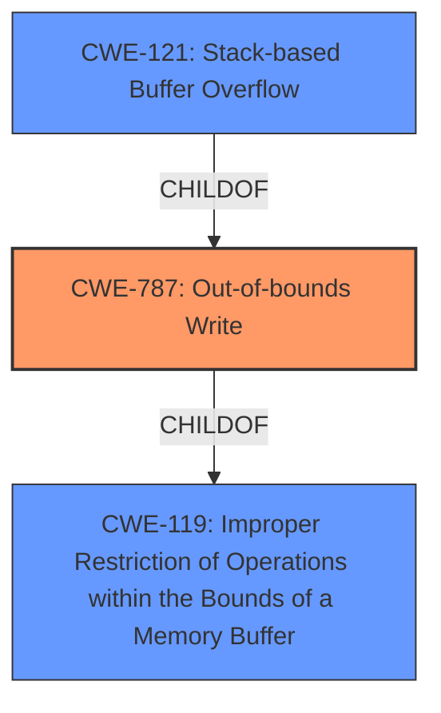

# Analysis for CVE-2022-3602

# Summary
| CWE ID | CWE Name | Confidence | CWE Abstraction Level | CWE Vulnerability Mapping Label | CWE-Vulnerability Mapping Notes |
|---|---|---|---|---|---|
| CWE-787 | Out-of-bounds Write | 0.9 | Base | Allowed | Primary CWE |
| CWE-121 | Stack-based Buffer Overflow | 0.8 | Variant | Allowed | Secondary Candidate |
| CWE-119 | Improper Restriction of Operations within the Bounds of a Memory Buffer | 0.6 | Class | Discouraged | Secondary Candidate |

## Evidence and Confidence

*   **Confidence Score:** 0.9
*   **Evidence Strength:** HIGH

## Relationship Analysis
The primary weakness is CWE-787 **Out-of-bounds Write** which is a base CWE. CWE-121 **Stack-based Buffer Overflow** is a variant of CWE-787, indicating a more specific location of the overflow. CWE-119 **Improper Restriction of Operations within the Bounds of a Memory Buffer** is a class-level CWE and a parent of both CWE-787 and CWE-121, representing a broader category of memory safety issues. The relationships show a hierarchy, with CWE-119 being the most general, CWE-787 being more specific, and CWE-121 being the most specific.

## Vulnerability Chain
The chain of events includes: **improper input validation** of the email address in the X.509 certificate, leading to a **buffer overflow**, specifically an **out-of-bounds write** on the stack. The impact is a crash (denial of service) or potential remote code execution.

## Summary of Analysis
The initial assessment identified a **buffer overflow** vulnerability. Based on the retriever results and the vulnerability description, the most accurate CWE is CWE-787 **Out-of-bounds Write**. The vulnerability involves writing past the end of a buffer, which aligns directly with the definition of CWE-787. While CWE-119 **Improper Restriction of Operations within the Bounds of a Memory Buffer** is a broader category, CWE-787 provides more specific detail. The description also mentions that the overflow occurs on the stack, making CWE-121 **Stack-based Buffer Overflow** a relevant, more specific variant.

The selection is primarily based on the following evidence:
*   Vulnerability Description Key Phrases: "**weakness:** **buffer overflow**"
*   CVE Reference Links Content Summary: "Both CVE-2022-3602 and CVE-2022-3786 are caused by buffer overflow vulnerabilities in OpenSSL's processing of email addresses within X.509 certificates, specifically during name constraint checking." "CVE-2022-3602: A 4-byte buffer overflow on the stack occurs when parsing a crafted email address in an X.509 certificate."
*   "An attacker can craft a malicious email address to overflow four attacker-controlled bytes on the stack."

CWE-787 is selected as the primary CWE because it accurately describes the **out-of-bounds write** condition. CWE-121 is considered because the overflow occurs on the stack, which is a more specific detail. However, the root cause is the **out-of-bounds write** itself, making CWE-787 the more appropriate primary classification. CWE-119 is a class-level CWE that is too general.

Relevant CWE Information:

# Enhanced Context (25 CWEs)
The following CWEs were identified as potentially relevant to this vulnerability:

## CWE-131: Incorrect Calculation of Buffer Size
**Abstraction Level**: Base
**Similarity Score**: 0.75
**Source**: dense

**Description**:
The product does not correctly calculate the size to be used when allocating a buffer, which could lead to a buffer overflow.

**Mapping Guidance**:
- Usage: Allowed
- Rationale: This CWE entry is at the Base level of abstraction, which is a preferred level of abstraction for mapping to the root causes of vulnerabilities.

*   **Why it was not chosen:** While an incorrect calculation of buffer size could lead to a buffer overflow, the provided description does not indicate that this was the cause. The root cause appears to be a lack of input validation.

## CWE-1289: Improper Validation of Unsafe Equivalence in Input
**Abstraction Level**: Base
**Similarity Score**: 0.74
**Source**: dense

**Description**:
The product receives an input value that is used as a resource identifier or other type of reference, but it does not validate or incorrectly validates that the input is equivalent to a potentially-unsafe value.

**Mapping Guidance**:
- Usage: Allowed
- Rationale: This CWE entry is at the Base level of abstraction, which is a preferred level of abstraction for mapping to the root causes of vulnerabilities.

*   **Why it was not chosen:** This is less specific than the **improper input validation** leading to a buffer overflow.

## CWE-345: Insufficient Verification of Data Authenticity
**Abstraction Level**: Class
**Similarity Score**: 0.74
**Source**: dense

**Description**:
The product does not sufficiently verify the origin or authenticity of data, in a way that causes it to accept invalid data.

**Mapping Guidance**:
- Usage: Discouraged
- Rationale: This CWE entry is a level-1 Class (i.e., a child of a Pillar). It might have lower-level children that would be more appropriate

*   **Why it was not chosen:** This is too general.

## CWE-191: Integer Underflow (Wrap or Wraparound)
**Abstraction Level**: Base
**Similarity Score**: 0.73
**Source**: dense

**Description**:
The product subtracts one value from another, such that the result is less than the minimum allowable integer value, which produces a value that is not equal to the correct result.

**Mapping Guidance**:
- Usage: Allowed
- Rationale: This CWE entry is at the Base level of abstraction, which is a preferred level of abstraction for mapping to the root causes of vulnerabilities.

*   **Why it was not chosen:** This is not related to the vulnerability.

## CWE-125: Out-of-bounds Read
**Abstraction Level**: Base
**Similarity Score**: 0.73
**Source**: dense

**Description**:
The product reads data past the end, or before the beginning, of the intended buffer.

**Mapping Guidance**:
- Usage: Allowed
- Rationale: This CWE entry is at the Base level of abstraction, which is a preferred level of abstraction for mapping to the root causes of vulnerabilities.

*   **Why it was not chosen:** The vulnerability is an **out-of-bounds write**, not an **out-of-bounds read**.

## CWE-703: Improper Check or Handling of Exceptional Conditions
**Abstraction Level**: Pillar
**Similarity Score**: 0.73
**Source**: dense

**Description**:
The product does not properly anticipate or handle exceptional conditions that rarely occur during normal operation of the product.

**Mapping Guidance**:
- Usage: Discouraged
- Rationale: This CWE entry is extremely high-level, a Pillar.

*   **Why it was not chosen:** This is too general.

## CWE-295: Improper Certificate Validation
**Abstraction Level**: Base
**Similarity Score**: 0.73
**Source**: dense

**Description**:
The product does not validate, or incorrectly validates, a certificate.

**Mapping Guidance**:
- Usage: Allowed
- Rationale: This CWE entry is at the Base level of abstraction, which is a preferred level of abstraction for mapping to the root causes of vulnerabilities.

*   **Why it was not chosen:** The **improper certificate validation** is present, but this is a prerequisite for the actual vulnerability, which is an **out-of-bounds write**.

## CWE-129: Improper Validation of Array Index
**Abstraction Level**: Variant
**Similarity Score**: 0.73
**Source**: dense

**Description**:
The product uses untrusted input when calculating or using an array index, but the product does not validate or incorrectly validates the index to ensure the index references a valid position within the array.

**Mapping Guidance**:
- Usage: Allowed
- Rationale: This CWE entry is at the Variant level of abstraction, which is a preferred level of abstraction for mapping to the root causes of vulnerabilities.

*   **Why it was not chosen:** While