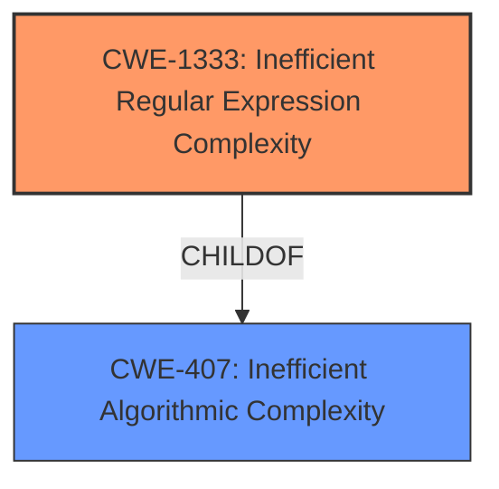

# Analysis Report for CVE-2022-36034

# Vulnerability Analysis Report: CVE-2022-36034

## Description


## Analysis (with Relationship Data)

# Summary
| CWE ID | CWE Name | Confidence | CWE Abstraction Level | CWE Vulnerability Mapping Label | CWE-Vulnerability Mapping Notes |
|---|---|---|---|---|---|
| CWE-1333 | Inefficient Regular Expression Complexity | 1.0 | Base | Allowed | Primary CWE |

## Evidence and Confidence

*   **Confidence Score:** 1.0
*   **Evidence Strength:** HIGH

## Relationship Analysis
The primary CWE identified is CWE-1333 (Inefficient Regular Expression Complexity), which is a Base level CWE. It is related to CWE-407 (Inefficient Algorithmic Complexity) as a child. This relationship suggests that the inefficient regular expression is a specific type of inefficient algorithm.



## Vulnerability Chain
The vulnerability chain starts with the use of an inefficient regular expression (CWE-1333). This inefficiency leads to excessive CPU consumption, resulting in a denial-of-service condition.

## Summary of Analysis
The analysis is based on the provided evidence, particularly the "**rootcause:** **regular expression denial of service**" phrase in the vulnerability description key phrases and the retriever results.

CWE-1333 (Inefficient Regular Expression Complexity) is the most appropriate because the vulnerability description explicitly mentions "Possible ReDoS" which stands for Regular expression Denial of Service. The description of CWE-1333 mentions ReDoS as an alternative term. The retriever results also show that CWE-1333 has a score of 1.0.

The other CWEs were considered but deemed less relevant. For example, CWE-1336 (Improper Neutralization of Special Elements Used in a Template Engine) was considered, but the description doesn't talk about template engines.

CWE-1333 is at the optimal level of specificity (Base) because it directly addresses the root cause of the vulnerability: the inefficient regular expression.

Relevant CWE Information:

# Enhanced Context (25 CWEs)

## CWE-1333: Inefficient Regular Expression Complexity
**Abstraction:** Base
**Similarity Score**: 1.000
**Source**: alternate_terms

**Description**:
The product uses a regular expression with an inefficient, possibly exponential worst-case computational complexity that consumes excessive CPU cycles.

**Mapping Guidance**:
- Usage: Allowed
- Rationale: This CWE entry is at the Base level of abstraction, which is a preferred level of abstraction for mapping to the root causes of vulnerabilities.


## CWE Relationship Analysis

Current CWEs represent these abstraction levels: .


### Vulnerability Chain Analysis

**Chain starting from CWE-1333:**
- 1333 (Inefficient Regular Expression Complexity) - ROOT


**Chain starting from CWE-407:**
- 407 (Inefficient Algorithmic Complexity) - ROOT


### CWE Relationship Diagram

```mermaid
graph TD
    classDef primary fill:#f96,stroke:#333,stroke-width:2px
    classDef secondary fill:#69f,stroke:#333
    classDef tertiary fill:#9e9,stroke:#333
```


*Report generated on 2025-03-30 22:39:31*
