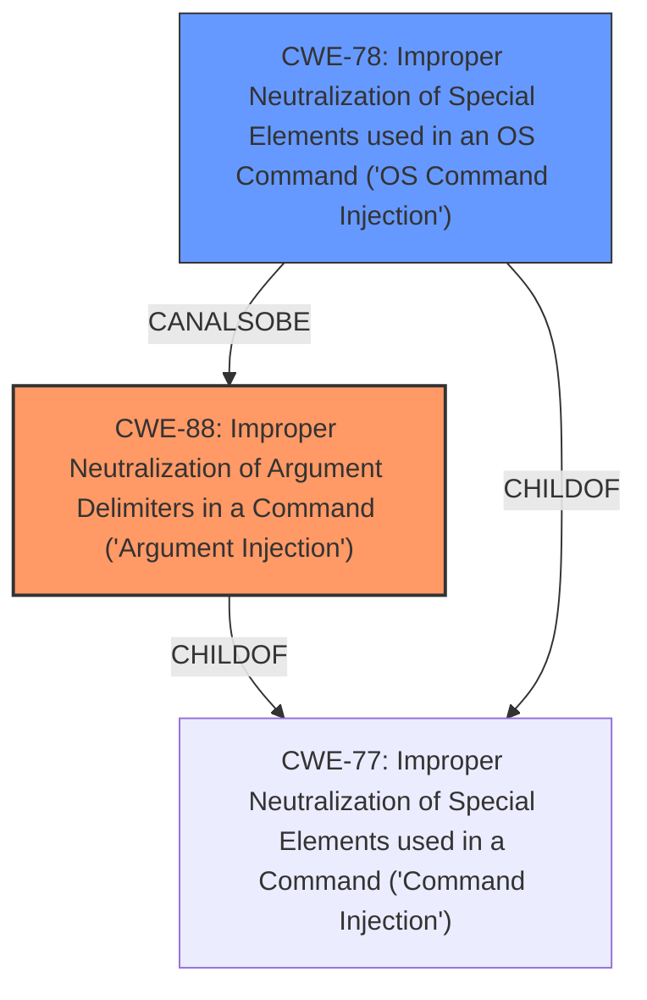

# Analysis for CVE-2022-36069

# Summary
| CWE ID | CWE Name | Confidence | CWE Abstraction Level | CWE Vulnerability Mapping Label | CWE-Vulnerability Mapping Notes |
|---|---|---|---|---|---|
| CWE-88 | Improper Neutralization of Argument Delimiters in a Command ('Argument Injection') | 1.0 | Base | Allowed | Primary CWE |
| CWE-78 | Improper Neutralization of Special Elements used in an OS Command ('OS Command Injection') | 0.7 | Base | Allowed | Secondary Candidate |

## Evidence and Confidence

*   **Confidence Score:** 0.85
*   **Evidence Strength:** HIGH

## Relationship Analysis
The primary relationship influencing the CWE selection is the hierarchical structure, specifically the parent-child relationship. CWE-88 is a more specific type of command injection, focusing on argument delimiters. While CWE-78 is a broader category, the details of this vulnerability align more closely with CWE-88. CWE-78 and CWE-88 have a peer relationship (CanAlsoBe). CWE-88 is a ChildOf CWE-77.

## Vulnerability Chain
The vulnerability chain starts with **improper input validation**, leading to argument injection, which results in arbitrary code execution.
  - Root Cause: **Improper Input Validation** allows an attacker to inject a leading dash into the repository URL.
  - Weakness: **CWE-88: Improper Neutralization of Argument Delimiters in a Command ('Argument Injection')**: The injected dash is treated as an argument delimiter.
  - Impact: Code Execution: The injected argument is used to execute arbitrary commands.

## Summary of Analysis
The initial assessment, supported by both the vulnerability description and the CVE Reference Links Content Summary, points towards a command injection vulnerability. However, the specific mechanism – the injection of argument delimiters – makes **CWE-88** a more precise fit than the general **CWE-78**. The evidence clearly indicates that the vulnerability arises from the **improper** handling of user-supplied input that is then used to construct a command. The attacker can insert a leading dash (`-`) into the repository URL, which is then interpreted as an optional argument.

The vulnerability description states, "When building the commands, Poetry correctly avoids Command Injection vulnerabilities by passing an array of arguments instead of a command string. However, there is the possibility that a user input starts with a dash (`-`) and is therefore treated as an optional argument instead of a positional one."

The CVE Reference Links Content Summary supports this, stating, "The primary weakness is the ability to inject arbitrary arguments into the `git clone` command. By starting the repository URL with a dash, an attacker can turn the URL into an option, such as `--upload-pack=payload.sh`."

The retriever results also support this, with CWE-88 having a high score.

**CWE-88** is at the Base level of abstraction, which is preferred. It accurately represents the weakness because the core issue is the **improper** handling of argument delimiters in a command string.

**CWE-78**, while related, is more general and applies to cases where special elements used in an OS command are not properly neutralized. While the end result is code execution, the specific injection point is at the argument level, making **CWE-88** a better fit.

The other CWEs were considered but deemed less relevant. For example, CWE-427 (Uncontrolled Search Path Element) is not applicable because the vulnerability does not involve an uncontrolled search path.

Based on the evidence, relationship analysis, and mapping guidance, **CWE-88** is the most appropriate classification for this vulnerability, with **CWE-78** as a secondary candidate.

Relevant CWE Information:

# Enhanced Context (25 CWEs)
The following CWEs were identified as potentially relevant to this vulnerability:

## CWE-184: Incomplete List of Disallowed Inputs
**Abstraction Level**: Base
**Similarity Score**: 0.78
**Source**: dense

**Description**:
The product implements a protection mechanism that relies on a list of inputs (or properties of inputs) that are not allowed by policy or otherwise require other action to neutralize before additional processing takes place, but the list is incomplete.

**Mapping Guidance**:
- Usage: Allowed
- Rationale: This CWE entry is at the Base level of abstraction, which is a preferred level of abstraction for mapping to the root causes of vulnerabilities.

## CWE-88: Improper Neutralization of Argument Delimiters in a Command ('Argument Injection')
**Abstraction Level**: Base
**Similarity Score**: 0.77
**Source**: dense

**Description**:
The product constructs a string for a command to be executed by a separate component
in another control sphere, but it does not properly delimit the
intended arguments, options, or switches within that command string.

**Mapping Guidance**:
- Usage: Allowed
- Rationale: This CWE entry is at the Base level of abstraction, which is a preferred level of abstraction for mapping to the root causes of vulnerabilities.

## CWE-74: Improper Neutralization of Special Elements in Output Used by a Downstream Component ('Injection')
**Abstraction Level**: Class
**Similarity Score**: 0.77
**Source**: dense

**Description**:
The product constructs all or part of a command, data structure, or record using externally-influenced input from an upstream component, but it does not neutralize or incorrectly neutralizes special elements that could modify how it is parsed or interpreted when it is sent to a downstream component.

**Mapping Guidance**:
- Usage: Discouraged
- Rationale: CWE-74 is high-level and often misused when lower-level weaknesses are more appropriate.

## CWE-138: Improper Neutralization of Special Elements
**Abstraction Level**: Class
**Similarity Score**: 0.76
**Source**: dense

**Description**:
The product receives input from an upstream component, but it does not neutralize or incorrectly neutralizes special elements that could be interpreted as control elements or syntactic markers when they are sent to a downstream component.

**Mapping Guidance**:
- Usage: Discouraged
- Rationale: This CWE entry is a level-1 Class (i.e., a child of a Pillar). It might have lower-level children that would be more appropriate

## CWE-1289: Improper Validation of Unsafe Equivalence in Input
**Abstraction Level**: Base
**Similarity Score**: 0.76
**Source**: dense

**Description**:
The product receives an input value that is used as a resource identifier or other type of reference, but it does not validate or incorrectly validates that the input is equivalent to a potentially-unsafe value.

**Mapping Guidance**:
- Usage: Allowed
- Rationale: This CWE entry is at the Base level of abstraction, which is a preferred level of abstraction for mapping to the root causes of vulnerabilities.

## CWE-116: Improper Encoding or Escaping of Output
**Abstraction Level**: Class
**Similarity Score**: 0.76
**Source**: dense

**Description**:
The product prepares a structured message for communication with another component, but encoding or escaping of the data is either missing or done incorrectly. As a result, the intended structure of the message is not preserved.

**Mapping Guidance**:
- Usage: Allowed-with-Review
- Rationale: This CWE entry is a Class and might have Base-level children that would be more appropriate

## CWE-59: Improper Link Resolution Before File Access ('Link Following')
**Abstraction Level**: Base
**Similarity Score**: 0.76
**Source**: dense

**Description**:
The product attempts to access a file based on the filename, but it does not properly prevent that filename from identifying a link or shortcut that resolves to an unintended resource.

**Mapping Guidance**:
- Usage: Allowed
- Rationale: This CWE entry is at the Base level of abstraction, which is a preferred level of abstraction for mapping to the root causes of vulnerabilities.

## CWE-41: Improper Resolution of Path Equivalence
**Abstraction Level**: Base
**Similarity Score**: 0.75
**Source**: dense

**Description**:
The product is vulnerable to file system contents disclosure through path equivalence. Path equivalence involves the use of special characters in file and directory names. The associated manipulations are intended to generate multiple names for the same object.

**Mapping Guidance**:
- Usage: Allowed
- Rationale: This CWE entry is at the Base level of abstraction, which is a preferred level of abstraction for mapping to the root causes of vulnerabilities.

## CWE-73: