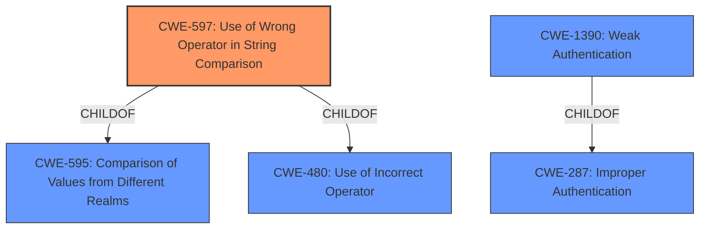

# Raw Analyzer Response for CVE-2022-36072

# Summary
| CWE ID | CWE Name | Confidence | CWE Abstraction Level | CWE Vulnerability Mapping Label | CWE-Vulnerability Mapping Notes |
|---|---|---|---|---|---|
| CWE-597 | Use of Wrong Operator in String Comparison | 0.9 | Variant | Allowed | Primary CWE |
| CWE-1390 | Weak Authentication | 0.7 | Class | Allowed-with-Review | Secondary Candidate |

## Evidence and Confidence

*   **Confidence Score:** 0.8
*   **Evidence Strength:** HIGH

## Relationship Analysis
The primary CWE, CWE-597, is a Variant of CWE-595 (Comparison of Values from Different Realms) and CWE-480 (Use of Incorrect Operator). CWE-1390 (Weak Authentication) is a Class that is a ChildOf CWE-287 (Improper Authentication). The selection of CWE-597 over CWE-1390 is based on the more specific nature of the **incorrect string comparison** (**unobvious feature of PHP**) using the wrong operator, which directly leads to the authentication bypass. CWE-1390 is a broader category that encompasses various authentication weaknesses, and while relevant, CWE-597 more precisely captures the root cause.

## Vulnerability Chain
The vulnerability chain starts with an **unobvious feature of PHP** related to type coercion and loose comparison (`==`). This leads to **incorrect string comparison** using the wrong operator (CWE-597), resulting in authentication bypass and potential user impersonation.
- **Root Cause:** PHP's loose comparison (`==`) with type juggling of strings starting with `0e`.
- **Weakness:** CWE-597: Use of Wrong Operator in String Comparison.
- **Impact:** Authentication bypass.

## Summary of Analysis
The initial assessment focused on identifying the root cause of the vulnerability, which is PHP's handling of string comparisons. The vulnerability description clearly states that "due to an **unobvious feature of PHP**, hashes generated by built-in functions and starting with the `0e` symbols were being handled as zero multiplied with the `e` number." The CVE Reference Links Content Summary further elaborates that "PHP's implicit type coercion during loose comparison allows a string to be treated as a number" and that "the use of `==` instead of `===` for comparisons, where it should compare type and value."

The Retriever Results identified CWE-597 (Use of Wrong Operator in String Comparison) as the top candidate with a high score. The description of CWE-597, "The product uses the wrong operator when comparing a string, such as using "==" when the .equals() method should be used instead," aligns perfectly with the vulnerability description. The use of `==` instead of `===` in PHP is a direct instance of using the wrong operator for string comparison.

CWE-1390 (Weak Authentication) was also considered, but it is a more general classification. While the vulnerability leads to weak authentication, the root cause is the **incorrect string comparison**, making CWE-597 a more precise fit.

Therefore, the final decision is to assign CWE-597 as the primary CWE, as it directly represents the root cause of the vulnerability. The evidence strongly supports this classification, and the relationships between CWEs further solidify the selection.

Relevant CWE Information:
- **Vulnerability Description Key Phrases:** **unobvious feature of PHP**.
- **CVE Reference Links Content Summary:** "PHP's implicit type coercion during loose comparison allows a string to be treated as a number" and "the use of `==` instead of `===` for comparisons".
- **Retriever Results:** CWE-597 has the highest score and its description aligns with the vulnerability.