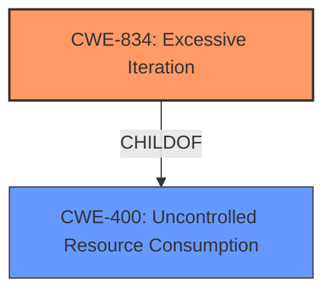

# Raw Analyzer Response for CVE-2022-36083

# Summary
| CWE ID | CWE Name | Confidence | CWE Abstraction Level | CWE Vulnerability Mapping Label | CWE-Vulnerability Mapping Notes |
|---|---|---|---|---|---|
| CWE-834 | Excessive Iteration | 0.9 | Class | Allowed | The product performs an iteration or loop without sufficiently limiting the number of times that the loop is executed. |
| CWE-400 | Uncontrolled Resource Consumption | 0.6 | Class | Allowed | Resource exhaustion due to attacker controlled inputs. |

## Evidence and Confidence

*   **Confidence Score:** 0.75
*   **Evidence Strength:** HIGH

## Relationship Analysis
The primary CWE is CWE-834, which is a Class-level CWE. The relationship analysis shows that CWE-834 (Excessive Iteration) can stem from **insufficient** limits. CWE-834's parent is CWE-691 (Insufficient Control Flow Management). CWE-400 is a Class-level CWE which is a parent of CWE-834.

## Vulnerability Chain
The chain of events is as follows:
1.  **Improper Input Validation** (implicit): The application fails to adequately validate the `p2c` parameter provided in the JWE header.
2.  **Excessive Iteration** (CWE-834): The application performs an excessive number of iterations based on the attacker-controlled `p2c` parameter.
3.  **Uncontrolled Resource Consumption** (CWE-400): The excessive iterations lead to uncontrolled consumption of CPU resources.
4.  **Denial of Service**: The excessive CPU consumption leads to a denial-of-service condition.

## Summary of Analysis
The initial analysis focused on identifying the root cause of the vulnerability and its subsequent impacts. The core issue is the **improper handling of the `p2c` parameter**, which allows an attacker to specify an extremely high iteration count for the PBKDF2 key derivation function.

The evidence from the vulnerability description includes:

*   "The purpose of this parameter is to intentionally slow down the key derivation function in order to make password brute-force and dictionary attacks more expensive."
*   "This makes the PBES2 algorithms unsuitable for situations where the JWE is coming from an untrusted source an adversary can intentionally pick an extremely high PBES2 Count value, that will initiate a CPU-bound computation that may take an unreasonable amount of time to finish."
*   "Under certain conditions, it is possible to have the users environment consume unreasonable amount of CPU time."

The **Retriever Results** identified CWE-834 (Excessive Iteration) as the top candidate, which aligns well with the vulnerability description. The excessive iteration directly leads to the consumption of unreasonable amounts of CPU time.

CWE-400 (Uncontrolled Resource Consumption) was considered as a potential primary CWE, but it is a broader category. While the vulnerability does result in uncontrolled resource consumption, the root cause is the excessive iteration count. Therefore, CWE-834 is a more precise classification.

The decision to classify this vulnerability as CWE-834 is based on the following:

*   The vulnerability description explicitly mentions that an attacker can cause the system to perform an unreasonable amount of computation by providing an extremely high PBES2 Count value.
*   The **Retriever Results** identifies CWE-834 as the best match.
*   CWE-834 is at the Class level of abstraction, providing a good balance between specificity and generality.

Relevant CWE Information:

# Enhanced Context (25 CWEs)
The following CWEs were identified as potentially relevant to this vulnerability:

## CWE-1240: Use of a Cryptographic Primitive with a Risky Implementation
**Abstraction Level**: Base
**Similarity Score**: 0.76
**Source**: dense

**Description**:
To fulfill the need for a cryptographic primitive, the product implements a cryptographic algorithm using a non-standard, unproven, or disallowed/non-compliant cryptographic implementation.

**Mapping Guidance**:
- Usage: Allowed
- Rationale: This CWE entry is at the Base level of abstraction, which is a preferred level of abstraction for mapping to the root causes of vulnerabilities.

## CWE-203: Observable Discrepancy
**Abstraction Level**: Base
**Similarity Score**: 0.76
**Source**: dense

**Description**:
The product behaves differently or sends different responses under different circumstances in a way that is observable to an unauthorized actor, which exposes security-relevant information about the state of the product, such as whether a particular operation was successful or not.

**Mapping Guidance**:
- Usage: Allowed
- Rationale: This CWE entry is at the Base level of abstraction, which is a preferred level of abstraction for mapping to the root causes of vulnerabilities.

## CWE-538: Insertion of Sensitive Information into Externally-Accessible File or Directory
**Abstraction Level**: Base
**Similarity Score**: 0.76
**Source**: dense

**Description**:
The product places sensitive information into files or directories that are accessible to actors who are allowed to have access to the files, but not to the sensitive information.

**Mapping Guidance**:
- Usage: Allowed
- Rationale: This CWE entry is at the Base level of abstraction, which is a preferred level of abstraction for mapping to the root causes of vulnerabilities.

## CWE-226: Sensitive Information in Resource Not Removed Before Reuse
**Abstraction Level**: Base
**Similarity Score**: 0.75
**Source**: dense

**Description**:
The product releases a resource such as memory or a file so that it can be made available for reuse, but it does not clear or "zeroize" the information contained in the resource before the product performs a critical state transition or makes the resource available for reuse by other entities.

**Mapping Guidance**:
- Usage: Allowed
- Rationale: This CWE entry is at the Base level of abstraction, which is a preferred level of abstraction for mapping to the root causes of vulnerabilities.

## CWE-312: Cleartext Storage of Sensitive Information
**Abstraction Level**: Base
**Similarity Score**: 0.75
**Source**: dense

**Description**:
The product stores sensitive information in cleartext within a resource that might be accessible to another control sphere.

**Mapping Guidance**:
- Usage: Allowed
- Rationale: This CWE entry is at the Base level of abstraction, which is a preferred level of abstraction for mapping to the root causes of vulnerabilities.

## CWE-345: Insufficient Verification of Data Authenticity
**Abstraction Level**: Class
**Similarity Score**: 0.75
**Source**: dense

**Description**:
The product does not sufficiently verify the origin or authenticity of data, in a way that causes it to accept invalid data.

**Mapping Guidance**:
- Usage: Discouraged
- Rationale: This CWE entry is a level-1 Class (i.e., a child of a Pillar). It might have lower-level children that would be more appropriate

## CWE-319: Cleartext Transmission of Sensitive Information
**Abstraction Level**: Base
**Similarity Score**: 0.75
**Source**: dense

**Description**:
The product transmits sensitive or security-critical data in cleartext in a communication channel that can be sniffed by unauthorized actors.

**Mapping Guidance**:
- Usage: Allowed
- Rationale: This CWE entry is at the Base level of abstraction, which is a preferred level of abstraction for mapping to the root causes of vulnerabilities.

## CWE-807: Reliance on Untrusted Inputs in a Security Decision
**Abstraction Level**: Base
**Similarity Score**: 0.74
**Source**: dense

**Description**:
The product uses a protection mechanism that relies on the existence or values of an input, but the input can be modified by an untrusted actor in a way that bypasses the protection mechanism.

**Mapping Guidance**:
- Usage: Allowed
- Rationale: This CWE entry is at the Base level of abstraction, which is a preferred level of abstraction for mapping to the root causes of vulnerabilities.

## CWE-212: Improper Removal of Sensitive Information Before Storage or Transfer
**Abstraction Level**: Base
**Similarity Score**: 0.74
**Source**: dense

**Description**:
The product stores, transfers, or shares a resource that contains sensitive information, but it does not properly remove that information before the product makes the resource available to unauthorized actors.

**Mapping Guidance**:
- Usage: Allowed
- Rationale: This CWE entry is at the Base level of abstraction, which is a preferred level of abstraction for mapping to the root causes of vulnerabilities.

## CWE-330: Use of Insufficiently Random Values
**Abstraction Level**: Class
**Similarity Score**: 0.74
**Source**: dense

**Description**:
The product uses insufficiently random numbers or values in a security context that depends