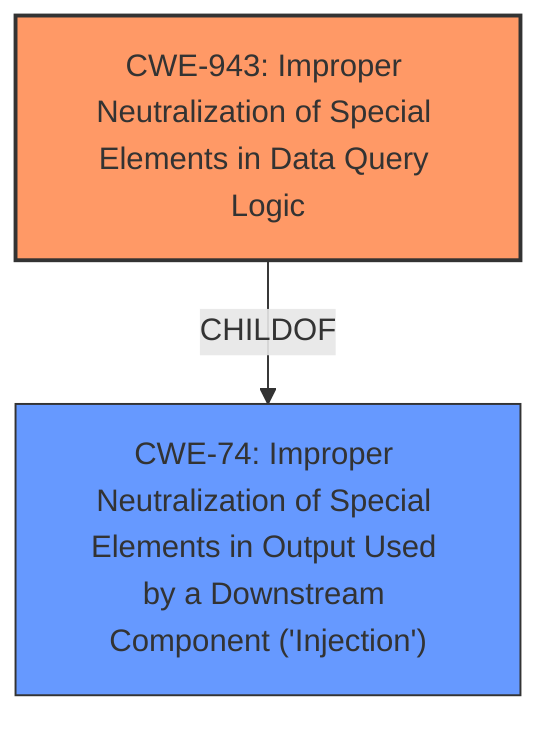

# Analysis Report for CVE-2022-36084

# Vulnerability Analysis Report: CVE-2022-36084

## Description


## Analysis (with Relationship Data)

# Summary
| CWE ID | CWE Name | Confidence | CWE Abstraction Level | CWE Vulnerability Mapping Label | CWE-Vulnerability Mapping Notes |
|---|---|---|---|---|---|
| CWE-943 | Improper Neutralization of Special Elements in Data Query Logic | 1.0 | Class | Primary | Allowed-with-Review |
| CWE-74 | Improper Neutralization of Special Elements in Output Used by a Downstream Component ('Injection') | 0.75 | Class | Secondary | Discouraged |

## Evidence and Confidence

*   **Confidence Score:** 1.0
*   **Evidence Strength:** HIGH

## Relationship Analysis
The primary CWE, CWE-943, is a child of CWE-74. This indicates that the vulnerability is a specific type of injection related to data query logic. The abstraction levels are consistent, with CWE-943 being a Class and CWE-74 being a Class as well. The relationship helps to refine the classification from a general injection to a more specific data query injection.



## Vulnerability Chain
The vulnerability chain starts with **improper input sanitization** which leads to **arbitrary AQL injection**, ultimately allowing an attacker to execute arbitrary AQL queries.

## Summary of Analysis
The initial analysis correctly identified the **weakness** as **arbitrary AQL injection** due to **improper input sanitization**, which aligns with CWE-943. The description explicitly states that users can inject arbitrary AQL queries, which are then executed by ArangoDB. This directly matches the CWE-943 description: "The product generates a query intended to access or manipulate data in a data store such as a database, but it does not neutralize or incorrectly neutralizes special elements that can modify the intended logic of the query."

The vulnerability description key phrases highlight "**improper input sanitization**" and "**arbitrary AQL injection**" as the root cause and weakness respectively. The CVE Reference Links Content Summary confirms this, stating "The vulnerability stems from the lack of proper sanitization of user-provided input when generating ArangoDB AQL queries in the cruddl library."

The selection of CWE-943 is at the optimal level of specificity because it directly addresses the data query injection aspect of the vulnerability, rather than a more general injection weakness.

Relevant CWE Information:

# Enhanced Context (25 CWEs)
The following CWEs were identified as potentially relevant to this vulnerability:

## CWE-74: Improper Neutralization of Special Elements in Output Used by a Downstream Component ('Injection')
**Abstraction Level**: Class
**Similarity Score**: 0.76
**Source**: dense

**Description**:
The product constructs all or part of a command, data structure, or record using externally-influenced input from an upstream component, but it does not neutralize or incorrectly neutralizes special elements that could modify how it is parsed or interpreted when it is sent to a downstream component.

**Mapping Guidance**:
- Usage: Discouraged
- Rationale: CWE-74 is high-level and often misused when lower-level weaknesses are more appropriate.

## CWE-943: Improper Neutralization of Special Elements in Data Query Logic
**Abstraction Level**: Class
**Similarity Score**: 0.73
**Source**: dense

**Description**:
The product generates a query intended to access or manipulate data in a data store such as a database, but it does not neutralize or incorrectly neutralizes special elements that can modify the intended logic of the query.

**Mapping Guidance**:
- Usage: Allowed-with-Review
- Rationale: This CWE entry is a Class and might have Base-level children that would be more appropriate

## CWE-94: Improper Control of Generation of Code ('Code Injection')
**Abstraction Level**: Base
**Similarity Score**: 4.33
**Source**: graph

**Description**:
CWE-94: Improper Control of Generation of Code ('Code Injection')

**Mapping Guidance**:
- Usage: Allowed-with-Review
- Rationale: This entry is frequently misused for vulnerabilities with a technical impact of "code execution," which does not by itself indicate a root cause weakness, since dozens of weaknesses can enable code execution.

**Relationships**:
- CANFOLLOW -> CWE-98
- PARENTOF -> CWE-96
- PARENTOF -> CWE-95
- PARENTOF -> CWE-1336
- CHILDOF -> CWE-913

## CWE-1336: Improper Neutralization of Special Elements Used in a Template Engine
**Abstraction Level**: Base
**Similarity Score**: 3.64
**Source**: graph

**Description**:
CWE-1336: Improper Neutralization of Special Elements Used in a Template Engine

**Mapping Guidance**:
- Usage: Allowed
- Rationale: This CWE entry is at the Base level of abstraction, which is a preferred level of abstraction for mapping to the root causes of vulnerabilities.

**Relationships**:
- CHILDOF -> CWE-94
- PARENTOF -> CWE-1336
- PEEROF -> CWE-1336

## CWE Details
### CWE-943: Improper Neutralization of Special Elements in Data Query Logic
The product generates a query intended to access or manipulate data in a data store such as a database, but it does not neutralize or incorrectly neutralizes special elements that can modify the intended logic of the query.
*   **How the vulnerability's details match the CWE's characteristics:** The vulnerability allows attackers to inject arbitrary AQL queries, directly manipulating the database query logic.
*   **The security implications and potential impact:** Attackers can gain unauthorized access to sensitive data, modify or delete data, or disrupt the availability of the database.
*   **Any parent-child relationships or chain patterns that influenced your mapping:** CWE-943 is a child of CWE-74, indicating it's a specific type of injection.
*   **Whether the weakness is primary or secondary in the vulnerability:** This is the primary weakness.
*   **How the official MITRE mapping guidance influenced your decision:** The mapping guidance suggests examining children of CWE-74 to find a better fit, which led to the selection of CWE-943.

### CWE-74: Improper Neutralization of Special Elements in Output Used by a Downstream Component ('Injection')
The product constructs all or part of a command, data structure, or record using externally-influenced input from an upstream component, but it does not neutralize or incorrectly neutralizes special elements that could modify how it is parsed or interpreted when it is sent to a downstream component.
*   **How the vulnerability's details match the CWE's characteristics:** The vulnerability involves injecting code into a downstream component (ArangoDB) through **improper input sanitization**.
*   **The security implications and potential impact:** Code injection can lead to arbitrary code execution, data breaches, or denial of service.
*   **Any parent-child relationships or chain patterns that influenced your mapping:** CWE-74 is a parent of CWE-943, representing a broader category of injection vulnerabilities.
*   **Whether the weakness is primary or secondary in the vulnerability:** This is a secondary weakness, as CWE-943 provides a more specific classification.
*   **How the official MITRE mapping guidance influenced your decision:** The mapping guidance discourages using CWE-74 directly when lower-level weaknesses are more appropriate, which led to prioritizing CWE-943.

### Considered But Not Used
*   **CWE-94: Improper Control of Generation of Code ('Code Injection')**: While the vulnerability does involve code injection, it's specifically within the context of a data query, making CWE-943 a better fit.
*   **CWE-1336: Improper Neutralization of Special Elements Used in a Template Engine**: This CWE is relevant to template injection. While there might be templates involved in generating the AQL query, the core issue is the lack of sanitization in the generated query itself, not the template.
*   **CWE-863: Incorrect Authorization**: The vulnerability isn't directly related to authorization mechanisms, but more about **improper input sanitization** that allows attackers to inject malicious code.
*   **CWE-79: Improper Neutralization of Input During Web Page Generation ('Cross-site Scripting')**: This CWE relates to Cross-Site Scripting vulnerabilities, which are not the focus of this vulnerability.
*   **CWE-425: Direct Request ('Forced Browsing')**: The vulnerability doesn't involve bypassing authorization checks to directly access resources.
*   **CWE-285: Improper Authorization**: Similar to CWE-863, the core issue isn't an authorization flaw, but an injection vulnerability.
*   **CWE-202: Exposure of Sensitive Information Through Data Queries**: While the injection could lead to information exposure, the primary weakness is


## CWE Relationship Analysis

Current CWEs represent these abstraction levels: .


### Vulnerability Chain Analysis

**Chain starting from CWE-79:**
- 79 (Improper Neutralization of Input During Web Page Generation ('Cross-site Scripting')) - ROOT


**Chain starting from CWE-425:**
- 425 (Direct Request ('Forced Browsing')) - ROOT


### CWE Relationship Diagram

```mermaid
graph TD
    classDef primary fill:#f96,stroke:#333,stroke-width:2px
    classDef secondary fill:#69f,stroke:#333
    classDef tertiary fill:#9e9,stroke:#333
```


*Report generated on 2025-03-31 13:07:28*
