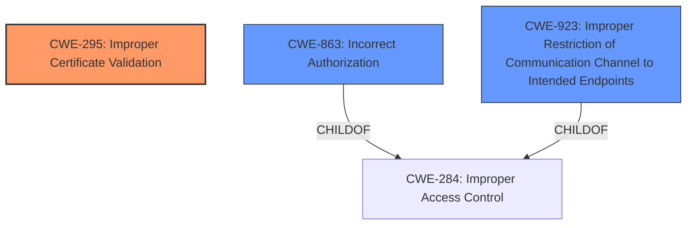

# Analysis for CVE-2022-36103

# Summary
| CWE ID | CWE Name | Confidence | CWE Abstraction Level | CWE Vulnerability Mapping Label | CWE-Vulnerability Mapping Notes |
|---|---|---|---|---|---|
| CWE-295 | Improper Certificate Validation | 0.9 | Base | Primary | Allowed |
| CWE-863 | Incorrect Authorization | 0.7 | Class | Secondary | Allowed-with-Review |
| CWE-923 | Improper Restriction of Communication Channel to Intended Endpoints | 0.6 | Class | Secondary | Allowed-with-Review |

## Evidence and Confidence

*   **Confidence Score:** 0.8
*   **Evidence Strength:** HIGH

## Relationship Analysis
The primary CWE is CWE-295 because the **improper validation of the request** directly leads to the **issuance of a Talos API certificate which allows full access to the Talos API**. CWE-295 has a PeerOf relationship with CWE-322 (Key Exchange without Entity Authentication), which wasn't directly applicable, but highlights the authentication context. CWE-863 (Incorrect Authorization) and CWE-923 (Improper Restriction of Communication Channel to Intended Endpoints) are secondary because they are higher-level classifications that describe the consequence of the **improper certificate validation**, where a compromised worker node can gain unauthorized access to resources on the control plane. These Class-level CWEs are less specific than the Base-level CWE-295.

## Vulnerability Chain
The vulnerability chain starts with the **improper validation of CSRs** (CWE-295) by the Talos control plane. This allows a worker node to request and receive a privileged certificate. With this certificate, the worker node gains **incorrect authorization** (CWE-863) and can **improperly communicate with unintended endpoints** (CWE-923), ultimately leading to the exposure of sensitive information and potential full cluster compromise. There is an environmental configuration prerequisite where a Kubernetes workload must be able to access the worker node's join token.

## Summary of Analysis
The assessment is heavily based on the provided evidence, specifically the Vulnerability Description Key Phrases and the CVE Reference Links Content Summary. The key phrase "**improper validation of the request**" directly points to a certificate validation issue, making CWE-295 the most appropriate primary CWE.

The CVE Reference Links Content Summary explicitly states: "The Talos control plane node's `trustd` API...lacked proper validation of the certificate signing requests (CSRs)." This confirms the root cause.

The graph relationships influenced the decision by highlighting the connection between certificate validation (CWE-295) and access control issues (CWE-863, CWE-923). However, since the root cause is the **improper certificate validation**, CWE-295 is the most specific and accurate choice.

CWE-295 is at the optimal level of specificity (Base) because it directly addresses the **lack of validation** in the certificate handling process. The related CWEs are at a higher level of abstraction and represent the consequences of the primary weakness.

Relevant CWE Information:

# Enhanced Context (25 CWEs)
The following CWEs were identified as potentially relevant to this vulnerability:

## CWE-295: Improper Certificate Validation
**Abstraction Level**: Base
**Similarity Score**: 0.79
**Source**: dense

**Description**:
The product does not validate, or incorrectly validates, a certificate.

**Mapping Guidance**:
- Usage: Allowed
- Rationale: This CWE entry is at the Base level of abstraction, which is a preferred level of abstraction for mapping to the root causes of vulnerabilities.

## CWE-863: Incorrect Authorization
**Abstraction Level**: Class

### Description
The product performs an authorization check when an actor attempts to access a resource or perform an action, but it does not correctly perform the check.

### Mapping Guidance
**Usage:** Allowed-with-Review
**Rationale:** This CWE entry is a Class and might have Base-level children that would be more appropriate

## CWE-923: Improper Restriction of Communication Channel to Intended Endpoints
**Abstraction Level**: Class

### Description
The product establishes a communication channel to (or from) an endpoint for privileged or protected operations, but it does not properly ensure that it is communicating with the correct endpoint.

### Mapping Guidance
**Usage:** Allowed-with-Review
**Rationale:** This CWE entry is a Class and might have Base-level children that would be more appropriate

## CWE-532: Insertion of Sensitive Information into Log File
**Abstraction Level**: Base

### Description
The product writes sensitive information to a log file.

### Mapping Guidance
**Usage:** Allowed

This CWE was considered but not selected as the sensitive information exposure is a consequence of the **improper certificate validation** and subsequent unauthorized access, rather than direct logging of sensitive data.

## CWE-306: Missing Authentication for Critical Function
**Abstraction Level**: Base

### Description
The product does not perform any authentication for functionality that requires a provable user identity or consumes a significant amount of resources.

### Mapping Guidance
**Usage:** Allowed

This CWE was considered but not selected as the **improper validation** of the CSR, not a complete absence of authentication, is the root cause.

## CWE-668: Exposure of Resource to Wrong Sphere
**Abstraction Level**: Class

### Description
The product exposes a resource to the wrong control sphere, providing unintended actors with inappropriate access to the resource.

### Mapping Guidance
**Usage:** Discouraged

This CWE was considered but not selected as it is too high-level and less descriptive than the **improper certificate validation** that leads to the exposure.

## CWE-277: Insecure Inherited Permissions
**Abstraction Level**: Variant

### Description
A product defines a set of insecure permissions that are inherited by objects that are created by the program.

### Mapping Guidance
**Usage:** Allowed

This CWE was considered but not selected as the vulnerability does not involve **insecure inherited permissions**.

## CWE-322: Key Exchange without Entity Authentication
**Abstraction Level**: Base

### Description
The product performs a key exchange with an actor without verifying the identity of that actor.

### Mapping Guidance
**Usage:** Allowed

This CWE was considered, as there is a certificate involved in the request. The vulnerability involves **improper validation of a certificate** rather than a key exchange without authentication.

## CWE-201: Insertion of Sensitive Information Into Sent Data
**Abstraction Level**: Base

### Description
The code transmits data to another actor, but a portion of the data includes sensitive information that should not be accessible to that actor.

### Mapping Guidance
**Usage:** Allowed

This CWE was considered, but the primary issue is not the insertion of sensitive information into sent data.

## CWE-1390: Weak Authentication
**Abstraction Level**: Class

### Description
The product uses an authentication mechanism to restrict access to specific users or identities, but the mechanism does not sufficiently prove that the claimed identity is correct.

### Mapping Guidance
**Usage:** Allowed-with-Review

This CWE was considered but not selected as the root cause is not a weak authentication mechanism, but rather the **improper validation of the certificate**.