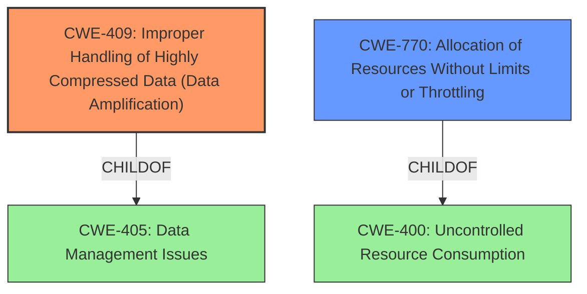

# Analysis for CVE-2022-36114

# Summary
| CWE ID | CWE Name | Confidence | CWE Abstraction Level | CWE Vulnerability Mapping Label | CWE-Vulnerability Mapping Notes |
|---|---|---|---|---|---|
| CWE-409 | Improper Handling of Highly Compressed Data (Data Amplification) | 0.9 | Base | Primary | Allowed |
| CWE-770 | Allocation of Resources Without Limits or Throttling | 0.7 | Base | Secondary | Allowed |

## Evidence and Confidence

*   **Confidence Score:** 0.8
*   **Evidence Strength:** HIGH

## Relationship Analysis
The primary relationship influencing the decision is the parent-child relationship between CWE-405 (Data Management Issues) and CWE-409 (Improper Handling of Highly Compressed Data). CWE-409 is a specific type of resource consumption issue, making it a more precise fit than CWE-400 (Uncontrolled Resource Consumption) which is a parent of CWE-770. The chain relationship between CWE-1284 (Improper Validation of Specified Quantity in Input) and CWE-789 (Memory Allocation with Excessive Size Value) was considered because an excessive size value from the compressed data could lead to memory allocation issues, but CWE-409 captures the essence of the **data amplification** issue more directly.

## Vulnerability Chain
The vulnerability chain starts with the **root cause**, which is the **Cargo's failure to limit the amount of data extracted from compressed archives**. This leads to the ability for an attacker to upload a specially crafted "zip bomb" package. The impact of this vulnerability is disk space exhaustion, potentially leading to a denial-of-service condition.

## Summary of Analysis
The initial analysis focused on identifying the **root cause** of the vulnerability, which is that **Cargo did not limit the amount of data extracted from compressed archives**. This aligns directly with the description of CWE-409, "Improper Handling of Highly Compressed Data (Data Amplification)," which describes a product that does not handle or incorrectly handles a compressed input with a very high compression ratio that produces a large output. The CVE Reference Links Content Summary also explicitly states that the fix involves introducing a `LimitErrorReader` to enforce a size limit, further supporting this classification.

The retriever results also listed CWE-409 as the top candidate, reinforcing the initial assessment. The relationship analysis showed that CWE-409 is a specific type of data management issue, fitting the context well.

CWE-770, "Allocation of Resources Without Limits or Throttling," was considered as a secondary weakness because the **lack of data limit leads to uncontrolled resource allocation (disk space)**. While this is a valid concern, CWE-409 more accurately captures the **data amplification** aspect of the vulnerability.

The decision to use CWE-409 as the primary CWE is based on the evidence that the vulnerability specifically involves a compressed archive leading to excessive data extraction, causing disk space exhaustion. This aligns perfectly with the description and observed examples of CWE-409.

Relevant CWE Information:

# Enhanced Context (25 CWEs)

## CWE-80: Improper Neutralization of Script-Related HTML Tags in a Web Page (Basic XSS)
**Abstraction Level**: Variant
**Similarity Score**: 0.78
**Source**: dense

**Description**:
The product receives input from an upstream component, but it does not neutralize or incorrectly neutralizes special characters such as "<", ">", and "&" that could be interpreted as web-scripting elements when they are sent to a downstream component that processes web pages.

**Mapping Guidance**:
- Usage: Allowed
- Rationale: This CWE entry is at the Variant level of abstraction, which is a preferred level of abstraction for mapping to the root causes of vulnerabilities.

**Why Not Used:** This CWE is related to Cross-Site Scripting (XSS) vulnerabilities, which are not relevant to this vulnerability.

## CWE-74: Improper Neutralization of Special Elements in Output Used by a Downstream Component ('Injection')
**Abstraction Level**: Class
**Similarity Score**: 0.78
**Source**: dense

**Description**:
The product constructs all or part of a command, data structure, or record using externally-influenced input from an upstream component, but it does not neutralize or incorrectly neutralizes special elements that could modify how it is parsed or interpreted when it is sent to a downstream component.

**Mapping Guidance**:
- Usage: Discouraged
- Rationale: CWE-74 is high-level and often misused when lower-level weaknesses are more appropriate.

**Why Not Used:** This CWE is a high-level injection weakness and is not specific to the vulnerability.

## CWE-59: Improper Link Resolution Before File Access ('Link Following')
**Abstraction Level**: Base
**Similarity Score**: 0.78
**Source**: dense

**Description**:
The product attempts to access a file based on the filename, but it does not properly prevent that filename from identifying a link or shortcut that resolves to an unintended resource.

**Mapping Guidance**:
- Usage: Allowed
- Rationale: This CWE entry is at the Base level of abstraction, which is a preferred level of abstraction for mapping to the root causes of vulnerabilities.

**Why Not Used:** This CWE is related to symlink vulnerabilities, which are not relevant to this vulnerability.

## CWE-116: Improper Encoding or Escaping of Output
**Abstraction Level**: Class
**Similarity Score**: 0.78
**Source**: dense

**Description**:
The product prepares a structured message for communication with another component, but encoding or escaping of the data is either missing or done incorrectly. As a result, the intended structure of the message is not preserved.

**Mapping Guidance**:
- Usage: Allowed-with-Review
- Rationale: This CWE entry is a Class and might have Base-level children that would be more appropriate

**Why Not Used:** This CWE is related to encoding/escaping issues, which are not relevant to this vulnerability.

## CWE-23: Relative Path Traversal
**Abstraction Level**: Base
**Similarity Score**: 0.78
**Source**: dense

**Description**:
The product uses external input to construct a pathname that should be within a restricted directory, but it does not properly neutralize sequences such as ".." that can resolve to a location that is outside of that directory.

**Mapping Guidance**:
- Usage: Allowed
- Rationale: This CWE entry is at the Base level of abstraction, which is a preferred level of abstraction for mapping to the root causes of vulnerabilities.

**Why Not Used:** This CWE is related to path traversal vulnerabilities, which are not relevant to this vulnerability.

## CWE-41: Improper Resolution of Path Equivalence
**Abstraction Level**: Base
**Similarity Score**: 0.77
**Source**: dense

**Description**:
The product is vulnerable to file system contents disclosure through path equivalence. Path equivalence involves the use of special characters in file and directory names. The associated manipulations are intended to generate multiple names for the same object.

**Mapping Guidance**:
- Usage: Allowed
- Rationale: This CWE entry is at the Base level of abstraction, which is a preferred level of abstraction for mapping to the root causes of vulnerabilities.

**Why Not Used:** This CWE is related to path equivalence vulnerabilities, which are not relevant to this vulnerability.

## CWE-184: Incomplete List of Disallowed Inputs
**Abstraction Level**: Base
**Similarity Score**: 0.77
**Source**: dense

**Description**:
The product implements a protection mechanism that relies on a list of inputs (or properties of inputs) that are not allowed by policy or otherwise require other action to neutralize before additional processing takes place, but the list is incomplete.

**Mapping Guidance**:
- Usage: Allowed
- Rationale: This CWE entry is at the Base level of abstraction, which is a preferred level of abstraction for mapping to the root causes of vulnerabilities.

**Why Not Used:** This CWE is related to incomplete lists of disallowed inputs, which are not relevant to this vulnerability.

## CWE-212: Improper Removal of Sensitive Information Before Storage or Transfer
**Abstraction Level**: Base
**Similarity Score**: 0.77
**Source**: dense

**Description**:
The product stores, transfers, or shares a resource that contains sensitive information, but it does not properly remove that information before the product makes the resource available to unauthorized actors.

**Mapping Guidance**:
- Usage: Allowed
- Rationale: This CWE entry is at the Base level of abstraction,