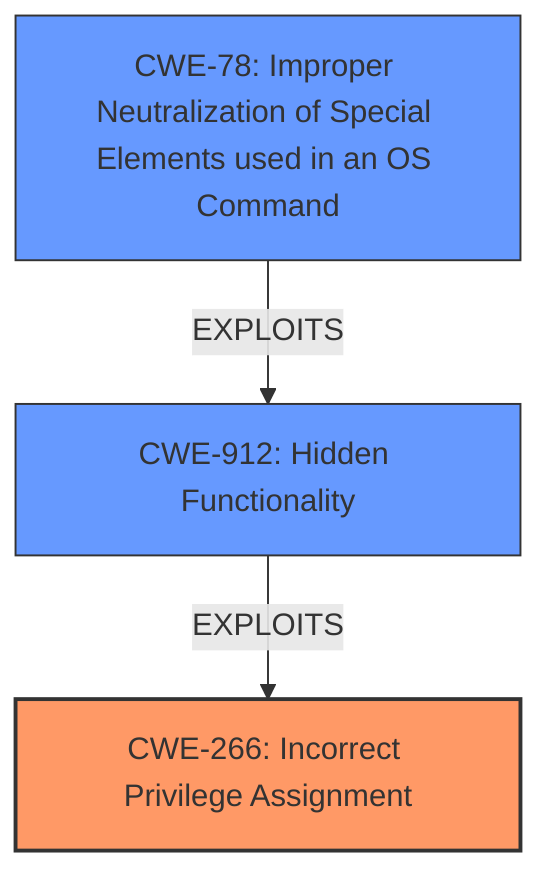

# Raw Analyzer Response for CVE-2022-36158

# Summary
| CWE ID  | CWE Name                                                                                                  | Confidence | CWE Abstraction Level | CWE Vulnerability Mapping Label | CWE-Vulnerability Mapping Notes |
| :-------- | :---------------------------------------------------------------------------------------------------------- | :----------- | :---------------------- | :------------------------------ | :------------------------------ |
| CWE-266 | Incorrect Privilege Assignment                                                                    | 0.8        | Base                    | Primary                       | Allowed                       |
| CWE-912 | Hidden Functionality                                                                         | 0.7        | Class                    | Secondary                     | Allowed-with-Review          |
| CWE-78  | Improper Neutralization of Special Elements used in an OS Command ('OS Command Injection') | 0.6        | Base                    | Secondary                     | Allowed                       |

## Evidence and Confidence

*   **Confidence Score:** 0.7
*   **Evidence Strength:** HIGH

## Relationship Analysis
The primary weakness is **Incorrect Privilege Assignment (CWE-266)**, indicating a flaw in how privileges are assigned to actors within the system. This leads to the exposure of **Hidden Functionality (CWE-912)**, which in turn can allow for **Improper Neutralization of Special Elements used in an OS Command (CWE-78)**. The relationships between these CWEs are such that **CWE-266** creates the initial condition, **CWE-912** exposes a vulnerable area, and **CWE-78** allows for exploitation via command injection.

## Vulnerability Chain
The vulnerability chain starts with **Incorrect Privilege Assignment (CWE-266)**, leading to the exposure of a hidden web page (**CWE-912**), which ultimately allows for arbitrary command execution via **Improper Neutralization of Special Elements used in an OS Command (CWE-78)**.
  - The root cause is the incorrect privilege assignment.
  - The hidden functionality provides an exploitable vector.
  - The OS command injection allows for complete control over the device.

## Summary of Analysis
Initially, the presence of **Insecure Permissions in the Wireless LAN Manager interface** pointed towards a privilege management issue. The discovery of a hidden web page (`/usr/www/ja/mnt_cmd.cgi`) that allows execution of Linux commands with root privileges further solidified this assessment.

The evidence is strong:
> Contec FXA3200 version 1.13.00 and under suffers from **Insecure Permissions in the Wireless LAN Manager interface** which allows malicious actors to execute Linux commands with root privilege via a hidden web page (/usr/www/ja/mnt_cmd.cgi).

This excerpt directly links the **insecure permissions** to the ability to execute commands with root privileges. The **CWE-266** (Incorrect Privilege Assignment) accurately reflects this root cause, as it describes a product that incorrectly assigns a privilege to a particular actor, creating an unintended sphere of control.

The selection of **CWE-266** is based on the evidence of **insecure permissions** leading to root privilege execution. The existence of a hidden web page that facilitates this exploitation led to the inclusion of **CWE-912**, and the ability to inject OS commands through this page resulted in the addition of **CWE-78**.

All selected CWEs are at the optimal level of specificity: **CWE-266** (Base) for the incorrect privilege assignment, **CWE-912** (Class) for the presence of hidden functionality that should not exist, and **CWE-78** (Base) for the OS command injection vulnerability.

Relevant CWE Information:

# Enhanced Context (25 CWEs)
The following CWEs were identified as potentially relevant to this vulnerability:

## CWE-274: Improper Handling of Insufficient Privileges
**Abstraction Level**: Base
**Similarity Score**: 0.78
**Source**: dense

**Description**:
The product does not handle or incorrectly handles when it has insufficient privileges to perform an operation, leading to resultant weaknesses.

**Mapping Guidance**:
- Usage: Discouraged
- Rationale: This CWE entry could be deprecated in a future version of CWE.

## CWE-653: Improper Isolation or Compartmentalization
**Abstraction Level**: Class
**Similarity Score**: 0.78
**Source**: dense

**Description**:
The product does not properly compartmentalize or isolate functionality, processes, or resources that require different privilege levels, rights, or permissions.

**Mapping Guidance**:
- Usage: Allowed
- Rationale: This CWE entry is at the Base level of abstraction, which is a preferred level of abstraction for mapping to the root causes of vulnerabilities.

## CWE-266: Incorrect Privilege Assignment
**Abstraction Level**: Base
**Similarity Score**: 0.78
**Source**: dense

**Description**:
A product incorrectly assigns a privilege to a particular actor, creating an unintended sphere of control for that actor.

**Mapping Guidance**:
- Usage: Allowed
- Rationale: This CWE entry is at the Base level of abstraction, which is a preferred level of abstraction for mapping to the root causes of vulnerabilities.

## CWE-280: Improper Handling of Insufficient Permissions or Privileges 
**Abstraction Level**: Base
**Similarity Score**: 0.78
**Source**: dense

**Description**:
The product does not handle or incorrectly handles when it has insufficient privileges to access resources or functionality as specified by their permissions. This may cause it to follow unexpected code paths that may leave the product in an invalid state.

**Mapping Guidance**:
- Usage: Allowed
- Rationale: This CWE entry is at the Base level of abstraction, which is a preferred level of abstraction for mapping to the root causes of vulnerabilities.

## CWE-668: Exposure of Resource to Wrong Sphere
**Abstraction Level**: Class
**Similarity Score**: 0.77
**Source**: dense

**Description**:
The product exposes a resource to the wrong control sphere, providing unintended actors with inappropriate access to the resource.

**Mapping Guidance**:
- Usage: Discouraged
- Rationale: CWE-668 is high-level and is often misused as a catch-all when lower-level CWE IDs might be applicable. It is sometimes used for low-information vulnerability reports [REF-1287]. It is a level-1 Class (i.e., a child of a Pillar). It is not useful for trend analysis.

## CWE-267: Privilege Defined With Unsafe Actions
**Abstraction Level**: Base
**Similarity Score**: 0.77
**Source**: dense

**Description**:
A particular privilege, role, capability, or right can be used to perform unsafe actions that were not intended, even when it is assigned to the correct entity.

**Mapping Guidance**:
- Usage: Allowed
- Rationale: This CWE entry is at the Base level of abstraction, which is a preferred level of abstraction for mapping to the root causes of vulnerabilities.

## CWE-807: Reliance on Untrusted Inputs in a Security Decision
**Abstraction Level**: Base
**Similarity Score**: 0.76
**Source**: dense

**Description**:
The product uses a protection mechanism that relies on the existence or values of an input, but the input can be modified by an untrusted actor in a way that bypasses the protection mechanism.

**Mapping Guidance**:
- Usage: Allowed
- Rationale: This CWE entry is at the Base level of abstraction, which is a preferred level of abstraction for mapping to the root causes of vulnerabilities.

## CWE-472: External Control of Assumed-Immutable Web Parameter
**Abstraction Level**: Base
**Similarity Score**: 0.76
**Source**: dense

**Description**:
The web application does not sufficiently verify inputs that are assumed to be immutable but are actually externally controllable, such as hidden form fields.

**Mapping Guidance**:
- Usage: Allowed
- Rationale: This CWE entry is at the Base level of abstraction, which is a preferred level of abstraction for mapping to the root causes of vulnerabilities.

## CWE-41: Improper Resolution of Path Equivalence
**Abstraction Level**: Base
**Similarity Score**: 0.76
**Source**: dense

**Description**:
The product is vulnerable to file system contents disclosure through path equivalence. Path equivalence involves the use of special characters in file and directory names. The associated manipulations are intended to generate multiple names for the same object.

**Mapping Guidance**:
- Usage: Allowed
- Rationale: This CWE entry is at the Base level of abstraction, which is a preferred level of abstraction for mapping to the root causes of vulnerabilities.

## CWE-74: Improper Neutralization of Special Elements in Output Used by a Downstream Component ('Injection')