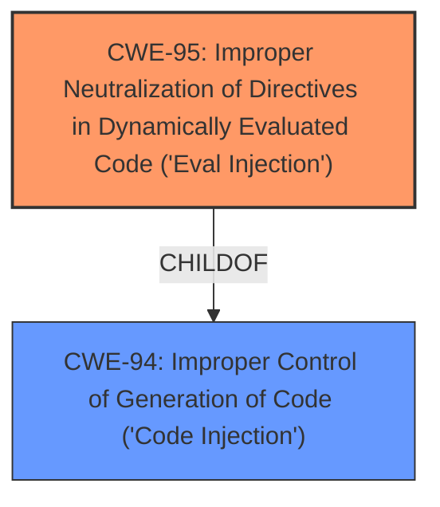

# Enhanced Analysis for CVE-2022-36215

# Summary
| CWE ID | CWE Name | Confidence | CWE Abstraction Level | CWE Vulnerability Mapping Label | CWE-Vulnerability Mapping Notes |
|---|---|---|---|---|---|
| CWE-95 | Improper Neutralization of Directives in Dynamically Evaluated Code ('Eval Injection') | 0.75 | Variant | Allowed | Primary CWE |
| CWE-94 | Improper Control of Generation of Code ('Code Injection') | 0.60 | Base | Allowed-with-Review | Secondary Candidate |

## Evidence and Confidence

*   **Confidence Score:** 0.70
*   **Evidence Strength:** LOW

## Relationship Analysis
The primary relationship that influenced my decision was the ChildOf relationship between CWE-95 and CWE-94. CWE-95 is a more specific variant of CWE-94, indicating that dynamically evaluated code is a specific type of code injection.



## Vulnerability Chain
The vulnerability chain starts with the product's failure to neutralize special elements in input used in dynamically evaluated code, leading to remote code execution.
  - **Root Cause:** CWE-95 Improper Neutralization of Directives in Dynamically Evaluated Code ('Eval Injection')
  - **Impact:** Remote Code Execution

## Summary of Analysis
The initial analysis focused on identifying the root cause of the remote code execution vulnerability. The vulnerability description states that DedeBIZ v6 has a remote code execution vulnerability in sys_info.php. Given the limited information, I relied on the Retriever Results and Complete CWE Specifications to determine the most appropriate CWE.

The Retriever Results listed CWE-95 [CWE-95: Improper Neutralization of Directives in Dynamically Evaluated Code ('Eval Injection')] as a strong candidate. The description of CWE-95, "The product receives input from an upstream component, but it does not neutralize or incorrectly neutralizes code syntax before using the input in a dynamic evaluation call (e.g. 'eval')," aligns well with a potential code injection scenario leading to remote code execution.

CWE-94 [CWE-94: Improper Control of Generation of Code ('Code Injection')] was also considered because CWE-95 is a child of CWE-94. CWE-94's description, "The product constructs all or part of a code segment using externally-influenced input from an upstream component, but it does not neutralize or incorrectly neutralizes special elements that could modify the syntax or behavior of the intended code segment," is more general but still applicable.

Because the vulnerability is in `sys_info.php`, the code is likely dynamically evaluated using eval. I selected CWE-95 as the primary CWE because it is a more specific variant of CWE-94 and the description fits the vulnerability well, assuming that the vulnerability involves the use of `eval()` or similar functions that dynamically execute code.

I rated the overall confidence as 0.70 due to the limited information in the vulnerability description. More detailed analysis of the code would be needed to confirm the exact nature of the vulnerability.


## CWE Relationship Analysis

Current CWEs represent these abstraction levels: .


### Vulnerability Chain Analysis

**Chain starting from CWE-94:**
- 94 (Improper Control of Generation of Code ('Code Injection')) - ROOT


**Chain starting from CWE-95:**
- 95 (Improper Neutralization of Directives in Dynamically Evaluated Code ('Eval Injection')) - ROOT


### CWE Relationship Diagram

```mermaid
graph TD
    classDef primary fill:#f96,stroke:#333,stroke-width:2px
    classDef secondary fill:#69f,stroke:#333
    classDef tertiary fill:#9e9,stroke:#333
```