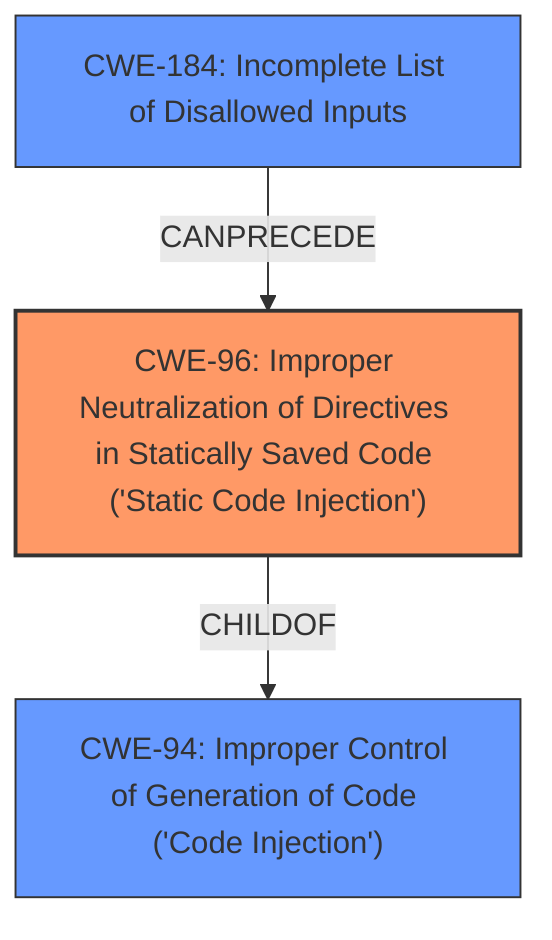

# Raw Analyzer Response for CVE-2022-36262

# Summary
| CWE ID | CWE Name | Confidence | CWE Abstraction Level | CWE Vulnerability Mapping Label | CWE-Vulnerability Mapping Notes |
|---|---|---|---|---|---|
| CWE-96 | Improper Neutralization of Directives in Statically Saved Code ('Static Code Injection') | 1.0 | Base | Allowed | Primary CWE |
| CWE-184 | Incomplete List of Disallowed Inputs | 0.7 | Base | Allowed | Secondary Candidate |

## Evidence and Confidence

*   **Confidence Score:** 0.85
*   **Evidence Strength:** HIGH

## Relationship Analysis
The primary relationship influencing the decision is the ChildOf relationship between CWE-96 and CWE-94 (Improper Control of Generation of Code ('Code Injection')). CWE-96 is a more specific type of code injection that occurs when the injected code is saved statically. The secondary relationship is the CanPrecede relationship between CWE-184 and CWE-96 which indicates that an incomplete list of disallowed inputs can lead to static code injection.

## Vulnerability Chain
The vulnerability chain starts with **insufficient input sanitization**, which leads to **arbitrary php code injection** into the `config.php` file. The incomplete sanitization allows an attacker to bypass the intended security measures. The end result is the ability to achieve remote code execution.
- **Root Cause:** Insufficient Input Sanitization
- **Weakness:** Bypassable Security Mechanism
- **Impact:** Code Injection leading to Remote Code Execution

## Summary of Analysis
The initial analysis indicated **arbitrary php code injection** due to **insufficient input sanitization** when modifying website settings in taoCMS. The key phrase "**arbitrary php code injection**" from the vulnerability description and the analysis of the CVE Reference Links Content Summary supported this.

The retriever results and complete CWE specifications were analyzed. CWE-96, Improper Neutralization of Directives in Statically Saved Code ('Static Code Injection'), emerged as the most appropriate primary CWE because the injected code is written to a static configuration file (config.php). This is supported by the Vulnerability Description Key Phrases and the CVE Reference Links Content Summary.

CWE-94 was considered, but CWE-96 is more specific because the injected code is statically saved. CWE-79 was also considered because the injected code could lead to cross-site scripting, but the root cause is code injection, not XSS.

The decision to select CWE-96 is based on the evidence from the vulnerability description, the retriever results, and the complete CWE specifications. The abstraction level of CWE-96 is Base, which is the preferred level of abstraction. The usage is Allowed per MITRE mapping guidance.

CWE-184 was considered as a secondary weakness because the `safeword` function has an **incomplete list of disallowed inputs** allowing a bypass with a backslash.

Relevant CWE Information:

# Enhanced Context (25 CWEs)
The following CWEs were identified as potentially relevant to this vulnerability:

## CWE-80: Improper Neutralization of Script-Related HTML Tags in a Web Page (Basic XSS)
**Abstraction Level**: Variant
**Similarity Score**: 0.77
**Source**: dense

**Description**:
The product receives input from an upstream component, but it does not neutralize or incorrectly neutralizes special characters such as "<", ">", and "&" that could be interpreted as web-scripting elements when they are sent to a downstream component that processes web pages.
**NOT USED:** XSS is a potential outcome of the code injection but is not the root cause.

## CWE-1336: Improper Neutralization of Special Elements Used in a Template Engine
**Abstraction Level**: Base
**Similarity Score**: 0.77
**Source**: dense

**Description**:
The product uses a template engine to insert or process externally-influenced input, but it does not neutralize or incorrectly neutralizes special elements or syntax that can be interpreted as template expressions or other code directives when processed by the engine.
**NOT USED:** Template injection is not the root cause.

## CWE-74: Improper Neutralization of Special Elements in Output Used by a Downstream Component ('Injection')
**Abstraction Level**: Class
**Similarity Score**: 0.76
**Source**: dense

**Description**:
The product constructs all or part of a command, data structure, or record using externally-influenced input from an upstream component, but it does not neutralize or incorrectly neutralizes special elements that could modify how it is parsed or interpreted when it is sent to a downstream component.
**NOT USED:** CWE-74 is high-level and often misused when lower-level weaknesses are more appropriate.

## CWE-917: Improper Neutralization of Special Elements used in an Expression Language Statement ('Expression Language Injection')
**Abstraction Level**: Base
**Similarity Score**: 0.75
**Source**: dense

**Description**:
The product constructs all or part of an expression language (EL) statement in a framework such as a Java Server Page (JSP) using externally-influenced input from an upstream component, but it does not neutralize or incorrectly neutralizes special elements that could modify the intended EL statement before it is executed.
**NOT USED:** Expression Language Injection is not the root cause.

## CWE-184: Incomplete List of Disallowed Inputs
**Abstraction Level**: Base
**Similarity Score**: 0.75
**Source**: dense

**Description**:
The product implements a protection mechanism that relies on a list of inputs (or properties of inputs) that are not allowed by policy or otherwise require other action to neutralize before additional processing takes place, but the list is incomplete.
**USED:** This could be a contributing factor as to why the 'safeword' function could be bypassed.

## CWE-96: Improper Neutralization of Directives in Statically Saved Code ('Static Code Injection')
**Abstraction Level**: Base
**Similarity Score**: 0.74
**Source**: dense

**Description**:
The product receives input from an upstream component, but it does not neutralize or incorrectly neutralizes code syntax before inserting the input into an executable resource, such as a library, configuration file, or template.
**USED:** PRIMARY CWE

## CWE-138: Improper Neutralization of Special Elements
**Abstraction Level**: Class
**Similarity Score**: 0.74
**Source**: dense

**Description**:
The product receives input from an upstream component, but it does not neutralize or incorrectly neutralizes special elements that could be interpreted as control elements or syntactic markers when they are sent to a downstream component.
**NOT USED:** CWE-138 is a more generic class, CWE-96 is more specific.

## CWE-116: Improper Encoding or Escaping of Output
**Abstraction Level**: Class
**Similarity Score**: 0.74
**Source**: dense

**Description**:
The product prepares a structured message for communication with another component, but encoding or escaping of the data is either missing or done incorrectly. As a result, the intended structure of the message is not preserved.
**NOT USED:** Encoding/escaping is missing, but CWE-96 is more specific.

## CWE-1289: Improper Validation of Unsafe Equivalence in Input
**Abstraction Level**: Base
**Similarity Score**: 0.73
**Source**: dense

**Description**:
The product receives an input value that is used as a resource identifier or other type of reference, but it does not validate or incorrectly validates that the input is equivalent to a potentially-unsafe value.
**NOT USED:** Equivalence validation is not relevant.

## CWE-838: Inappropriate Encoding for Output Context
**Abstraction Level**: Base
**Similarity Score**: 0.72
**Source**: dense

**Description**:
The product uses or specifies an encoding when generating output to a downstream component, but the specified encoding is not the same as the encoding that is expected by the downstream component.
**NOT USED:** Encoding context is not relevant.

## CWE-94: Improper Control of Generation of Code ('Code Injection')
**Abstraction Level**: base
**Similarity Score**: 4.33
**Source**: graph

**Description**:
CWE-94: Improper Control of Generation of Code ('Code Injection')
**NOT USED:** CWE-96 is a more specific variant of this CWE.

## CWE-78: Improper Neutralization of Special Elements used in an OS Command ('OS Command Injection')
**Abstraction Level**: base
**Similarity Score**: 4.33
**Source**: graph

**Description**:
CWE-78: Improper Neutralization of Special Elements used in an OS Command ('OS