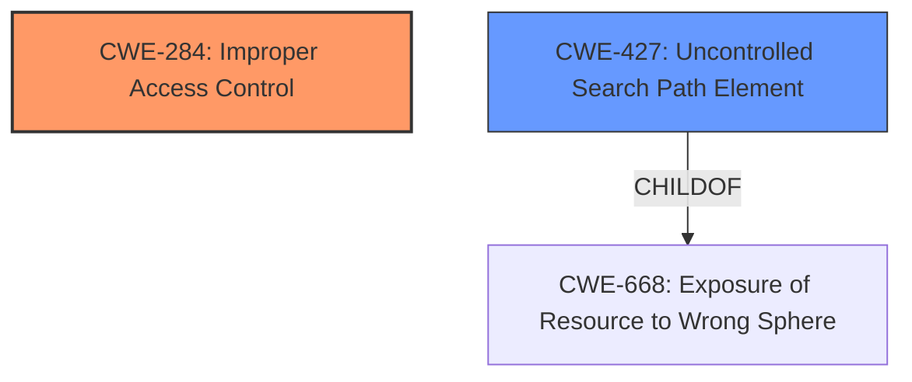

# Enhanced Analysis for CVE-2022-36263

# Summary
| CWE ID | CWE Name | Confidence | CWE Abstraction Level | CWE Vulnerability Mapping Label | CWE-Vulnerability Mapping Notes |
|---|---|---|---|---|---|
| CWE-284 | Improper Access Control | 0.7 | Pillar | Primary | Discouraged, but no more specific CWE fits the description |
| CWE-427 | Uncontrolled Search Path Element | 0.5 | Base | Secondary | Allowed, but requires more information to confirm |

## Evidence and Confidence

*   **Confidence Score:** 0.6
*   **Evidence Strength:** LOW

## Relationship Analysis
The primary CWE identified is CWE-284, which is a high-level Pillar. Several other CWEs are related to access control, like CWE-732 (Incorrect Permission Assignment for Critical Resource), CWE-863 (Incorrect Authorization), and CWE-306 (Missing Authentication), but these are more specific cases of access control issues. CWE-427 (Uncontrolled Search Path Element) is a child of CWE-668 (Exposure of Resource to Wrong Sphere), which could be a possible contributing factor if the application loads resources from an attacker-controlled path.



## Vulnerability Chain
The vulnerability chain starts with **incorrect access control**, which allows an attacker to execute arbitrary code via a crafted .exe file. The **root cause** is **incorrect access control**, and the impact is arbitrary code execution. If CWE-427 is involved, the chain would be: Uncontrolled Search Path -> Improper Access Control -> Arbitrary Code Execution.

## Summary of Analysis
The initial assessment identified the **root cause** as **incorrect access control**, which is explicitly mentioned in the vulnerability description. The description also specifies that an attacker can execute arbitrary code through a crafted .exe file, indicating a potential issue with how the application handles or restricts access to executable files.

The primary CWE selected is CWE-284 (Improper Access Control). Although CWE-284 is a high-level Pillar and discouraged for use, the provided information does not give enough to select a more specific base or variant CWE.
The secondary CWE considered is CWE-427 (Uncontrolled Search Path Element). The vulnerability involves the execution of a crafted .exe file, which might indicate that the application is loading resources from an uncontrolled search path. However, this is speculative and would require more information.

The selection of CWE-284 is based on the **root cause** identified in the vulnerability description. The selection of CWE-427 is speculative and based on the potential attack vector involving a crafted .exe file, but the evidence is weak. My assessment is heavily based on the limited evidence provided, mainly the phrase "**incorrect access control**". Without further details, selecting a more specific CWE would be speculative.

Relevant CWE Information:

# Enhanced Context (25 CWEs)

## CWE-131: Incorrect Calculation of Buffer Size
**Abstraction Level**: Base
**Similarity Score**: 0.77
**Source**: dense

**Description**:
The product does not correctly calculate the size to be used when allocating a buffer, which could lead to a buffer overflow.

**Mapping Guidance**:
- Usage: Allowed
- Rationale: This CWE entry is at the Base level of abstraction, which is a preferred level of abstraction for mapping to the root causes of vulnerabilities.

*Not Used*: This CWE is not relevant because the vulnerability description does not mention buffer size calculations or buffer overflows.

## CWE-667: Improper Locking
**Abstraction Level**: Class
**Similarity Score**: 0.76
**Source**: dense

**Description**:
The product does not properly acquire or release a lock on a resource, leading to unexpected resource state changes and behaviors.

**Mapping Guidance**:
- Usage: Allowed-with-Review
- Rationale: This CWE entry is a Class and might have Base-level children that would be more appropriate

*Not Used*: This CWE is not relevant as the vulnerability description makes no mention of locking or resource state issues.

## CWE-668: Exposure of Resource to Wrong Sphere
**Abstraction Level**: Class
**Similarity Score**: 0.76
**Source**: dense

**Description**:
The product exposes a resource to the wrong control sphere, providing unintended actors with inappropriate access to the resource.

**Mapping Guidance**:
- Usage: Discouraged
- Rationale: CWE-668 is high-level and is often misused as a catch-all when lower-level CWE IDs might be applicable. It is sometimes used for low-information vulnerability reports [REF-1287]. It is a level-1 Class (i.e., a child of a Pillar). It is not useful for trend analysis.

*Not Used*: While exposure of a resource to the wrong sphere could be related to access control, the description lacks specific details to warrant this classification over the more direct CWE-284.

## CWE-404: Improper Resource Shutdown or Release
**Abstraction Level**: Class
**Similarity Score**: 0.75
**Source**: dense

**Description**:
The product does not release or incorrectly releases a resource before it is made available for re-use.

**Mapping Guidance**:
- Usage: Allowed-with-Review
- Rationale: This CWE entry is a Class and might have Base-level children that would be more appropriate

*Not Used*: This CWE is not applicable because the vulnerability description does not mention resource release issues.

## CWE-754: Improper Check for Unusual or Exceptional Conditions
**Abstraction Level**: Class
**Similarity Score**: 0.75
**Source**: dense

**Description**:
The product does not check or incorrectly checks for unusual or exceptional conditions that are not expected to occur frequently during day to day operation of the product.

**Mapping Guidance**:
- Usage: Allowed-with-Review
- Rationale: This CWE entry is a Class and might have Base-level children that would be more appropriate

*Not Used*: This CWE is not relevant since the description does not mention any checks for unusual conditions.

## CWE-653: Improper Isolation or Compartmentalization
**Abstraction Level**: Class
**Similarity Score**: 0.75
**Source**: dense

**Description**:
The product does not properly compartmentalize or isolate functionality, processes, or resources that require different privilege levels, rights, or permissions.

**Mapping Guidance**:
- Usage: Allowed
- Rationale: This CWE entry is at the Base level of abstraction, which is a preferred level of abstraction for mapping to the root causes of vulnerabilities.

*Not Used*: This could be tangentially related if the access control issue stems from poor isolation, but CWE-284 more directly addresses the stated weakness.

## CWE-125: Out-of-bounds Read
**Abstraction Level**: Base
**Similarity Score**: 0.75
**Source**: dense

**Description**:
The product reads data past the end, or before the beginning, of the intended buffer.

**Mapping Guidance**:
- Usage: Allowed
- Rationale: This CWE entry is at the Base level of abstraction, which is a preferred level of abstraction for mapping to the root causes of vulnerabilities.

*Not Used*: This CWE is not relevant because the vulnerability description does not mention out-of-bounds reads.

## CWE-691: Insufficient Control Flow Management
**Abstraction Level**: Pillar
**Similarity Score**: 0.75
**Source**: dense

**Description**:
The code does not sufficiently manage its control flow during execution, creating conditions in which the control flow can be modified in unexpected ways.

**Mapping Guidance**:
- Usage: Discouraged
- Rationale: This CWE entry is extremely high-level, a Pillar. However, classification research is limited for weaknesses of this type, so there can be gaps or organizational difficulties within CWE that force use of this weakness, even at such a high level of abstraction.

*Not Used*: Too high-level and doesn't directly relate to the **incorrect access control** issue.

## CWE-119: Improper Restriction of Operations within the Bounds of a Memory Buffer
**Abstraction Level**: Class
**Similarity Score**: 0.75
**Source**: dense

**Description**:
The product performs operations on a memory buffer, but it reads from or writes to a memory location outside the buffer's intended boundary. This may result in read or write operations on unexpected memory locations that could be linked to other variables, data structures, or internal program data.

**Mapping Guidance**:
- Usage: Discouraged
- Rationale: CWE-119 is commonly misused in low-information vulnerability reports when lower-level CWEs could be used instead, or when more details about the vulnerability are available.

*Not Used*: This CWE is not relevant because the vulnerability description does not mention buffer overflows or memory corruption.

## CWE-41: Improper Resolution of Path Equivalence


## CWE Relationship Analysis

Current CWEs represent these abstraction levels: .


### Vulnerability Chain Analysis

**Chain starting from CWE-131:**
- 131 (Incorrect Calculation of Buffer Size) - ROOT


**Chain starting from CWE-41:**
- 41 (Improper Resolution of Path Equivalence) - ROOT


### CWE Relationship Diagram

```mermaid
graph TD
    classDef primary fill:#f96,stroke:#333,stroke-width:2px
    classDef secondary fill:#69f,stroke:#333
    classDef tertiary fill:#9e9,stroke:#333
```