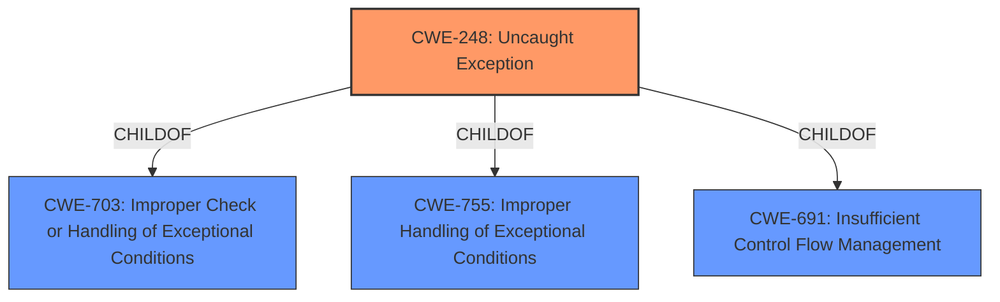

# Analysis for CVE-2022-36287

# Summary
| CWE ID | CWE Name | Confidence | CWE Abstraction Level | CWE Vulnerability Mapping Label | CWE-Vulnerability Mapping Notes |
|---|---|---|---|---|---|
| CWE-248 | Uncaught Exception | 1.0 | Base | Allowed | Primary CWE |

## Evidence and Confidence

*   **Confidence Score:** 1.0
*   **Evidence Strength:** HIGH

## Relationship Analysis
The primary relationship influencing the decision is the ChildOf relationship of CWE-248 to CWE-703 (Improper Check or Handling of Exceptional Conditions), CWE-755 (Improper Handling of Exceptional Conditions), and CWE-691 (Insufficient Control Flow Management). While these parents were considered, CWE-248 provides the most specific description of the vulnerability. The abstraction level of Base for CWE-248 is optimal, as it directly describes the root cause.

## Vulnerability Chain
The vulnerability chain is relatively simple: the **uncaught exception** (CWE-248) directly leads to a denial of service. There are no apparent intermediate steps or prerequisites mentioned in the provided information.

## Summary of Analysis
The analysis is based primarily on the provided evidence, especially the "Vulnerability Description Key Phrases" and "CVE Reference Links Content Summary". These sections explicitly state that the root cause is an **uncaught exception**, which can lead to a denial-of-service condition.

The selection of CWE-248 is justified because it directly matches the root cause described in the vulnerability report: "An **exception** is thrown from a function, but it is not caught." The report explicitly mentions the "Uncaught exception" as the **weakness** and root cause.

CWE-248 is at the optimal level of specificity (Base), as it accurately captures the underlying cause of the vulnerability. Higher-level CWEs like CWE-755 (Improper Handling of Exceptional Conditions) are less specific. While CWE-755 could apply, CWE-248 describes the specific type of improper handling, i.e., the exception is uncaught.

Relevant CWE Information:

# Enhanced Context (25 CWEs)
The following CWEs were identified as potentially relevant to this vulnerability:

## CWE-703: Improper Check or Handling of Exceptional Conditions
**Abstraction Level**: Pillar
**Similarity Score**: 0.75
**Source**: dense

**Description**:
The product does not properly anticipate or handle exceptional conditions that rarely occur during normal operation of the product.

**Mapping Guidance**:
- Usage: Discouraged
- Rationale: This CWE entry is extremely high-level, a Pillar.

## CWE-691: Insufficient Control Flow Management
**Abstraction Level**: Pillar
**Similarity Score**: 0.75
**Source**: dense

**Description**:
The code does not sufficiently manage its control flow during execution, creating conditions in which the control flow can be modified in unexpected ways.

**Mapping Guidance**:
- Usage: Discouraged
- Rationale: This CWE entry is extremely high-level, a Pillar. However, classification research is limited for weaknesses of this type, so there can be gaps or organizational difficulties within CWE that force use of this weakness, even at such a high level of abstraction.

## CWE-755: Improper Handling of Exceptional Conditions
**Abstraction Level**: Class
**Similarity Score**: 0.160
**Source**: sparse

**Description**:
The product does not handle or incorrectly handles an exceptional condition.

**Mapping Guidance**:
- Usage: Discouraged
- Rationale: This CWE entry is a level-1 Class (i.e., a child of a Pillar). It might have lower-level children that would be more appropriate

## CWE-248: Uncaught Exception
**Abstraction:** Base

### Description
An exception is thrown from a function, but it is not caught.

### Mapping Guidance
**Usage:** Allowed
**Rationale:** This CWE entry is at the Base level of abstraction, which is a preferred level of abstraction for mapping to the root causes of vulnerabilities.