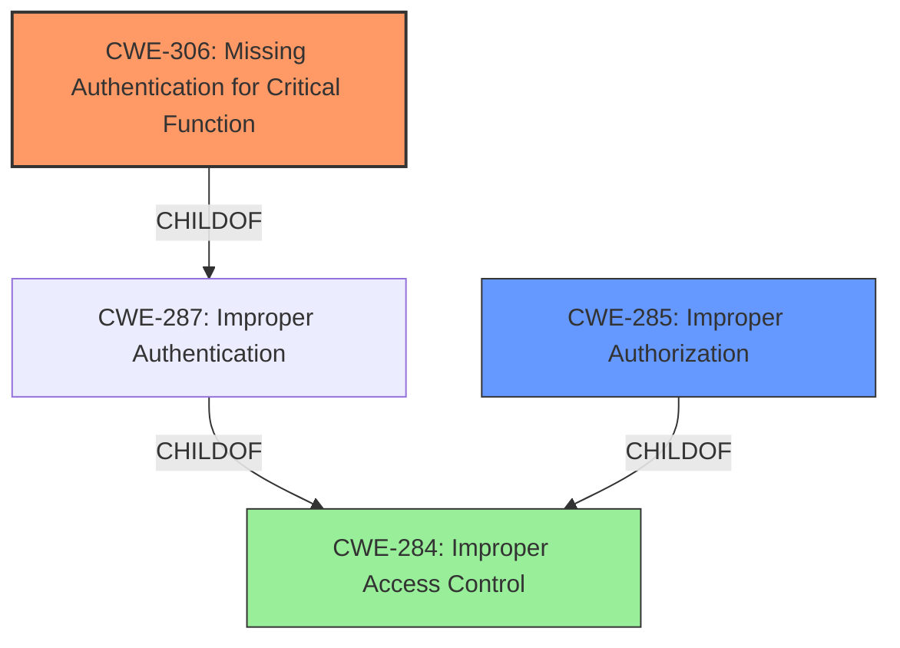

# Raw Analyzer Response for CVE-2022-36296

# Summary
| CWE ID | CWE Name | Confidence | CWE Abstraction Level | CWE Vulnerability Mapping Label | CWE-Vulnerability Mapping Notes |
|---|---|---|---|---|---|
| CWE-306 | Missing Authentication for Critical Function | 0.9 | Base | Allowed | Primary CWE |
| CWE-285 | Improper Authorization | 0.5 | Class | Discouraged | Secondary Candidate |
| CWE-284 | Improper Access Control | 0.3 | Pillar | Discouraged | Secondary Candidate |

## Evidence and Confidence

*   **Confidence Score:** 0.9
*   **Evidence Strength:** HIGH

## Relationship Analysis
The primary CWE, CWE-306 [Missing Authentication for Critical Function], is a base-level weakness, indicating a specific flaw in the authentication process. It is a child of CWE-287 [Improper Authentication] and hence is more specific.

CWE-285 [Improper Authorization] is a class-level weakness, a child of CWE-284 [Improper Access Control], and serves as a higher-level categorization. CWE-284 is a Pillar. The relationship between these CWEs highlights a progression from a general access control issue (CWE-284) to a more specific authorization problem (CWE-285), finally culminating in the lack of authentication (CWE-306).

## Vulnerability Chain
The chain of root cause and weaknesses for the described vulnerability is as follows:
  - The root cause is **Broken Authentication**, which translates to CWE-306 [Missing Authentication for Critical Function], indicating that critical functions lack authentication mechanisms.
  - The absence of authentication leads to **Improper Authorization** (CWE-285), where actions are performed without verifying user privileges.
  - This ultimately results in **Improper Access Control** (CWE-284), as unauthorized users can modify, create, or delete posts.
  - Thus the sequence is: CWE-306 -> CWE-285 -> CWE-284

## Summary of Analysis
The initial assessment pointed towards a **Broken Authentication** vulnerability, which was confirmed by the CVE Reference Links Content Summary, indicating a flaw in user authentication. This aligns directly with CWE-306 [Missing Authentication for Critical Function], where the product lacks authentication for critical functionalities. The analysis considered alternative CWEs such as CWE-285 [Improper Authorization] and CWE-284 [Improper Access Control], but these were deemed less specific. The final decision to classify this vulnerability as CWE-306 [Missing Authentication for Critical Function] is based on the direct evidence of missing authentication mechanisms for critical functions such as updating, creating, and deleting posts.

The evidence from the vulnerability description is: "***Broken Authentication** vulnerability in JumpDEMAND Inc. ActiveDEMAND plugin <= 0.2.27 at WordPress allows unauthenticated post update/create/delete."

The graph relationships influenced the selection by clarifying the specificity levels. While access control and authorization issues are present, the root cause is the absence of authentication which then leads to the other issues.

CWE-306 [Missing Authentication for Critical Function] is at the optimal level of specificity because it directly addresses the root cause: the absence of authentication for critical functions.