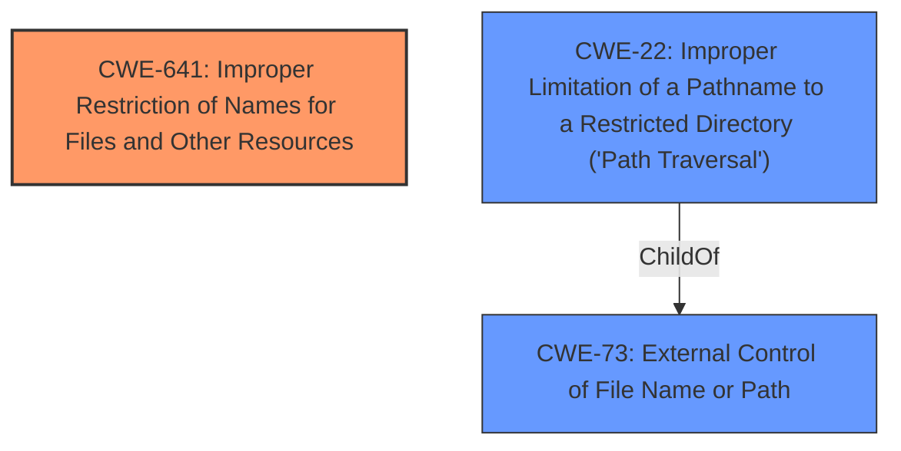

# Analysis for CVE-2022-36302

# Summary
| CWE ID | CWE Name | Confidence | CWE Abstraction Level | CWE Vulnerability Mapping Label | CWE-Vulnerability Mapping Notes |
|---|---|---|---|---|---|
| CWE-641 | Improper Restriction of Names for Files and Other Resources | 0.9 | Base | Allowed | Primary CWE |
| CWE-73 | External Control of File Name or Path | 0.7 | Base | Allowed | Secondary Candidate |
| CWE-22 | Improper Limitation of a Pathname to a Restricted Directory ('Path Traversal') | 0.6 | Base | Allowed | Secondary Candidate |

## Evidence and Confidence

*   **Confidence Score:** 0.8
*   **Evidence Strength:** HIGH

## Relationship Analysis
The primary CWE is CWE-641 **[CWE-641: Improper Restriction of Names for Files and Other Resources]**, which is a base level CWE. The vulnerability involves **file path manipulation**, indicating that the software **does not restrict or incorrectly restricts the resulting name** of a file or resource.

CWE-73 **[CWE-73: External Control of File Name or Path]** and CWE-22 **[CWE-22: Improper Limitation of a Pathname to a Restricted Directory ('Path Traversal')]** are considered as secondary candidates, as the description mentions an attacker being able to modify the file path to access different resources. CWE-73 **[CWE-73: External Control of File Name or Path]** is a parent of CWE-22 **[CWE-22: Improper Limitation of a Pathname to a Restricted Directory ('Path Traversal')]**.

## Vulnerability Chain
The chain of events includes an initial **file path manipulation** vulnerability due to **improper restriction of names**, which enables an attacker to access sensitive information.

## Summary of Analysis
The initial assessment identified CWE-641 **[CWE-641: Improper Restriction of Names for Files and Other Resources]** as the primary CWE because the core issue is the **lack of proper restrictions on file names or paths**, leading to potential access to unauthorized resources.

The vulnerability description explicitly mentions "**File path manipulation**" and "**Improper Restriction of Names for Files and Other Resources (CWE-641)**". This indicates that the software **does not properly restrict or incorrectly restricts the resulting name**, allowing an attacker to modify the file path to access different resources.

CWE-73 **[CWE-73: External Control of File Name or Path]** and CWE-22 **[CWE-22: Improper Limitation of a Pathname to a Restricted Directory ('Path Traversal')]** were considered but classified as secondary because CWE-641 **[CWE-641: Improper Restriction of Names for Files and Other Resources]** more accurately represents the root cause, which is the **lack of proper restriction** on the filename. CWE-73 **[CWE-73: External Control of File Name or Path]** and CWE-22 **[CWE-22: Improper Limitation of a Pathname to a Restricted Directory ('Path Traversal')]** are more specific consequences of this **improper restriction**.

The selection of CWE-641 **[CWE-641: Improper Restriction of Names for Files and Other Resources]** as the primary CWE is at the optimal level of specificity because it addresses the fundamental issue of **improper restriction of names**, which is a base-level weakness.

Relevant CWE Information:

# Enhanced Context (25 CWEs)

## CWE-668: Exposure of Resource to Wrong Sphere
**Abstraction Level**: Class
**Similarity Score**: 0.78
**Source**: dense

**Description**:
The product exposes a resource to the wrong control sphere, providing unintended actors with inappropriate access to the resource.

**Mapping Guidance**:
- Usage: Discouraged
- Rationale: CWE-668 is high-level and is often misused as a catch-all when lower-level CWE IDs might be applicable. It is sometimes used for low-information vulnerability reports [REF-1287]. It is a level-1 Class (i.e., a child of a Pillar). It is not useful for trend analysis.

*CWE-668 was not selected as it is a higher level class and CWE-641 is a more specific base level weakness.*

## CWE-23: Relative Path Traversal
**Abstraction Level**: Base
**Similarity Score**: 0.76
**Source**: dense

**Description**:
The product uses external input to construct a pathname that should be within a restricted directory, but it does not properly neutralize sequences such as ".." that can resolve to a location that is outside of that directory.

**Mapping Guidance**:
- Usage: Allowed
- Rationale: This CWE entry is at the Base level of abstraction, which is a preferred level of abstraction for mapping to the root causes of vulnerabilities.

*CWE-23 was considered but classified as a secondary candidate, as the description mentions an attacker being able to modify the file path to access different resources, but doesn't explicitly mention ".." sequences.*

## CWE-552: Files or Directories Accessible to External Parties
**Abstraction Level**: Base
**Similarity Score**: 0.76
**Source**: dense

**Description**:
The product makes files or directories accessible to unauthorized actors, even though they should not be.

**Mapping Guidance**:
- Usage: Allowed
- Rationale: This CWE entry is at the Base level of abstraction, which is a preferred level of abstraction for mapping to the root causes of vulnerabilities.

*CWE-552 was not selected because the vulnerability is specifically about **file path manipulation**, not simply making files accessible.*

## CWE-73: External Control of File Name or Path
**Abstraction Level**: Base
**Similarity Score**: 0.76
**Source**: dense

**Description**:
The product allows user input to control or influence paths or file names that are used in filesystem operations.

**Mapping Guidance**:
- Usage: Allowed
- Rationale: This CWE entry is at the Base level of abstraction, which is a preferred level of abstraction for mapping to the root causes of vulnerabilities.

*CWE-73 was considered but classified as a secondary candidate, as the description mentions an attacker being able to modify the file path to access different resources.*

## CWE-41: Improper Resolution of Path Equivalence
**Abstraction Level**: Base
**Similarity Score**: 0.76
**Source**: dense

**Description**:
The product is vulnerable to file system contents disclosure through path equivalence. Path equivalence involves the use of special characters in file and directory names. The associated manipulations are intended to generate multiple names for the same object.

**Mapping Guidance**:
- Usage: Allowed
- Rationale: This CWE entry is at the Base level of abstraction, which is a preferred level of abstraction for mapping to the root causes of vulnerabilities.

*CWE-41 was not selected as there is no evidence of path equivalence issues in the description.*

## CWE-610: Externally Controlled Reference to a Resource in Another Sphere
**Abstraction Level**: Class
**Similarity Score**: 0.76
**Source**: dense

**Description**:
The product uses an externally controlled name or reference that resolves to a resource that is outside of the intended control sphere.

**Mapping Guidance**:
- Usage: Discouraged
- Rationale: This CWE entry is a level-1 Class (i.e., a child of a Pillar). It might have lower-level children that would be more appropriate

*CWE-610 was not selected as it's a class level CWE and there are more specific base level CWEs that apply.*

## CWE-664: Improper Control of a Resource Through its Lifetime
**Abstraction Level**: Pillar
**Similarity Score**: 0.74
**Source**: dense

**Description**:
The product does not maintain or incorrectly maintains control over a resource throughout its lifetime of creation, use, and release.

**Mapping Guidance**:
- Usage: Discouraged
- Rationale: This CWE entry is high-level when lower-level children are available.

*CWE-664 was not selected as it is a high-level Pillar and there are more specific base level CWEs that apply.*

## CWE-669: Incorrect Resource Transfer Between Spheres
**Abstraction Level**: Class
**Similarity Score**: 0.74
**Source**: dense

**Description**:
The product does not properly transfer a resource/behavior to another sphere, or improperly imports a resource/behavior from another sphere, in a manner that provides unintended control over that resource.

**Mapping Guidance**:
- Usage: Allowed-with-Review
- Rationale: This CWE entry is