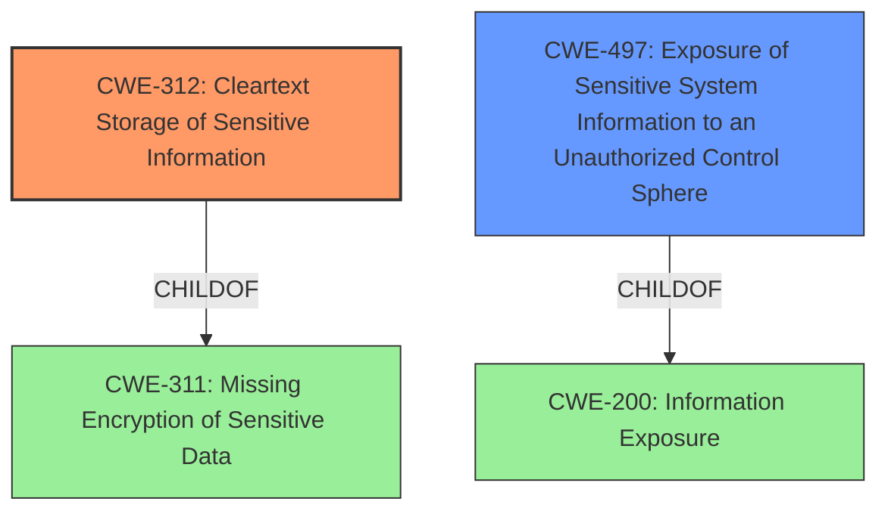

# Raw Analyzer Response for CVE-2022-36308

# Summary
| CWE ID | CWE Name | Confidence | CWE Abstraction Level | CWE Vulnerability Mapping Label | CWE-Vulnerability Mapping Notes |
|---|---|---|---|---|---|
| CWE-312 | Cleartext Storage of Sensitive Information | 1.0 | Base | Allowed | Primary CWE |
| CWE-497 | Exposure of Sensitive System Information to an Unauthorized Control Sphere | 0.7 | Base | Allowed | Secondary Candidate |

## Evidence and Confidence

*   **Confidence Score:** 0.9
*   **Evidence Strength:** HIGH

## Relationship Analysis
The primary CWE selected is CWE-312, which is a Base level CWE. It is related to CWE-311 (Missing Encryption of Sensitive Data) as a child. CWE-497 is a base level CWE and a child of CWE-200, Improper Input Validation.

## Vulnerability Chain
The vulnerability chain starts with the **SNMP credentials in plaintext**. This leads to **exposure of sensitive information**, enabling an attacker with web access to **manipulate the eNodeB over SNMP**.

## Summary of Analysis
The primary weakness is that the Airspan AirVelocity 1500 web management UI displays **SNMP credentials in plaintext**.
The vulnerability description states "Airspan AirVelocity 1500 web management UI displays **SNMP credentials in plaintext** on software versions older than 15.18.00.2511, and stores SNMPv3 credentials unhashed on the filesystem, enabling anyone with web access to use these credentials to manipulate the eNodeB over SNMP."
The CVE Reference Links Content Summary confirms that "Airspan's AirVelocity 1500 eNB devices store SNMPv3 credentials in plaintext due to improper handling by the web UI." and lists "CWE-256: Plaintext Storage of Passwords" as a weakness.
The root cause is that "The web UI writes SNMPv3 passwords to a configuration file (`/bsdata/snmpd.conf`) that is not managed by `snmpd`, preventing `snmpd` from automatically hashing the passwords. Additionally, the web UI displays all SNMP credentials in plaintext."

Based on the evidence, the best primary CWE is CWE-312 Cleartext Storage of Sensitive Information.
CWE-312 is a Base level CWE, which is a preferred level of abstraction. The description of CWE-312 states, "The product stores sensitive information in cleartext within a resource that might be accessible to another control sphere." This aligns directly with the vulnerability description. The MITRE mapping guidance Usage is Allowed.

CWE-256 Plaintext Storage of a Password was considered, but CWE-312 is a better fit because the vulnerability involves storing SNMPv3 credentials unhashed on the filesystem and the web management UI displays all SNMP credentials in plaintext. Thus, it is more than just storing a password.

CWE-497 Exposure of Sensitive System Information to an Unauthorized Control Sphere was also considered since the **plaintext SNMP credentials** are exposed through the web UI. However, the primary issue is the **cleartext storage**, making CWE-312 a better primary fit. CWE-497 is considered as a secondary candidate.
CWE-497 is a Base level CWE, which is a preferred level of abstraction. The description of CWE-497 states, "The product does not properly prevent sensitive system-level information from being accessed by unauthorized actors who do not have the same level of access to the underlying system as the product does." This aligns with the vulnerability description where anyone with web access is able to view the SNMP credentials. The MITRE mapping guidance Usage is Allowed.

CWE-798 Use of Hard-coded Credentials was considered because the vulnerability involves storing credentials. However, it is not hard-coded credentials, so it is not the best fit.

CWE-522 Insufficiently Protected Credentials was considered, but it is a Class level CWE, and there are better Base level CWEs available.

CWE-257 Storing Passwords in a Recoverable Format was considered, but CWE-312 is a better fit since it involves more than just passwords.