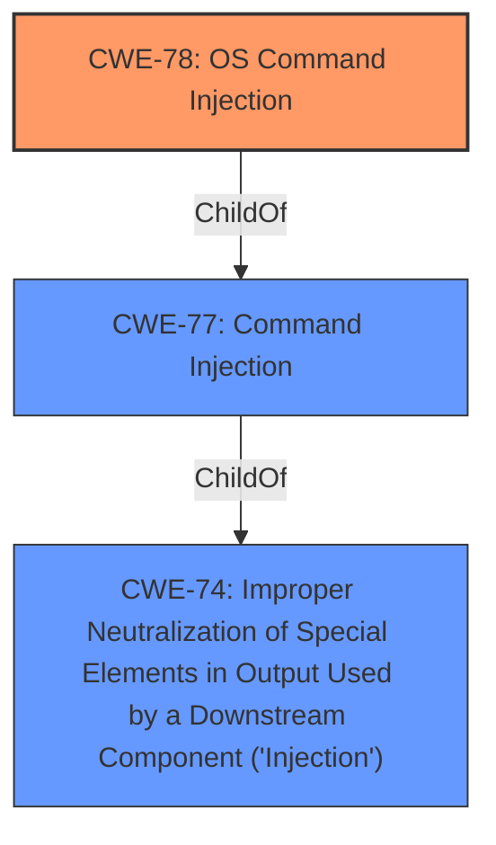

# Analysis Report for CVE-2022-36309

# Vulnerability Analysis Report: CVE-2022-36309

## Description


## Analysis (with Relationship Data)

# Summary
| CWE ID | CWE Name | Confidence | CWE Abstraction Level | CWE Vulnerability Mapping Label | CWE-Vulnerability Mapping Notes |
|---|---|---|---|---|---|
| CWE-78 | Improper Neutralization of Special Elements used in an OS Command ('OS Command Injection') | 1.0 | Base | Allowed | Primary CWE |

## Evidence and Confidence

*   **Confidence Score:** 1.0
*   **Evidence Strength:** HIGH

## Relationship Analysis
The primary relationship that influenced the decision was the ChildOf relationship between CWE-78 and CWE-77, where CWE-78 is more specific. The analysis considered the mapping guidance that encouraged the selection of the base CWE-78 over the class CWE-77.



## Vulnerability Chain
The vulnerability chain starts with the lack of proper input sanitization which leads directly to OS command injection, allowing arbitrary command execution with root privileges.
  - Missing Input Sanitization (Implicit)
  - CWE-78: Improper Neutralization of Special Elements used in an OS Command ('OS Command Injection')

## Summary of Analysis
The initial analysis strongly pointed towards **CWE-78**: Improper Neutralization of Special Elements used in an OS Command ('OS Command Injection') based on the vulnerability description and the CVE Reference Links Content Summary, where the root cause was identified as a **command injection** vulnerability due to the script not properly sanitizing user-provided input before using it in a system command. The `ActiveBank` parameter in the POST request is vulnerable to command injection. The attacker can inject shell commands by adding them after a semicolon within the `ActiveBank` parameter.

The evidence from the CVE Reference Links Content Summary includes:
*   "The `recoverySubmit.cgi` CGI script, which runs with root privileges, has a command injection vulnerability."
*   "**Command Injection (CWE-78):** The script does not properly sanitize user-provided input before using it in a system command. Specifically the 'ActiveBank' parameter allows for command injection."

The Retriever Results also listed **CWE-78**: Improper Neutralization of Special Elements used in an OS Command ('OS Command Injection') as the second best match.

The selection of **CWE-78** is at the optimal level of specificity because it directly describes the root cause of the vulnerability, which is the improper neutralization of special elements used in constructing an OS command. This aligns with the CWE's description and mapping guidance, which encourages the use of Base-level CWEs when they accurately represent the weakness.

CWE-77 was considered, but the description explicitly states this is an OS command, making **CWE-78** a better fit.
CWE-20 was considered, but this is a more general Improper Input Validation which is not the root cause but rather a condition.
CWE-94 was considered but discarded as the product isn't generating code, rather executing OS commands.
CWE-22 was considered but discarded as this is a **Path Traversal** issue, and not related to this vulnerability.


## CWE Relationship Analysis

Current CWEs represent these abstraction levels: .


### Vulnerability Chain Analysis

**Chain starting from CWE-20:**
- 20 (Improper Input Validation) - ROOT


**Chain starting from CWE-78:**
- 78 (Improper Neutralization of Special Elements used in an OS Command ('OS Command Injection')) - ROOT


### CWE Relationship Diagram

```mermaid
graph TD
    classDef primary fill:#f96,stroke:#333,stroke-width:2px
    classDef secondary fill:#69f,stroke:#333
    classDef tertiary fill:#9e9,stroke:#333
```


*Report generated on 2025-03-31 02:44:20*
