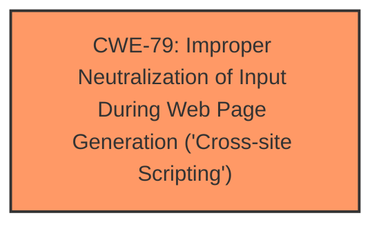

# Analysis for CVE-2022-36340

# Summary
| CWE ID | CWE Name | Confidence | CWE Abstraction Level | CWE Vulnerability Mapping Label | CWE-Vulnerability Mapping Notes |
|---|---|---|---|---|---|
| CWE-79 | Improper Neutralization of Input During Web Page Generation ('Cross-site Scripting') | 1.0 | Base | Allowed | Primary CWE |

## Evidence and Confidence

*   **Confidence Score:** 1.0
*   **Evidence Strength:** HIGH

## Relationship Analysis
The primary relationship that influenced my decision was the direct mapping of the vulnerability description to **CWE-79** (Improper Neutralization of Input During Web Page Generation ('Cross-site Scripting')). **CWE-79** is a base-level CWE, which aligns well with the identified weakness.

## Vulnerability Chain
The vulnerability chain consists of:
1.  Improper handling of `post-meta` shortcode (Root Cause: **CWE-79**)

## Summary of Analysis
The analysis revealed a clear Cross-Site Scripting (**CWE-79**) vulnerability due to the improper handling of the `post-meta` shortcode in the MailOptin plugin.

The evidence from the "CVE Reference Links Content Summary" section explicitly states: "* Security: Fixed XSS from post-meta shortcode in email campaign builder.*" This directly supports the selection of **CWE-79**.

The confidence in this assessment is high (1.0) due to the direct and explicit evidence linking the vulnerability to Cross-Site Scripting. **CWE-79** is at the optimal level of specificity (Base) as it accurately describes the **WEAKNESS**.

**CWEs Considered But Not Used:**

*   **CWE-116 (Improper Encoding or Escaping of Output):** While related to output handling, the core issue is the lack of neutralization of input for web page generation, making **CWE-79** a more precise fit.
*   **CWE-862 (Missing Authorization) / CWE-863 (Incorrect Authorization):** The vulnerability is not primarily related to missing or incorrect authorization checks, but rather to the improper handling of input that leads to XSS.
*   **CWE-22 (Improper Limitation of a Pathname to a Restricted Directory 'Path Traversal') / CWE-73 (External Control of File Name or Path):** These CWEs are related to file path manipulation, which is not the case here.
*   **CWE-352 (Cross-Site Request Forgery (CSRF)):** There's no indication of CSRF in the provided vulnerability description.
*   **CWE-359 (Exposure of Private Personal Information to an Unauthorized Actor):** The vulnerability description does not mention any exposure of private personal information.
*   **CWE-425 (Direct Request ('Forced Browsing')):** The description does not indicate missing or inadequate authorization on restricted URLs.
*   **CWE-502 (Deserialization of Untrusted Data):** The vulnerability description does not mention deserialization of untrusted data.
*   **CWE-1390 (Weak Authentication):** The description does not suggest any issue with the authentication mechanism.