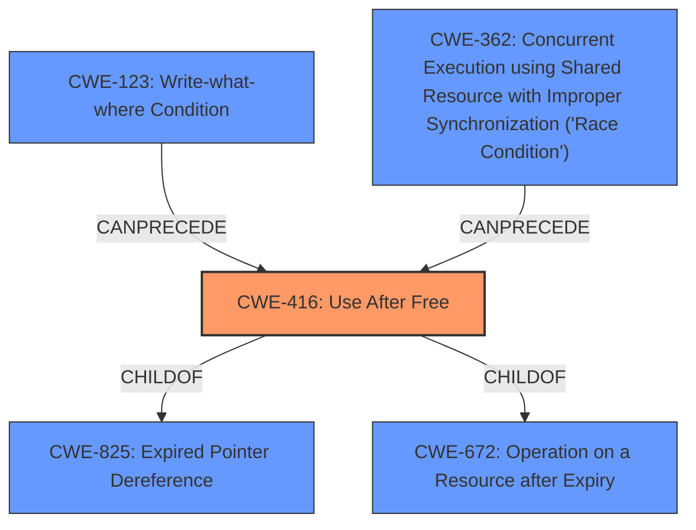

# Enhanced Analysis for CVE-2022-3636

# Summary
| CWE ID  | CWE Name                                                                          | Confidence | CWE Abstraction Level | CWE Vulnerability Mapping Label | CWE-Vulnerability Mapping Notes |
| :-------- | :---------------------------------------------------------------------------------- | :--------- | :---------------------- | :------------------------------ | :------------------------------ |
| CWE-416 | Use After Free                                                                  | 1.0        | Variant                 | Primary                         | Allowed                       |

## Evidence and Confidence

*   **Confidence Score:** 1.0
*   **Evidence Strength:** HIGH

## Relationship Analysis
The primary CWE identified is CWE-416 (**Use After Free**).

-   CWE-416 is a Variant of CWE-825 (**Expired Pointer Dereference**) and CWE-672 (**Operation on a Resource after Expiry**). This indicates that CWE-416 represents a specific type of resource expiry issue where memory is accessed after being freed.
-   CWE-416 can be preceded by CWE-123 (**Write-what-where Condition**), suggesting a potential chain where an attacker gains the ability to write to arbitrary memory locations after a free operation.
-   CWE-362 (**Concurrent Execution using Shared Resource with Improper Synchronization ('Race Condition')**) can lead to a use-after-free (CWE-416).



## Vulnerability Chain
The vulnerability chain starts with the **incorrect use of** `hlist_for_each_entry()` **instead of the safe version** `hlist_for_each_entry_safe` **in a situation where the list entries are potentially being deleted during iteration**. This leads to a **Use After Free** (CWE-416). The impact of exploiting this vulnerability includes denial-of-service (DoS) or potentially arbitrary code execution.

## Summary of Analysis
The initial analysis correctly identifies the **use after free** vulnerability based on the vulnerability description and the CVE Reference Links Content Summary. The **weakness** is clearly stated in the Vulnerability Description Key Phrases.

The selection of CWE-416 is strongly supported by the evidence. The vulnerability description explicitly mentions a "**use after free**". The CVE Reference Links Content Summary confirms this, stating that the root cause is the incorrect use of `hlist_for_each_entry()` which frees a memory location that is later accessed, leading to a "**use-after-free vulnerability**".

The graph relationships confirm that CWE-416 is a specific type of memory safety issue, making it an appropriate and specific classification. CWE-416 is at the Variant level of abstraction, which is the preferred level of abstraction for mapping to the root causes of vulnerabilities.

Relevant CWE Information:

# Enhanced Context (25 CWEs)
The following CWEs were identified as potentially relevant to this vulnerability:

## CWE-131: Incorrect Calculation of Buffer Size
**Abstraction Level**: Base
**Similarity Score**: 0.77
**Source**: dense
**Description**:
The product does not correctly calculate the size to be used when allocating a buffer, which could lead to a buffer overflow.
**Rationale for not selecting**: This CWE relates to incorrect buffer size calculation, which is not the primary issue in the vulnerability description. The vulnerability is related to **use after free** and not the buffer size.

## CWE-125: Out-of-bounds Read
**Abstraction Level**: Base
**Similarity Score**: 0.77
**Source**: dense
**Description**:
The product reads data past the end, or before the beginning, of the intended buffer.
**Rationale for not selecting**: This CWE relates to reading beyond buffer boundaries, which is not the primary issue. The vulnerability focuses on accessing memory after it has been freed.

## CWE-191: Integer Underflow (Wrap or Wraparound)
**Abstraction Level**: Base
**Similarity Score**: 0.77
**Source**: dense
**Description**:
The product subtracts one value from another, such that the result is less than the minimum allowable integer value, which produces a value that is not equal to the correct result.
**Rationale for not selecting**: This CWE relates to integer underflow, which is not relevant to the vulnerability description. The vulnerability is focused on **use after free**.

## CWE-362: Concurrent Execution using Shared Resource with Improper Synchronization ('Race Condition')
**Abstraction Level**: Class
**Similarity Score**: 0.76
**Source**: dense
**Description**:
The product contains a concurrent code sequence that requires temporary, exclusive access to a shared resource, but a timing window exists in which the shared resource can be modified by another code sequence operating concurrently.
**Rationale for not selecting**: While a race condition could potentially lead to a use-after-free, the primary **weakness** described is the **use after free** itself.

## CWE-667: Improper Locking
**Abstraction Level**: Class
**Similarity Score**: 0.76
**Source**: dense
**Description**:
The product does not properly acquire or release a lock on a resource, leading to unexpected resource state changes and behaviors.
**Rationale for not selecting**: Improper locking might be a contributing factor, but the core issue is accessing memory after it has been freed, not the locking mechanism itself.

## CWE-126: Buffer Over-read
**Abstraction Level**: Variant
**Similarity Score**: 0.76
**Source**: dense
**Description**:
The product reads from a buffer using buffer access mechanisms such as indexes or pointers that reference memory locations after the targeted buffer.
**Rationale for not selecting**: Similar to CWE-125, this relates to reading beyond buffer boundaries and is not the primary vulnerability.

## CWE-130: Improper Handling of Length Parameter Inconsistency
**Abstraction Level**: Base
**Similarity Score**: 0.76
**Source**: dense
**Description**:
The product parses a formatted message or structure, but it does not handle or incorrectly handles a length field that is inconsistent with the actual length of the associated data.
**Rationale for not selecting**: This CWE is not relevant to the vulnerability.

## CWE-908: Use of Uninitialized Resource
**Abstraction Level**: Base
**Similarity Score**: 0.76
**Source**: dense
**Description**:
The product uses or accesses a resource that has not been initialized.
**Rationale for not selecting**: This CWE is about using uninitialized resources, not resources that have been freed.

## CWE-404: Improper Resource Shutdown or Release
**Abstraction Level**: Class
**Similarity Score**: 0.75
**Source**: dense
**Description**:
The product does not release or incorrectly releases a resource before it is made available for re-use.
**Rationale for not selecting**: While resource release is related, the core problem is accessing the resource *after* it has been released.

## CWE-805: Buffer Access with Incorrect Length Value
**Abstraction Level**: Base
**Similarity Score**: 0.75
**Source**: dense
**Description**:
The product uses a sequential operation to read or write a buffer, but it uses an incorrect length value that causes it to access memory that is outside of the bounds of the buffer.
**Rationale for not selecting**: This CWE relates to incorrect length values in buffer access, which is not the primary issue.

## CWE-364: Signal Handler Race Condition
**Abstraction Level**: Base
**Similarity Score**: 8253.31
**Source**: sparse
**Description**:
The product uses a signal handler that introduces a race condition.
**Rationale for not selecting**: While race conditions are possible, the described vulnerability is primarily a **use after free** rather than being directly caused by a signal handler.

## CWE-362: Concurrent Execution using Shared Resource with Improper Synchronization ('Race Condition')
**Abstraction Level**: Class
**Similarity Score**: 7593.76
**Source**: sparse
**Description**:
The product contains a concurrent code sequence that requires temporary, exclusive access to a shared resource, but a timing window exists in which the shared resource can be modified by another code sequence operating concurrently.
**Rationale for not selecting**: Although concurrency issues could potentially lead to a **use


## CWE Relationship Analysis

Current CWEs represent these abstraction levels: .


### Vulnerability Chain Analysis

**Chain starting from CWE-131:**
- 131 (Incorrect Calculation of Buffer Size) - ROOT


**Chain starting from CWE-825:**
- 825 (Expired Pointer Dereference) - ROOT


### CWE Relationship Diagram

```mermaid
graph TD
    classDef primary fill:#f96,stroke:#333,stroke-width:2px
    classDef secondary fill:#69f,stroke:#333
    classDef tertiary fill:#9e9,stroke:#333
```