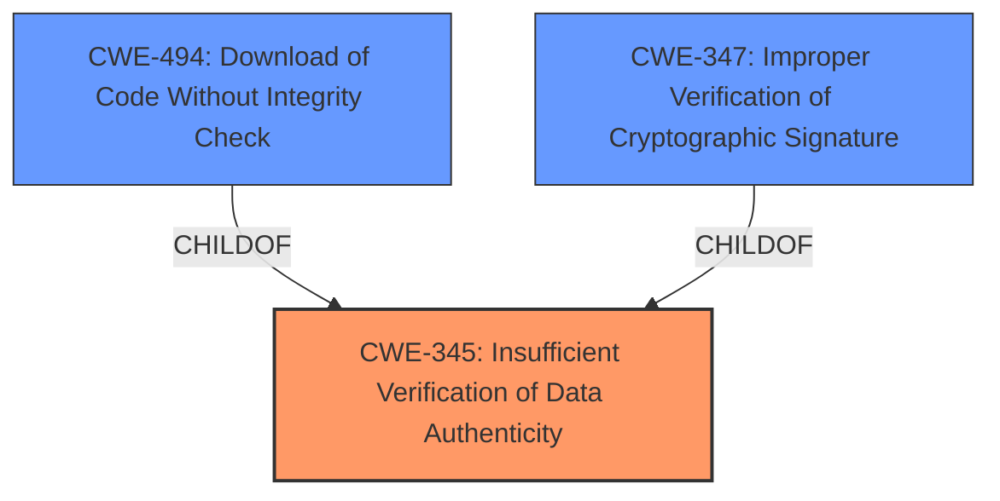

# Analysis Report for CVE-2022-36360

# Vulnerability Analysis Report: CVE-2022-36360

## Description


## Analysis (with Relationship Data)

# Summary
| CWE ID | CWE Name | Confidence | CWE Abstraction Level | CWE Vulnerability Mapping Label | CWE-Vulnerability Mapping Notes |
|---|---|---|---|---|---|
| CWE-345 | Insufficient Verification of Data Authenticity | 1.0 | Class | Primary | Allowed-with-Review |
| CWE-494 | Download of Code Without Integrity Check | 0.8 | Base | Secondary | Allowed |
| CWE-347 | Improper Verification of Cryptographic Signature | 0.6 | Base | Secondary | Allowed |

## Evidence and Confidence

*   **Confidence Score:** 0.9
*   **Evidence Strength:** HIGH

## Relationship Analysis
The primary CWE selected is CWE-345, which is a Class-level CWE. While it's generally preferred to map to Base or Variant levels, the evidence directly supports the **insufficient verification of data authenticity**. CWE-347 is a child of CWE-345 and is more specific (Improper Verification of Cryptographic Signature) but the description does not mention signatures, so it is a secondary candidate. CWE-494 (Download of Code Without Integrity Check) is also a child of CWE-345 and is considered as the firmware is downloaded without integrity checks.mermaid



## Vulnerability Chain
The vulnerability chain starts with the **root cause** of **loading firmware updates without checking authenticity**. This leads to the potential **impact** of flashing manipulated firmware onto the device.

## Summary of Analysis
The initial analysis focused on the **root cause** identified in the vulnerability description: **"loading firmware updates without checking the authenticity."** The CVE Reference Links Content Summary reinforces this by stating that the affected devices load firmware updates without properly checking their authenticity and use a non-cryptographic method to verify integrity.

The primary CWE match is CWE-345 (Insufficient Verification of Data Authenticity). This aligns with the observed behavior of the device loading firmware without proper authenticity checks. While CWE-345 is a Class-level CWE, it directly reflects the **root cause** described in the vulnerability report.

CWE-494 (Download of Code Without Integrity Check) is a related CWE, as it describes the scenario of downloading code without sufficient verification, aligning with the firmware update process.

CWE-347 (Improper Verification of Cryptographic Signature) was considered because cryptographic signatures provide strong authenticity guarantees. However, the description states that the integrity of the unencrypted firmware is verified by a non-cryptographic method, making CWE-347 less directly applicable, but still a possibility as the non-cryptographic method is insufficient.

The selection of CWE-345 is justified by the direct evidence of insufficient authenticity verification during firmware updates. While more specific CWEs exist, CWE-345 accurately captures the **root cause** of the vulnerability. The other two are secondary considerations.

Relevant CWE Information:
```
## CWE-345: Insufficient Verification of Data Authenticity
**Abstraction Level**: Class
**Similarity Score**: 0.80
**Source**: dense

**Description**:
The product does not sufficiently verify the origin or authenticity of data, in a way that causes it to accept invalid data.
```
```
## CWE-494: Download of Code Without Integrity Check
**Abstraction Level**: Base
**Similarity Score**: 0.336
**Source**: sparse

**Description**:
The product downloads source code or an executable from a remote location and executes the code without sufficiently verifying the origin and integrity of the code.
```
```
## CWE-347: Improper Verification of Cryptographic Signature
**Abstraction Level**: Base
**Similarity Score**: 0.352
**Source**: sparse

**Description**:
The product does not verify, or incorrectly verifies, the cryptographic signature for data.
```
```


## CWE Relationship Analysis

Current CWEs represent these abstraction levels: .


### Vulnerability Chain Analysis

**Chain starting from CWE-345:**
- 345 (Insufficient Verification of Data Authenticity) - ROOT


**Chain starting from CWE-494:**
- 494 (Download of Code Without Integrity Check) - ROOT


### CWE Relationship Diagram

```mermaid
graph TD
    classDef primary fill:#f96,stroke:#333,stroke-width:2px
    classDef secondary fill:#69f,stroke:#333
    classDef tertiary fill:#9e9,stroke:#333
```


*Report generated on 2025-03-30 14:43:59*
