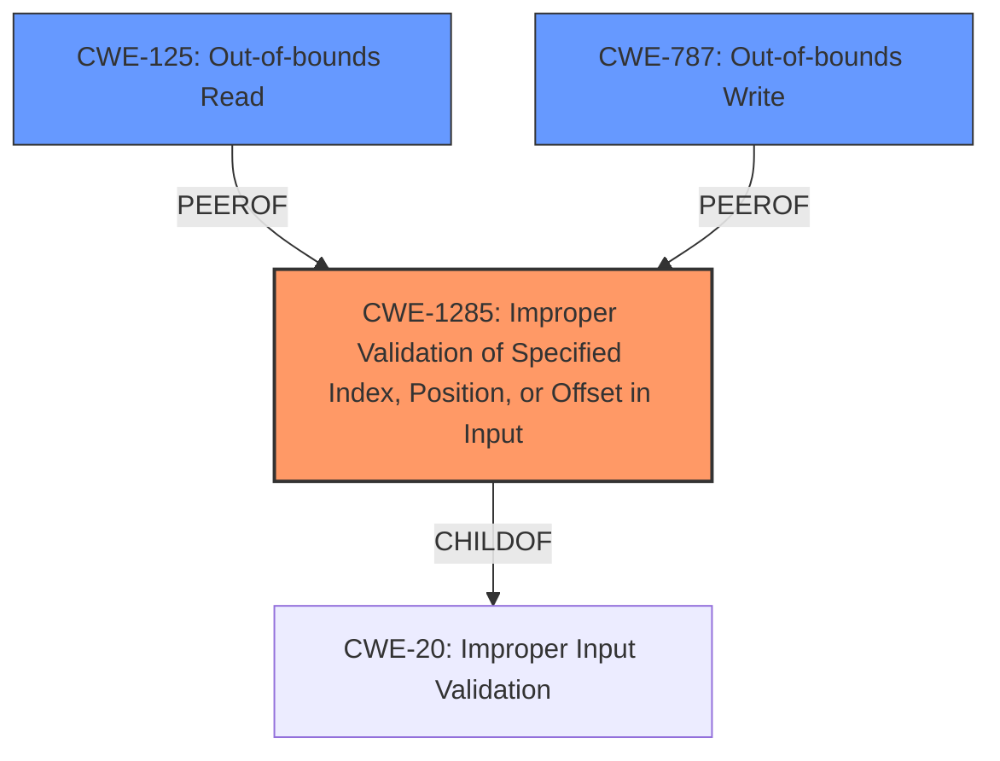

# Raw Analyzer Response for CVE-2022-36363

# Summary
| CWE ID  | CWE Name                                                                  | Confidence | CWE Abstraction Level | CWE Vulnerability Mapping Label | CWE-Vulnerability Mapping Notes |
| :-------- | :------------------------------------------------------------------------ | :--------- | :---------------------- | :------------------------------ | :------------------------------ |
| CWE-1285  | Improper Validation of Specified Index, Position, or Offset in Input    | 0.9        | Base                    | Primary CWE                     | Allowed                       |
| CWE-125   | Out-of-bounds Read                                                        | 0.6        | Base                    | Secondary Candidate             | Allowed                       |
| CWE-787   | Out-of-bounds Write                                                       | 0.6        | Base                    | Secondary Candidate             | Allowed                       |

## Evidence and Confidence

*   **Confidence Score:** 0.8
*   **Evidence Strength:** HIGH

## Relationship Analysis
The primary CWE, CWE-1285, is a base-level weakness focusing on the improper validation of input that specifies an index, position, or offset. The vulnerability description clearly states that the affected devices **do not properly validate an offset value**. CWE-1285 is a child of CWE-20 (Improper Input Validation), indicating that it's a more specific type of input validation issue. The possible consequences of this improper validation, namely the ability to retrieve parts of the memory, suggest potential out-of-bounds access. This connection justifies considering CWE-125 (Out-of-bounds Read) and CWE-787 (Out-of-bounds Write) as secondary candidates, as memory retrieval could involve reading outside the intended boundaries, and improper offset handling could lead to writing to unintended memory locations as well.

## Vulnerability Chain
The vulnerability chain starts with the **improper validation of the offset value** (CWE-1285). This lack of validation can lead to an attacker supplying an offset that is outside the intended memory boundaries. Depending on how this offset is used, it could result in reading data from unintended memory locations (CWE-125) or writing data to unintended memory locations (CWE-787), both of which could lead to information disclosure or potentially other impacts.

## Summary of Analysis
Initially, the vulnerability description pointed strongly towards an input validation issue related to offset values, supported by the key phrase "**do not properly validate an offset value**". The CVE Reference Links Content Summary further reinforced this by explicitly stating: "The affected devices do not properly validate an offset value that can be defined in TCP packets when calling a method," and "Improper validation of a specified index, position, or offset in input." This aligns perfectly with CWE-1285.

The retriever results also listed CWE-1285 as the top candidate. The description for CWE-1285, "The product receives input that is expected to specify an index, position, or offset into an indexable resource such as a buffer or file, but it does not validate or incorrectly validates that the specified index/position/offset has the required properties," is a direct match to the vulnerability.

Although the primary weakness is the lack of input validation (CWE-1285), the impact (retrieving parts of the content of the memory) suggests that this could lead to out-of-bounds read (CWE-125) or out-of-bounds write (CWE-787) if the offset is used to access memory locations outside the intended buffer. Because of the potential for out-of-bounds access due to the offset, I am including those as secondary candidates.

The selected CWEs are at the optimal level of specificity because CWE-1285 directly addresses the root cause (improper offset validation), while CWE-125 and CWE-787 capture potential consequences stemming from this root cause. More general CWEs like CWE-20 (Improper Input Validation) are less specific and do not capture the precise nature of the vulnerability.