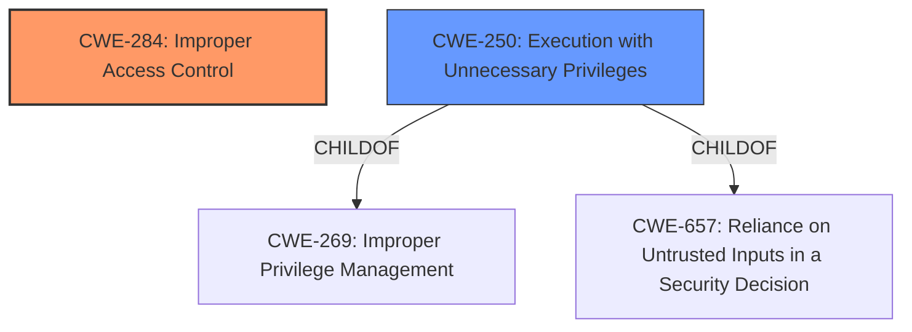

# Raw Analyzer Response for CVE-2022-36369

# Summary
| CWE ID | CWE Name | Confidence | CWE Abstraction Level | CWE Vulnerability Mapping Label | CWE-Vulnerability Mapping Notes |
|---|---|---|---|---|---|
| CWE-284 | Improper Access Control | 0.8 | Pillar | Primary | Discouraged |
| CWE-250 | Execution with Unnecessary Privileges | 0.6 | Base | Secondary | Allowed |

## Evidence and Confidence

*   **Confidence Score:** 0.7
*   **Evidence Strength:** MEDIUM

## Relationship Analysis
The primary CWE selected is CWE-284, Improper Access Control, which is a high-level Pillar. Due to the limited information, a more specific CWE could not be determined. CWE-250, Execution with Unnecessary Privileges, is a base-level CWE that could potentially be associated, especially if the improper access control leads to running processes with higher privileges than necessary.

## Vulnerability Chain
The vulnerability chain starts with the **improper access control**, potentially leading to escalation of privileges. A potential chain could be:

1.  **Improper Access Control** (CWE-284): The root cause is the **improper access control** within the QATzip software.
2.  Escalation of Privilege: The impact is the potential for an authenticated user to escalate their privileges via local access.
3.  Execution with Unnecessary Privileges (CWE-250): If the access control issue results in the program running with elevated privileges.

## Summary of Analysis
The initial assessment identified **improper access control** as the primary weakness. The retriever results also highlighted CWE-284, Improper Access Control, as a relevant candidate, although it is a high-level Pillar. The evidence from the vulnerability description and CVE summary supports this classification. The relationships analysis considered more specific child CWEs of CWE-284, but the available information does not allow for a more precise mapping.

CWE-284 is selected as the primary CWE because the vulnerability description explicitly mentions **improper access control** as the root cause. The CVE Reference Links Content Summary reinforces this by stating that the **root cause of the vulnerability** is **improper access control** in QATzip software.

The selection of CWE-284 is based on the provided evidence only, specifically the "**rootcause:** **improper access control**" phrase from the Vulnerability Description Key Phrases and the "Root cause of vulnerability: Improper access control in QATzip software" from the CVE Reference Links Content Summary.

CWE-250 is considered a secondary weakness because the **improper access control** might lead to the program running with unnecessary privileges, which amplifies the consequences of the initial weakness.

The selected CWEs are at the appropriate level of specificity given the available information. While more specific CWEs might exist, the current evidence does not support a more detailed classification.

Relevant CWE Information:
*   CWE-691, CWE-653, CWE-667, CWE-274, CWE-703, CWE-664, CWE-754, CWE-404, CWE-668, CWE-1220, CWE-119, CWE-863, CWE-1257, CWE-639, CWE-125, CWE-193, CWE-322, CWE-787, CWE-190, CWE-825, CWE-170, CWE-1260, CWE-822, CWE-287, CWE-453, CWE-248

CWEs Considered but Not Used:

*   CWE-119 (Improper Restriction of Operations within the Bounds of a Memory Buffer): While this CWE has a high similarity score, the description focuses on memory buffer operations, which are not explicitly mentioned in the vulnerability description. The root cause is **improper access control**, not necessarily a memory-related issue. Therefore, CWE-119 is not the most appropriate mapping.
*   CWE-863 (Incorrect Authorization): This is a child of CWE-284. While authorization is a form of access control, the description doesn't specify whether authorization checks are incorrect. It simply states **improper access control**.
*   CWE-277 (Insecure Inherited Permissions): While this is related to permissions, there's no explicit mention of insecure inherited permissions in the description.
*   CWE-250 (Execution with Unnecessary Privileges): Although this is a possibility, the primary issue is the **improper access control**. This CWE could be a consequence of the access control issue, but it is not the root cause.