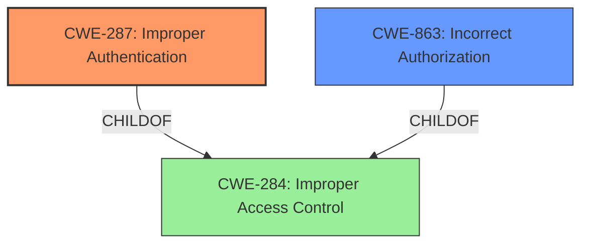

# Analysis for CVE-2022-36370

# Summary
| CWE ID | CWE Name | Confidence | CWE Abstraction Level | CWE Vulnerability Mapping Label | CWE-Vulnerability Mapping Notes |
|---|---|---|---|---|---|
| CWE-287 | Improper Authentication | 0.8 | Class | Primary | Discouraged |
| CWE-863 | Incorrect Authorization | 0.6 | Class | Secondary | Allowed-with-Review |

## Evidence and Confidence

*   **Confidence Score:** 0.8
*   **Evidence Strength:** HIGH

## Relationship Analysis
The primary CWE, CWE-287 **Improper Authentication**, is a child of CWE-284 **Improper Access Control**. CWE-863 **Incorrect Authorization** is a peer of CWE-287 **Improper Authentication**, both stemming from access control issues. The abstraction level for both chosen CWEs is Class, as the vulnerability manifests as a high-level authentication problem that could potentially have more specific underlying causes.

## Vulnerability Chain
The vulnerability chain starts with **Improper Authentication** which leads to potential privilege escalation. The user gains unauthorized access due to the **authentication** flaw, and can then perform actions they should not be authorized to do.

## Summary of Analysis
The initial assessment identified **Improper Authentication** as the primary weakness. The vulnerability description explicitly mentions **"Improper authentication"** as the root cause, which aligns directly with CWE-287. The "CVE Reference Links Content Summary" further supports this by stating, "Root cause of vulnerability: **Improper authentication** in BIOS firmware."

While CWE-287 is a class-level CWE and discouraged for use when more specific options are available, the provided information does not offer sufficient detail to pinpoint a more precise root cause. Therefore, it's the most appropriate choice based on the available evidence.

CWE-863 **Incorrect Authorization** was considered as a secondary CWE because **improper authentication** often leads to **incorrect authorization**. If a user is not properly authenticated, they may gain access to resources or actions that they are not authorized to perform. While **improper authentication** is the primary issue, the resulting access to privileged functions makes **incorrect authorization** a relevant secondary concern.

Other CWEs considered but not selected:
*   CWE-119 **Improper Restriction of Operations within the Bounds of a Memory Buffer**: This is not related, the description does not indicate any memory buffer issues.
*   CWE-453 **Insecure Default Variable Initialization**: Although this CWE had a relatively high retriever score, there is no indication in the description that the vulnerability involves insecure default variable initialization.
*   CWE-691 **Insufficient Control Flow Management**, CWE-693 **Protection Mechanism Failure**, CWE-284 **Improper Access Control**: These are higher level pillars and classes, but we have a more specific class for **Improper Authentication** that is a child of **Improper Access Control**.
*   CWE-1256 **Improper Restriction of Software Interfaces to Hardware Features**: While the vulnerability is in the BIOS firmware, the issue is not related to improper restriction of software interfaces to hardware features. It is more directly related to authentication.
*   CWE-617 **Reachable Assertion**: This is not related, the description does not indicate any assertion issues.

The final selection of CWE-287 and CWE-863 is based on the explicit mention of **improper authentication** in the vulnerability description and CVE reference, as well as the understanding that **improper authentication** often leads to **incorrect authorization**, with both fitting the general flaw of access control.
# Enhanced Context (25 CWEs)
The following CWEs were identified as potentially relevant to this vulnerability:

## CWE-693: Protection Mechanism Failure
**Abstraction Level**: Pillar
**Similarity Score**: 0.76
**Source**: dense

**Description**:
The product does not use or incorrectly uses a protection mechanism that provides sufficient defense against directed attacks against the product.

**Mapping Guidance**:
- Usage: Discouraged
- Rationale: This CWE entry is extremely high-level, a Pillar.

## CWE-691: Insufficient Control Flow Management
**Abstraction Level**: Pillar
**Similarity Score**: 0.76
**Source**: dense

**Description**:
The code does not sufficiently manage its control flow during execution, creating conditions in which the control flow can be modified in unexpected ways.

**Mapping Guidance**:
- Usage: Discouraged
- Rationale: This CWE entry is extremely high-level, a Pillar. However, classification research is limited for weaknesses of this type, so there can be gaps or organizational difficulties within CWE that force use of this weakness, even at such a high level of abstraction.

## CWE-703: Improper Check or Handling of Exceptional Conditions
**Abstraction Level**: Pillar
**Similarity Score**: 0.75
**Source**: dense

**Description**:
The product does not properly anticipate or handle exceptional conditions that rarely occur during normal operation of the product.

**Mapping Guidance**:
- Usage: Discouraged
- Rationale: This CWE entry is extremely high-level, a Pillar.

## CWE-664: Improper Control of a Resource Through its Lifetime
**Abstraction Level**: Pillar
**Similarity Score**: 0.75
**Source**: dense

**Description**:
The product does not maintain or incorrectly maintains control over a resource throughout its lifetime of creation, use, and release.

**Mapping Guidance**:
- Usage: Discouraged
- Rationale: This CWE entry is high-level when lower-level children are available.

## CWE-653: Improper Isolation or Compartmentalization
**Abstraction Level**: Class
**Similarity Score**: 0.74
**Source**: dense

**Description**:
The product does not properly compartmentalize or isolate functionality, processes, or resources that require different privilege levels, rights, or permissions.

**Mapping Guidance**:
- Usage: Allowed
- Rationale: This CWE entry is at the Base level of abstraction, which is a preferred level of abstraction for mapping to the root causes of vulnerabilities.

## CWE-274: Improper Handling of Insufficient Privileges
**Abstraction Level**: Base
**Similarity Score**: 0.74
**Source**: dense

**Description**:
The product does not handle or incorrectly handles when it has insufficient privileges to perform an operation, leading to resultant weaknesses.

**Mapping Guidance**:
- Usage: Discouraged
- Rationale: This CWE entry could be deprecated in a future version of CWE.

## CWE-1220: Insufficient Granularity of Access Control
**Abstraction Level**: Base
**Similarity Score**: 0.74
**Source**: dense

**Description**:
The product implements access controls via a policy or other feature with the intention to disable or restrict accesses (reads and/or writes) to assets in a system from untrusted agents. However, implemented access controls lack required granularity, which renders the control policy too broad because it allows accesses from unauthorized agents to the security-sensitive assets.

**Mapping Guidance**:
- Usage: Allowed
- Rationale: This CWE entry is at the Base level of abstraction, which is a preferred level of abstraction for mapping to the root causes of vulnerabilities.

## CWE-657: Violation of Secure Design Principles
**Abstraction Level**: Class
**Similarity Score**: 0.73
**Source**: dense

**Description**:
The product violates well-established principles for secure design.

**Mapping Guidance**:
- Usage: Discouraged
- Rationale: This CWE entry is a level-1 Class (i.e., a child of a Pillar). It might have lower-level children that would be more appropriate

## CWE-667: Improper Locking
**Abstraction Level**: Class
**Similarity Score**: 0.73
**Source**: dense

**Description**:
The product does not properly acquire or release a lock on a resource, leading to unexpected resource state changes and behaviors.

**Mapping Guidance**:
- Usage: Allowed-with-Review
- Rationale: This CWE entry is a Class and might have Base-level children that would be more appropriate

## CWE-1299: Missing Protection Mechanism for Alternate Hardware Interface
**Abstraction Level**: Base
**Similarity Score**: 0.73
**Source**: dense

**Description**:
The lack of protections on alternate paths to access
                control-protected assets (such as unprotected shadow registers
                and other external facing unguarded interfaces) allows an
                attacker to bypass existing protections to the asset that are
		only performed against the primary path.

**Mapping Guidance**:
- Usage: Allowed
- Rationale: This CWE entry is at the