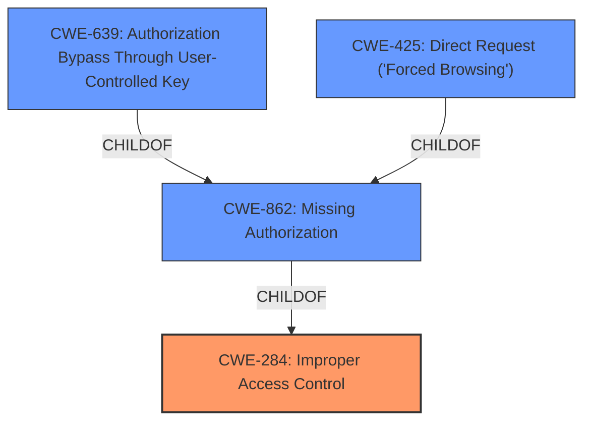

# Analysis Report for CVE-2022-36375

# Vulnerability Analysis Report: CVE-2022-36375

## Description


## Analysis (with Relationship Data)

# Summary
| CWE ID | CWE Name | Confidence | CWE Abstraction Level | CWE Vulnerability Mapping Label | CWE-Vulnerability Mapping Notes |
|---|---|---|---|---|---|
| CWE-284 | Improper Access Control | 0.8 | Pillar | Primary | Discouraged |
| CWE-862 | Missing Authorization | 0.7 | Class | Secondary | Allowed-with-Review |
| CWE-639 | Authorization Bypass Through User-Controlled Key | 0.6 | Base | Secondary | Allowed |
| CWE-425 | Direct Request ('Forced Browsing') | 0.5 | Base | Secondary | Allowed |

## Evidence and Confidence

*   **Confidence Score:** 0.7
*   **Evidence Strength:** HIGH

## Relationship Analysis
The primary relationship that influenced the decision was the parent-child relationship between CWE-284 (Improper Access Control), CWE-862 (Missing Authorization), and CWE-639 (Authorization Bypass Through User-Controlled Key). CWE-284 is a high-level pillar, while CWE-862 is a Class, and CWE-639 and CWE-425 are Base level. The vulnerability involves access control issues due to **missing authorization** and **improper authorization**, which are more specific than just "improper access control".



## Vulnerability Chain
The vulnerability chain starts with the **missing authorization** checks in the WordPress plugin, leading to the ability for authenticated users with high roles to modify options. This results in potential unauthorized access and modification of sensitive data.

## Summary of Analysis
The initial analysis considered CWE-284, CWE-862, CWE-639, and CWE-425 due to their relevance to access control issues and the retriever results. The final selection was based on the evidence from the vulnerability description and CVE details, highlighting the **lack of proper authorization** and **broken access control**.

The vulnerability description states, "**wordpress options change vulnerability** in Biplob Adhikaris Tabs plugin <= 3.6.0 at WordPress." The CVE reference links content summary confirms, "The vulnerability is a Broken Access Control issue. The core problem lies in the **lack of proper authorization**, authentication, or nonce token checks in certain functions of the WordPress Tabs plugin. This allows unprivileged users to execute actions that should be restricted to higher privilege levels, like administrators."

CWE-284 is a high-level classification and is generally discouraged. However, it is the best fit as the primary CWE because the core problem is a **broken access control** issue. CWE-862, CWE-639, and CWE-425 are considered secondary because they provide more specific details. CWE-862 (Missing Authorization) accurately captures the **lack of authorization checks**. CWE-639 (Authorization Bypass Through User-Controlled Key) is relevant because the vulnerability allows users to bypass authorization by manipulating keys. CWE-425 (Direct Request ('Forced Browsing')) is relevant because the plugin does not adequately enforce appropriate authorization on all restricted URLs, scripts, or files.

The selected CWEs are at the optimal level of specificity because they represent the **root cause** of the vulnerability (CWE-284), as well as the technical details of the **missing authorization checks** (CWE-862, CWE-639, CWE-425).

Relevant CWE Information:

# Enhanced Context (25 CWEs)
The following CWEs were identified as potentially relevant to this vulnerability:

## CWE-639: Authorization Bypass Through User-Controlled Key
**Abstraction Level**: Base
**Similarity Score**: 0.77
**Source**: dense

**Description**:
The system's authorization functionality does not prevent one user from gaining access to another user's data or record by modifying the key value identifying the data.

**Mapping Guidance**:
- Usage: Allowed
- Rationale: This CWE entry is at the Base level of abstraction, which is a preferred level of abstraction for mapping to the root causes of vulnerabilities.

**Explanation:** This CWE is relevant because the vulnerability allows users to bypass authorization by manipulating keys.

## CWE-472: External Control of Assumed-Immutable Web Parameter
**Abstraction Level**: Base
**Similarity Score**: 0.77
**Source**: dense

**Description**:
The web application does not sufficiently verify inputs that are assumed to be immutable but are actually externally controllable, such as hidden form fields.

**Mapping Guidance**:
- Usage: Allowed
- Rationale: This CWE entry is at the Base level of abstraction, which is a preferred level of abstraction for mapping to the root causes of vulnerabilities.

**Explanation:** This CWE is relevant because the **plugin does not properly validate inputs**, which can lead to processing incorrect input.

## CWE-807: Reliance on Untrusted Inputs in a Security Decision
**Abstraction Level**: Base
**Similarity Score**: 0.75
**Source**: dense

**Description**:
The product uses a protection mechanism that relies on the existence or values of an input, but the input can be modified by an untrusted actor in a way that bypasses the protection mechanism.

**Mapping Guidance**:
- Usage: Allowed
- Rationale: This CWE entry is at the Base level of abstraction, which is a preferred level of abstraction for mapping to the root causes of vulnerabilities.

**Explanation:** This CWE is relevant because the **plugin relies on untrusted inputs** for security decisions.

## CWE-1220: Insufficient Granularity of Access Control
**Abstraction Level**: Base
**Similarity Score**: 0.75
**Source**: dense

**Description**:
The product implements access controls via a policy or other feature with the intention to disable or restrict accesses (reads and/or writes) to assets in a system from untrusted agents. However, implemented access controls lack required granularity, which renders the control policy too broad because it allows accesses from unauthorized agents to the security-sensitive assets.

**Mapping Guidance**:
- Usage: Allowed
- Rationale: This CWE entry is at the Base level of abstraction, which is a preferred level of abstraction for mapping to the root causes of vulnerabilities.

**Explanation:** This CWE is not as strong a fit as CWE-862 or CWE-639 but could be a contributing factor if the access controls are too broad.

## CWE-425: Direct Request ('Forced Browsing')
**Abstraction Level**: Base
**Similarity Score**: 0.75
**Source**: dense

**Description**:
The web application does not adequately enforce appropriate authorization on all restricted URLs, scripts, or files.

**Mapping Guidance**:
- Usage: Allowed
- Rationale: This CWE entry is at the Base level of abstraction, which is a preferred level of abstraction for mapping to the root causes of vulnerabilities.

**Explanation:** This CWE is relevant because the **plugin does not adequately enforce authorization** on all restricted resources.

## CWE-1390: Weak Authentication
**Abstraction Level**: Class
**Similarity Score**: 0.75
**Source**: dense

**Description**:
The product uses an authentication mechanism to restrict access to specific users or identities, but the mechanism does not sufficiently prove that the claimed identity is correct.

**Mapping Guidance**:
- Usage: Allowed-with-Review
- Rationale: This CWE entry is a Class and might have Base-level children that would be more appropriate

**Explanation:** This CWE is not directly relevant because the vulnerability focuses more on authorization issues than authentication.

## CWE-274: Improper Handling of Insufficient Privileges
**Abstraction Level**: Base
**Similarity Score**: 0.74
**Source**: dense

**Description**:
The product does not handle or incorrectly handles when it has insufficient privileges to perform an operation, leading to resultant weaknesses.

**Mapping Guidance**:
- Usage: Discouraged
- Rationale: This CWE entry could be deprecated in a future version of CWE.

**Explanation:** This CWE is not directly relevant but can be a secondary factor if the plugin incorrectly handles privilege levels.

## CWE-668: Exposure of Resource to Wrong Sphere
**Abstraction Level**: Class
**Similarity Score**: 0.74
**Source**: dense

**Description**:
The product exposes a resource to the wrong control sphere, providing unintended actors with inappropriate access to the resource.

**Mapping Guidance**:
- Usage: Discouraged
- Rationale: CWE-668 is high-


## CWE Relationship Analysis

Current CWEs represent these abstraction levels: .


### Vulnerability Chain Analysis

**Chain starting from CWE-862:**
- 862 (Missing Authorization) - ROOT


**Chain starting from CWE-425:**
- 425 (Direct Request ('Forced Browsing')) - ROOT


### CWE Relationship Diagram

```mermaid
graph TD
    classDef primary fill:#f96,stroke:#333,stroke-width:2px
    classDef secondary fill:#69f,stroke:#333
    classDef tertiary fill:#9e9,stroke:#333
```


*Report generated on 2025-03-30 11:23:47*
