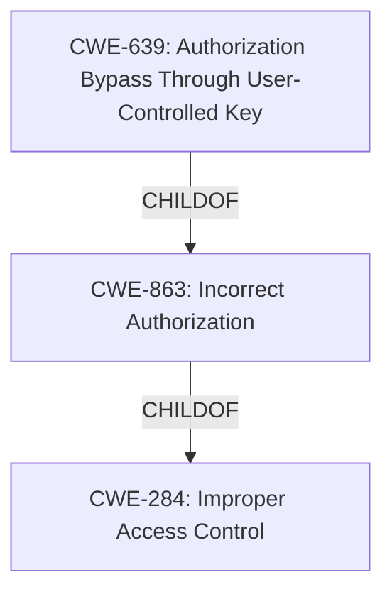

# Analysis Report for CVE-2022-36387

# Vulnerability Analysis Report: CVE-2022-36387

## Description


## Analysis (with Relationship Data)

# Summary
| CWE ID | CWE Name | Confidence | CWE Abstraction Level | CWE Vulnerability Mapping Label | CWE-Vulnerability Mapping Notes |
|---|---|---|---|---|---|
| CWE-284 | Improper Access Control | 0.8 | Pillar | Primary | Discouraged |
| CWE-639 | Authorization Bypass Through User-Controlled Key | 0.6 | Base | Secondary | Allowed |

## Evidence and Confidence

*   **Confidence Score:** 0.7
*   **Evidence Strength:** LOW

## Relationship Analysis
The primary relationship influencing the decision is the hierarchical structure, specifically the parent-child relationship between CWE-284 (Improper Access Control) and CWE-639 (Authorization Bypass Through User-Controlled Key). While CWE-639 is a more specific child of CWE-284 and fits the description better, the evidence is too weak to confidently choose it. The tool suggested choosing lower-level CWEs, but ultimately, due to the lack of information, the high-level CWE-284 is the better choice.



## Vulnerability Chain
The vulnerability chain is relatively simple:

1.  **Root Cause:** **Broken access control** (**CWE-284**) due to an unspecified flaw in the plugin.
2.  **Potential Weakness:** Possibly **Authorization Bypass Through User-Controlled Key (CWE-639)**, but evidence is insufficient.
3.  **Impact:** Unauthorized access to resources or data.

The missing link is the specific mechanism of the access control bypass.

## Summary of Analysis
Initial Analysis:
The vulnerability description indicates a **broken access control** issue in a WordPress plugin. The key phrase "**broken access control**" directly points towards CWE-284 (Improper Access Control). The retriever results also list CWE-284 as the top candidate. However, CWE-284 is a high-level Pillar, and the mapping guidance discourages its use when more specific CWEs are available.

Criticism:
The lack of details in the CVE Reference Links Content Summary makes it challenging to pinpoint the exact nature of the access control issue. Without more information, it's difficult to determine if a more specific CWE, such as CWE-639 (Authorization Bypass Through User-Controlled Key) or CWE-863 (Incorrect Authorization), would be a better fit.

Resulting Conclusion:
Given the limited evidence, the primary CWE is CWE-284 (Improper Access Control), with a confidence score of 0.8. While other CWEs like CWE-639 could potentially be a better fit, the lack of detailed information prevents a more precise mapping. CWE-639 is added as a secondary candidate with a lower confidence of 0.6.

The decision is heavily based on the "**broken access control**" key phrase from the "Vulnerability Description Key Phrases" section, indicating a general access control issue. The absence of specific details in the CVE Reference Links Content Summary limits the ability to refine the CWE selection further.

The selected CWEs are at the most specific level possible given the available evidence. More detailed information about the vulnerability would be needed to justify a more granular mapping.

Relevant CWE Information:

# Enhanced Context (25 CWEs)

## CWE-284: Improper Access Control
**Abstraction:** Pillar
**Status:** Incomplete

### Description
The product does not restrict or incorrectly restricts access to a resource from an unauthorized actor.

### Extended Description
Access control involves the use of several protection mechanisms such as:
  - Authentication (proving the identity of an actor)
  - Authorization (ensuring that a given actor can access a resource), and
  - Accountability (tracking of activities that were performed)
When any mechanism is not applied or otherwise fails, attackers can compromise the security of the product by gaining privileges, reading sensitive information, executing commands, evading detection, etc.

### Mapping Guidance
**Usage:** Discouraged
**Rationale:** CWE-284 is extremely high-level, a Pillar. Its name, "Improper Access Control," is often misused in low-information vulnerability reports. It is not useful for trend analysis.
**Comments:** Consider using descendants of CWE-284 that are more specific to the kind of access control involved.

## CWE-639: Authorization Bypass Through User-Controlled Key
**Abstraction:** Base
**Status:** Incomplete

### Description
The system's authorization functionality does not prevent one user from gaining access to another user's data or record by modifying the key value identifying the data.

### Extended Description
Retrieval of a user record occurs in the system based on some key value that is under user control. The key would typically identify a user-related record stored in the system and would be used to lookup that record for presentation to the user. It is likely that an attacker would have to be an authenticated user in the system. However, the authorization process would not properly check the data access operation to ensure that the authenticated user performing the operation has sufficient entitlements to perform the requested data access, hence bypassing any other authorization checks present in the system.

## CWE-863: Incorrect Authorization
**Abstraction:** Class
**Status:** Incomplete

### Description
The product performs an authorization check when an actor attempts to access a resource or perform an action, but it does not correctly perform the check.

### Mapping Guidance
**Usage:** Allowed-with-Review
**Rationale:** This CWE entry is a Class and might have Base-level children that would be more appropriate
**Comments:** Examine children of this entry to see if there is a better fit
**Reasons:**
- Abstraction

## Other CWEs Considered But Not Used:
- CWE-1390: Weak Authentication: This was considered because authentication is related to access control. However, the description focuses on access control failures, not authentication weaknesses. Therefore, it was not selected.
- CWE-863: Incorrect Authorization: This is a child of CWE-285 but is more specific. Without details, it's hard to know if authorization is incorrect vs missing. Therefore, it was not selected.
- CWE-306: Missing Authentication for Critical Function: Similar to CWE-1390, the focus is on access control, not a complete lack of authentication. Therefore, it was not selected.
- CWE-287: Improper Authentication: This is too general and doesn't fit as well as CWE-284. Therefore, it was not selected.
- CWE-352: Cross-Site Request Forgery (CSRF): This requires specific conditions related to web requests, which are not mentioned in the description. Therefore, it was not selected.
- CWE-471: Modification of Assumed-Immutable Data (MAID): There is no indication of data modification in the description. Therefore, it was not selected.


## CWE Relationship Analysis

Current CWEs represent these abstraction levels: .


### Vulnerability Chain Analysis

**Chain starting from CWE-1390:**
- 1390 (Weak Authentication) - ROOT


**Chain starting from CWE-352:**
- 352 (Cross-Site Request Forgery (CSRF)) - ROOT


### CWE Relationship Diagram

```mermaid
graph TD
    classDef primary fill:#f96,stroke:#333,stroke-width:2px
    classDef secondary fill:#69f,stroke:#333
    classDef tertiary fill:#9e9,stroke:#333
```


*Report generated on 2025-03-30 21:57:49*
