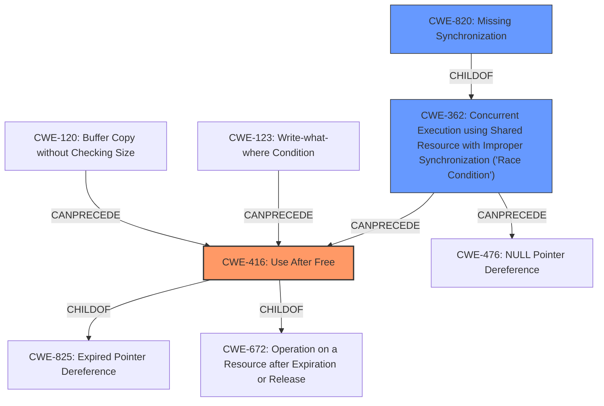

# Raw Analyzer Response for CVE-2022-3640

# Summary
| CWE ID | CWE Name | Confidence | CWE Abstraction Level | CWE Vulnerability Mapping Label | CWE-Vulnerability Mapping Notes |
|---|---|---|---|---|---|
| CWE-416 | Use After Free | 1.0 | Variant | Primary | Allowed |
| CWE-820 | Missing Synchronization | 0.6 | Base | Secondary | Allowed |
| CWE-362 | Concurrent Execution using Shared Resource with Improper Synchronization ('Race Condition') | 0.5 | Class | Secondary | Allowed-with-Review |

## Evidence and Confidence

*   **Confidence Score:** 0.8
*   **Evidence Strength:** HIGH

## Relationship Analysis
The primary CWE selected was CWE-416 **Use After Free**. This is a variant-level CWE, providing good specificity. Several relationships were considered. CWE-416 is a child of CWE-825 and CWE-672. CWE-416 can be preceded by CWE-120 and CWE-123.

CWE-820 **Missing Synchronization** and CWE-362 **Concurrent Execution using Shared Resource with Improper Synchronization ('Race Condition')** were also considered as contributing factors. CWE-362 is a class level CWE and has children that may be more appropriate. CWE-362 can precede CWE-416 and CWE-476.

## Vulnerability Chain
The vulnerability chain begins with a concurrency issue, where a shared resource is accessed without proper synchronization (CWE-820). This leads to a race condition (CWE-362), where the state of the resource can change unexpectedly. The race condition results in a **use-after-free** (CWE-416), where memory is accessed after it has been freed.

## Summary of Analysis
The initial analysis correctly identified **use-after-free** as the primary **weakness**. The evidence from the "CVE Reference Links Content Summary" section confirms the **root cause** is a **use-after-free** in the Bluetooth L2CAP subsystem. The technical details explain that the channel is released prematurely, and a mutex is still held, causing the UAF. This aligns directly with the description of CWE-416: "The product reuses or references memory after it has been freed."

The retriever results listed CWE-416 **Use After Free** as the second highest match.

CWE-820 **Missing Synchronization** was considered because the technical details indicate a mutex is held after the channel is released, suggesting a synchronization problem. However, the primary issue is the **use-after-free**, so CWE-416 is the more direct mapping.

CWE-362 **Concurrent Execution using Shared Resource with Improper Synchronization ('Race Condition')** was also considered, as the vulnerability occurs in a concurrent environment and involves a race condition. However, the core issue is the **use-after-free** that results from the race condition, making CWE-416 the primary mapping.

The selected CWEs are at the optimal level of specificity. CWE-416 is a Variant, which is preferred over the more general Class or Pillar levels.

Relevant evidence:

*   "The vulnerability is a use-after-free in the Bluetooth L2CAP subsystem, specifically within the `l2cap_conn_del()` function."
*   "**Use-after-free:** A memory region (a Bluetooth channel) is freed, but a pointer to it is still used later, leading to corruption."
*   "The issue occurs when `l2cap_recv_frame()` creates an A2MP channel, but it doesn't increment the refcount. Thus, when `hci_error_reset()` is called, the channel is released, but the mutex to access this channel is still held. This causes the UAF when the mutex is released at `l2cap_chan_unlock()`."