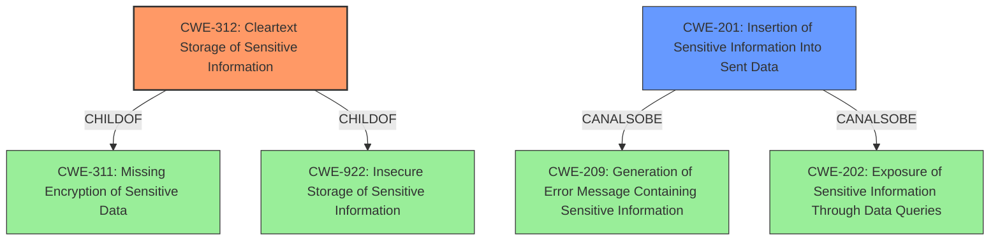

# Analysis for CVE-2022-3644

# Summary
| CWE ID | CWE Name | Confidence | CWE Abstraction Level | CWE Vulnerability Mapping Label | CWE-Vulnerability Mapping Notes |
|---|---|---|---|---|---|
| CWE-312 | Cleartext Storage of Sensitive Information | 1.0 | Base | Allowed | Primary CWE. The vulnerability description states that tokens are stored in plaintext, which directly matches the CWE's description. |
| CWE-201 | Insertion of Sensitive Information Into Sent Data | 0.5 | Base | Allowed | Secondary CWE. The vulnerability description says the plaintext tokens are exposed in read/write mode via the API. |

## Evidence and Confidence

*   **Confidence Score:** 0.8
*   **Evidence Strength:** MEDIUM

## Relationship Analysis
The primary relationship considered was the child-parent relationship between CWE-312 and its parent CWE-311 (Missing Encryption of Sensitive Data) and CWE-922 (Insecure Storage of Sensitive Information). CWE-312 is a more specific case of these broader categories, making it a better fit. CWE-201 is in a CanAlsoBe relationship with CWE-209 (Generation of Error Message Containing Sensitive Information) and CWE-202 (Exposure of Sensitive Information Through Data Queries), which highlights the potential for sensitive data leakage.

## Vulnerability Chain
The chain of events is as follows:
1.  **Root Cause:** **Improper token storage** (CWE-312)
2.  **Impact:** Tokens exposed in read/write mode via API (CWE-201)

## Summary of Analysis
The initial assessment identified the **improper token storage** as the primary weakness. The Retriever Results suggested CWE-312 (Cleartext Storage of Sensitive Information) and CWE-522 (Insufficiently Protected Credentials) as potential candidates. The final decision was heavily influenced by the direct match between the vulnerability description and the CWE-312 description. The fact that the tokens are exposed via the API is why CWE-201 was added as a secondary CWE.

The evidence supporting this decision comes directly from the vulnerability description: "The collection remote for pulp_ansible stores tokens in plaintext instead of using pulps encrypted field and exposes them in read/write mode via the API."

CWE-312 is at the optimal level of specificity because it directly addresses the **root cause** of the vulnerability, which is the storage of sensitive information in cleartext. While CWE-522 is related, it's a more general class of weakness, and CWE-312 provides a more precise characterization of the issue.

Other CWEs considered but not used:

*   CWE-256 (Plaintext Storage of a Password): While related, this is specifically for passwords, whereas the vulnerability description refers to tokens, which may have different characteristics.
*   CWE-522 (Insufficiently Protected Credentials): Considered but deemed too general compared to CWE-312.
*   CWE-922 (Insecure Storage of Sensitive Information): Considered, but CWE-312 is a more specific instance of this class.