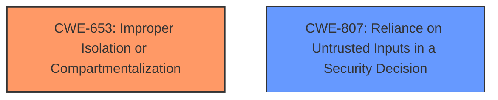

# Analysis Report for CVE-2022-36443

# Vulnerability Analysis Report: CVE-2022-36443

## Description


## Analysis (with Relationship Data)

# Summary
| CWE ID    | CWE Name                                                    | Confidence | CWE Abstraction Level | CWE Vulnerability Mapping Label | CWE-Vulnerability Mapping Notes |
| :--------- | :---------------------------------------------------------- | :--------- | :-------------------- | :------------------------------ | :------------------------------ |
| CWE-653 | Improper Isolation or Compartmentalization | 0.85 | Class | Allowed | Root Cause |
| CWE-807     | Reliance on Untrusted Inputs in a Security Decision        | 0.70       | Base                  | Allowed                         | Secondary Candidate |

## Evidence and Confidence

*   **Confidence Score:** 0.80
*   **Evidence Strength:** HIGH

## Relationship Analysis
The primary weakness identified is CWE-653, **Improper Isolation or Compartmentalization**, because the administrator expects to be able to restrict all communications, but the product does not properly isolate the ethernet channel. The secondary weakness is CWE-807, **Reliance on Untrusted Inputs in a Security Decision**, because the product relies on the fact that the input communication channels are secure, but the product receives input from an untrusted actor (ethernet).



## Vulnerability Chain
The chain of root cause and weaknesses for the Vulnerability Description is:
1.  The administrator attempts to lock down communication channels.
2.  The Zebra Enterprise Home Screen **allows the administrator to lock some communication channels (wireless and SD card)**, but not all.
3.  The product does not properly compartmentalize or isolate functionality, processes, or resources that require different privilege levels, rights, or permissions (**CWE-653**).
4.  It is still possible to use a physical connection (Ethernet cable) without restriction, which could lead to data exfiltration, unauthorized access, or circumvention of security policies.

## Summary of Analysis
Initially, the analysis focused on identifying the root cause of the vulnerability, which is the **failure to properly isolate or compartmentalize different communication channels**. The administrator's intention to lock down communication channels is thwarted by the product's inability to restrict Ethernet communication. This leads to a potential security breach.

The selection of CWE-653 is based on the fact that the product "does not properly compartmentalize or isolate functionality, processes, or resources that require different privilege levels, rights, or permissions." This directly aligns with the vulnerability description, which states that "it is still possible to use a physical connection (Ethernet cable) without restriction" despite the administrator's attempt to lock down other communication channels.

The selection of CWE-807 is based on the fact that the product "**allows the administrator to lock some communication channels (wireless and SD card)** but it is still possible to use a physical connection (Ethernet cable) without restriction." Since the administrator is attempting to implement a security decision by locking down communication channels, but the product relies on potentially **untrusted inputs** from other communication channels.

Other CWEs considered include:

*   CWE-1263: Improper Physical Access Control - While physical access is required to exploit the vulnerability, the core issue is the lack of proper isolation of communication channels. This CWE is too broad.
*   CWE-319: Cleartext Transmission of Sensitive Information - This CWE is not applicable as the vulnerability does not involve transmitting sensitive information in cleartext.
*   CWE-119: Improper Restriction of Operations within the Bounds of a Memory Buffer - This CWE is not applicable as the vulnerability does not involve memory buffer operations.
*   CWE-306: Missing Authentication for Critical Function - This CWE is not applicable as the vulnerability does not involve a missing authentication mechanism.
*   CWE-1204: Generation of Weak Initialization Vector (IV) - This CWE is not applicable as the vulnerability does not involve cryptographic operations.
*   CWE-912: Hidden Functionality - This CWE is not applicable as the vulnerability does not involve undocumented functionality.
*   CWE-1257: Improper Access Control Applied to Mirrored or Aliased Memory Regions - This CWE is not applicable as the vulnerability does not involve aliased memory regions.
*   CWE-285: Improper Authorization - This CWE is too high-level and doesn't accurately describe the root cause.
*   CWE-863: Incorrect Authorization - This CWE is too high-level and doesn't accurately describe the root cause.
*   CWE-20: Improper Input Validation - This CWE is too high-level and doesn't accurately describe the root cause.

The selected CWEs are at the optimal level of specificity because they directly address the root cause of the vulnerability, which is the **lack of proper isolation of communication channels and reliance on untrusted inputs**. They are also at the appropriate abstraction level (Class and Base) as recommended by the MITRE mapping guidance.


## CWE Relationship Analysis

Current CWEs represent these abstraction levels: .


### Vulnerability Chain Analysis

**Chain starting from CWE-1257:**
- 1257 (Improper Access Control Applied to Mirrored or Aliased Memory Regions) - ROOT


**Chain starting from CWE-1204:**
- 1204 (Generation of Weak Initialization Vector (IV)) - ROOT


### CWE Relationship Diagram

```mermaid
graph TD
    classDef primary fill:#f96,stroke:#333,stroke-width:2px
    classDef secondary fill:#69f,stroke:#333
    classDef tertiary fill:#9e9,stroke:#333
```


*Report generated on 2025-03-30 11:49:51*
