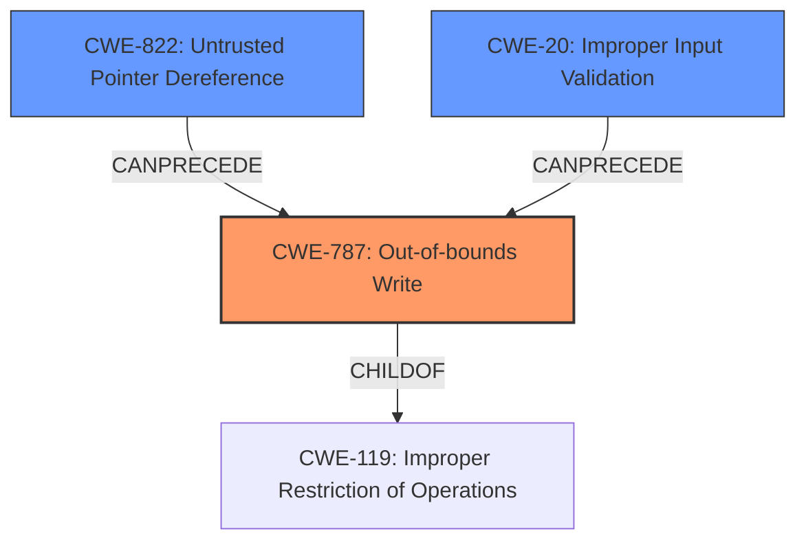

# Analysis for CVE-2022-36448

# Summary
| CWE ID | CWE Name | Confidence | CWE Abstraction Level | CWE Vulnerability Mapping Label | CWE-Vulnerability Mapping Notes |
|---|---|---|---|---|---|
| CWE-787 | Out-of-bounds Write | 1.0 | Base | Allowed | Primary CWE. The vulnerability allows writing to a memory location specified by the `IhisiParamBuffer` NVRAM variable without proper validation. |
| CWE-822 | Untrusted Pointer Dereference | 0.7 | Base | Allowed | Secondary CWE. The vulnerability takes a value from an untrusted source (NVRAM variable), converts it to a pointer, and dereferences it without validation. |
| CWE-20 | Improper Input Validation | 0.5 | Class | Discouraged | Secondary CWE. The root cause is the lack of proper input validation of the address obtained from NVRAM. |

## Evidence and Confidence

*   **Confidence Score:** 0.8
*   **Evidence Strength:** HIGH

## Relationship Analysis
The primary weakness is **CWE-787 (Out-of-bounds Write)**, where data is written beyond the intended buffer. This is facilitated by **CWE-822 (Untrusted Pointer Dereference)**, because the address to write to comes from an external NVRAM variable and is not validated, and the more general **CWE-20 (Improper Input Validation)**. The hierarchical relationships here are that **CWE-787** is a child of **CWE-119**, and **CWE-20** is a parent of **CWE-787**.

## Vulnerability Chain
The vulnerability chain starts with the **improper input validation (CWE-20)** of the address obtained from the `IhisiParamBuffer` NVRAM variable. This leads to an **untrusted pointer dereference (CWE-822)**, as the address is used without proper checks. This ultimately results in an **out-of-bounds write (CWE-787)**, allowing memory corruption in SMM.

## Summary of Analysis
The initial analysis focused on the **SMM memory corruption** as the key phrase indicating a memory-related weakness. The CVE Reference Links Content Summary confirms that the root cause involves writing to a memory location specified by the `IhisiParamBuffer` variable without validation, which is directly related to **CWE-787 (Out-of-bounds Write)**.

The evidence supports the selection of **CWE-787** as the primary CWE because the vulnerability allows writing to an arbitrary memory location, resulting in memory corruption. The "CVE Reference Links Content Summary" explicitly states this: "The vulnerability lies within the PnpSmm driver of InsydeH2O UEFI firmware, specifically in a Software SMI handler... The handler processes a NVRAM variable called `IhisiParamBuffer`, which contains an address. This address is used to write a predictable value, with insufficient validation." This quote clearly demonstrates the **improper handling** of the address.

**CWE-822 (Untrusted Pointer Dereference)** is also relevant, as the address used for writing is obtained from an untrusted source (NVRAM) and dereferenced without validation. This is supported by the CVE summary: "The vulnerability stems from using a user-controlled address from the `IhisiParamBuffer` NVRAM variable without proper checks."

**CWE-20 (Improper Input Validation)** is included because the address obtained from NVRAM is not properly validated. This is the root cause that enables the out-of-bounds write.

The selected CWEs are at the optimal level of specificity because **CWE-787** directly describes the memory corruption issue, **CWE-822** highlights the untrusted source of the pointer, and **CWE-20** identifies the lack of proper input validation as the underlying cause.

CWEs considered but not used:

*   **CWE-119 (Improper Restriction of Operations within the Bounds of a Memory Buffer)**: While related, **CWE-787** is a more specific child of **CWE-119** and thus a better fit.
*   **CWE-367 (Time-of-check Time-of-use (TOCTOU) Race Condition)**: This CWE is not applicable because the vulnerability doesn't involve a race condition between checking and using a resource.
*   **CWE-401 (Missing Release of Memory after Effective Lifetime)**: This CWE is not applicable as the vulnerability doesn't involve memory leaks.
*   **CWE-415 (Double Free)**: This CWE is not applicable as the vulnerability doesn't involve double freeing memory.
*   **CWE-825 (Expired Pointer Dereference)**: This CWE is similar to **CWE-822** but less descriptive of the root cause. While an expired pointer *could* be used, the primary issue is that the pointer is untrusted to begin with.