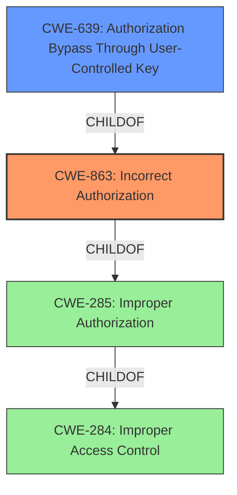

# Enhanced Analysis for CVE-2022-36453

# Summary
| CWE ID | CWE Name | Confidence | CWE Abstraction Level | CWE Vulnerability Mapping Label | CWE-Vulnerability Mapping Notes |
|---|---|---|---|---|---|
| CWE-863 | Incorrect Authorization | 0.9 | Class | Primary | Allowed-with-Review |
| CWE-639 | Authorization Bypass Through User-Controlled Key | 0.7 | Base | Secondary | Allowed |

## Evidence and Confidence

*   **Confidence Score:** 0.8
*   **Evidence Strength:** HIGH

## Relationship Analysis
The primary CWE selected is CWE-863 (Incorrect Authorization), which is a Class-level CWE. A more specific Base-level CWE, CWE-639 (Authorization Bypass Through User-Controlled Key), was also considered. CWE-639 is a child of CWE-863. The relationship between CWE-863 and its parent, CWE-285 (Improper Authorization) and grandparent, CWE-284 (Improper Access Control) were also considered.



## Vulnerability Chain
The vulnerability chain starts with **improper authorization controls** (CWE-863) leading to the ability for an authenticated attacker to modify their profile parameters and control another extension number.

## Summary of Analysis
The initial assessment identified **improper authorization controls** as the root cause, aligning with CWE-863 (Incorrect Authorization). The evidence includes:
- Vulnerability Description Key Phrases: "**rootcause:** **improper authorization controls**"
- CVE Reference Links Content Summary: "The vulnerability allows an authenticated attacker to control another extension number or impersonate another user's name."

CWE-863 is a Class-level CWE, and its description, "The product performs an authorization check when an actor attempts to access a resource or perform an action, but it does not correctly perform the check," aligns with the vulnerability description. The attacker is authenticated, so authentication isn't the primary issue, but the authorization after authentication is flawed.

CWE-639 (Authorization Bypass Through User-Controlled Key) was also considered because the attacker is able to control another extension number, possibly by modifying a key. However, the description doesn't explicitly say a key is being modified. So, CWE-863 is the primary CWE.

The CWE-284 and CWE-285 are high level and lower-level CWEs can frequently be used instead.

The selected CWEs are at an appropriate level of specificity, with CWE-863 representing the general class of **incorrect authorization**, and CWE-639 as a potential base case if the vulnerability specifically involves user-controlled keys for authorization bypass.


## CWE Relationship Analysis

Current CWEs represent these abstraction levels: .


### Vulnerability Chain Analysis

**Chain starting from CWE-285:**
- 285 (Improper Authorization) - ROOT


**Chain starting from CWE-639:**
- 639 (Authorization Bypass Through User-Controlled Key) - ROOT


### CWE Relationship Diagram

```mermaid
graph TD
    classDef primary fill:#f96,stroke:#333,stroke-width:2px
    classDef secondary fill:#69f,stroke:#333
    classDef tertiary fill:#9e9,stroke:#333
```