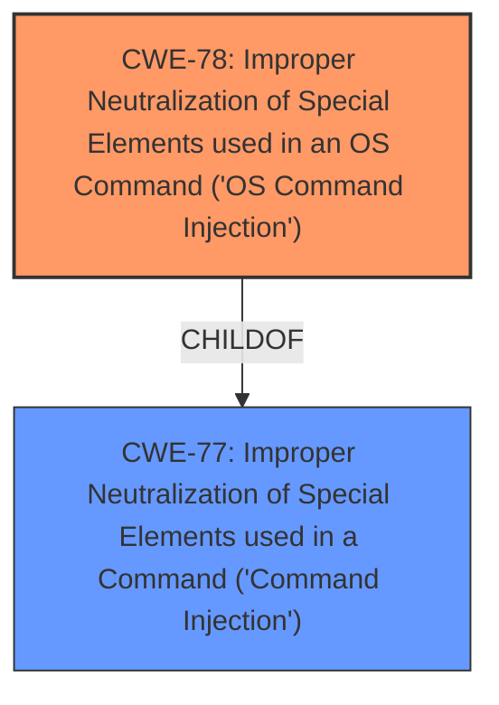

# Raw Analyzer Response for CVE-2022-36460

# Summary
| CWE ID | CWE Name | Confidence | CWE Abstraction Level | CWE Vulnerability Mapping Label | CWE-Vulnerability Mapping Notes |
|---|---|---|---|---|---|
| CWE-78 | Improper Neutralization of Special Elements used in an OS Command ('OS Command Injection') | 1.0 | Base | Allowed | Primary CWE |

## Evidence and Confidence

*   **Confidence Score:** 1.0
*   **Evidence Strength:** HIGH

## Relationship Analysis
The primary relationship that impacted my decision was the parent-child relationship between CWE-77 (Improper Neutralization of Special Elements used in a Command ('Command Injection')) and CWE-78 (Improper Neutralization of Special Elements used in an OS Command ('OS Command Injection')). CWE-78 is a more specific case of CWE-77, focusing specifically on OS commands. Given that the vulnerability description explicitly mentions a **command injection** vulnerability where the FileName parameter is passed to the `dosystem` function, which executes it as a system command, CWE-78 is a more accurate and specific classification.

## Vulnerability Chain
The vulnerability chain is straightforward:

1.  **Root Cause:** **Improper neutralization** of special elements in the FileName parameter. (CWE-78)
2.  The unsanitized FileName parameter is passed to the `dosystem` function.
3.  The `dosystem` function executes the parameter as a system command.
4.  **Impact:** Arbitrary command execution on the router's operating system.

## Summary of Analysis
The initial analysis correctly identifies the presence of a **command injection** vulnerability. The evidence from the CVE Reference Links Content Summary strongly supports this, stating that the "FileName" parameter is directly passed to the `dosystem` function without proper sanitization.

The Retriever Results also support this, with CWE-77 and CWE-78 being the top candidates. However, because the vulnerability involves the execution of OS commands, CWE-78 is the more precise choice.

The provided evidence is sufficient to confidently classify this vulnerability as CWE-78. The selection is based on the root cause, which is the **improper neutralization** of special elements in an OS command, and the resulting impact, which is arbitrary command execution. The choice of CWE-78 over CWE-77 is due to the specific context of OS command execution.

Other CWEs Considered:

*   CWE-77: Considered, but CWE-78 is a more specific child that more accurately reflects the nature of the vulnerability (OS command execution).
*   CWE-88: Considered, but the primary issue isn't with argument delimiters, but rather the overall command being injected.
*   CWE-184: Considered, as it relates to incomplete lists of disallowed inputs, but the core issue is the lack of any sanitization, not an incomplete list.

The final decision to select CWE-78 is based on the evidence of OS command execution and the hierarchical relationship between CWE-77 and CWE-78. This ensures the most specific and accurate classification of the vulnerability.