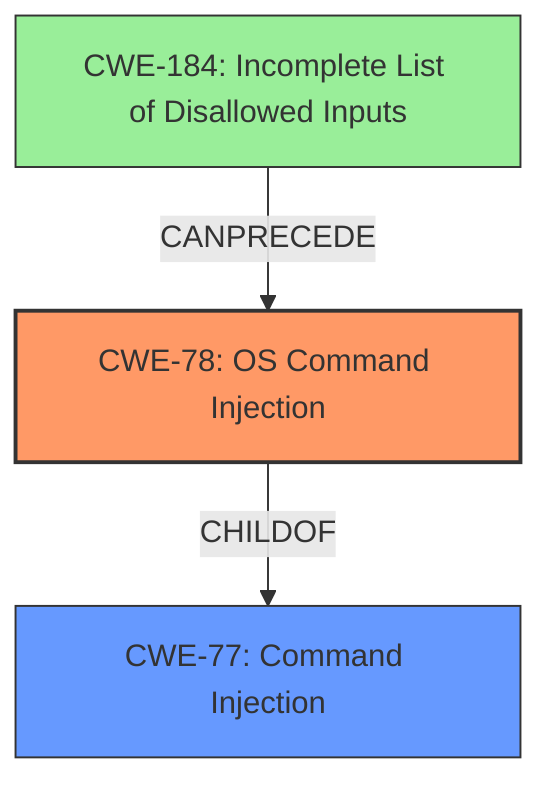

# Analysis for CVE-2022-36523

# Summary
| CWE ID | CWE Name | Confidence | CWE Abstraction Level | CWE Vulnerability Mapping Label | CWE-Vulnerability Mapping Notes |
|---|---|---|---|---|---|
| CWE-78 | Improper Neutralization of Special Elements used in an OS Command ('OS Command Injection') | 1.0 | Base | Allowed | Primary CWE |
| CWE-77 | Improper Neutralization of Special Elements used in a Command ('Command Injection') | 0.7 | Class | Allowed-with-Review | Secondary Candidate, considered but less specific |
| CWE-184 | Incomplete List of Disallowed Inputs | 0.5 | Base | Allowed | Secondary Candidate, part of a potential chain |

## Evidence and Confidence

*   **Confidence Score:** 1.0
*   **Evidence Strength:** HIGH

## Relationship Analysis
The primary CWE is CWE-78, which is a base level CWE and a child of the class level CWE-77. CWE-78 is more specific, referring to OS Commands, while CWE-77 covers all commands. CWE-184 can precede CWE-78, indicating a potential chain where an incomplete list of disallowed inputs leads to OS Command Injection.

## Vulnerability Chain
The vulnerability chain starts with a potential **incomplete list of disallowed inputs (CWE-184)** which leads to **Improper Neutralization of Special Elements used in an OS Command ('OS Command Injection') (CWE-78)**, allowing execution of arbitrary commands.

## Summary of Analysis
The vulnerability description clearly states that the D-Link Go-RT-AC750 is vulnerable to **command injection** via /htdocs/upnpinc/gena.php. The key phrase also identifies the **weakness** as **command injection**.

The retriever results list CWE-77 and CWE-78 as top candidates. CWE-78 is more specific as it refers to OS commands. Since the vulnerability description doesn't specify the type of command, CWE-77 could also be considered. However, given the context of a network device, it is highly likely that the **command injection** involves OS commands. Therefore, CWE-78 is the most appropriate primary CWE.

CWE-184 is also a possible factor, as the **command injection** could be due to an incomplete list of disallowed inputs. This would mean that the application failed to properly sanitize the input, allowing malicious commands to be injected.

The final decision is based on the evidence that the **weakness** is **command injection** and the high likelihood that it involves OS commands, making CWE-78 the best fit. CWE-77 is a parent of CWE-78, but less specific. CWE-184 is a potential contributing factor in a chain.

Relevant CWE Information:

# Enhanced Context (25 CWEs)

## CWE-184: Incomplete List of Disallowed Inputs
**Abstraction Level**: Base
**Similarity Score**: 0.80
**Source**: dense

**Description**:
The product implements a protection mechanism that relies on a list of inputs (or properties of inputs) that are not allowed by policy or otherwise require other action to neutralize before additional processing takes place, but the list is incomplete.

**Mapping Guidance**:
- Usage: Allowed
- Rationale: This CWE entry is at the Base level of abstraction, which is a preferred level of abstraction for mapping to the root causes of vulnerabilities.

## CWE-77: Improper Neutralization of Special Elements used in a Command ('Command Injection')
**Abstraction:** Class
**Status:** Draft

### Description
The product constructs all or part of a command using externally-influenced input from an upstream component, but it does not neutralize or incorrectly neutralizes special elements that could modify the intended command when it is sent to a downstream component.

### Extended Description
Many protocols and products have their own custom command language. While OS or shell command strings are frequently discovered and targeted, developers may not realize that these other command languages might also be vulnerable to attacks.

### Alternative Terms
Command injection: an attack-oriented phrase for this weakness. Note: often used when "OS command injection" (CWE-78) was intended.

### Relationships
ChildOf -> CWE-74
ChildOf -> CWE-74

### Mapping Guidance
**Usage:** Allowed-with-Review
**Rationale:** CWE-77 is often misused when OS command injection (CWE-78) was intended instead [REF-1287].
**Comments:** Ensure that the analysis focuses on the root-cause error that allows the execution of commands, as there are many weaknesses that can lead to this consequence. See Terminology Notes. If the weakness involves a command language besides OS shell invocation, then CWE-77 could be used.
**Reasons:**
- Frequent Misuse
**Suggested Alternatives:**
- CWE-78: OS Command Injection

## CWE-78: Improper Neutralization of Special Elements used in an OS Command ('OS Command Injection')
**Abstraction:** Base
**Status:** Stable

### Description
The product constructs all or part of an OS command using externally-influenced input from an upstream component, but it does not neutralize or incorrectly neutralizes special elements that could modify the intended OS command when it is sent to a downstream component.

### Extended Description
This weakness can lead to a vulnerability in environments in which the attacker does not have direct access to the operating system, such as in web applications. Alternately, if the weakness occurs in a privileged program, it could allow the attacker to specify commands that normally would not be accessible, or to call alternate commands with privileges that the attacker does not have. The problem is exacerbated if the compromised process does not follow the principle of least privilege, because the attacker-controlled commands may run with special system privileges that increases the amount of damage.

### Alternative Terms
Shell injection
Shell metacharacters
OS Command Injection

### Relationships
ChildOf -> CWE-77
ChildOf -> CWE-74
ChildOf -> CWE-77
ChildOf -> CWE-77
CanAlsoBe -> CWE-88

### Mapping Guidance
**Usage:** Allowed
**Rationale:** This CWE entry is at the Base level of abstraction, which is a preferred level of abstraction for mapping to the root causes of vulnerabilities.

The analysis relies heavily on the vulnerability description and the "Vulnerability Description Key Phrases" section. Since the CVE Reference Links Content Summary is unrelated, it does not contribute to the assessment.