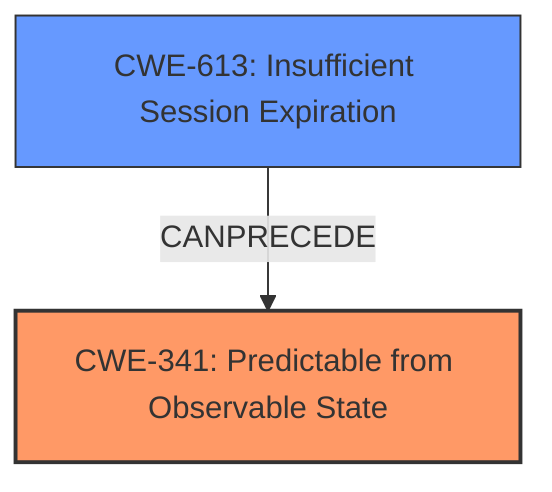

# Raw Analyzer Response for CVE-2022-36536

# Summary
| CWE ID | CWE Name | Confidence | CWE Abstraction Level | CWE Vulnerability Mapping Label | CWE-Vulnerability Mapping Notes |
|---|---|---|---|---|---|
| CWE-341 | Predictable from Observable State | 0.9 | Base | Allowed | Primary CWE. The session tokens are generated based on the current date and time, making them easily brute-forceable. |
| CWE-613 | Insufficient Session Expiration | 0.7 | Base | Allowed | Secondary CWE. The vulnerability involves the creation of session tokens that do not expire correctly, allowing attackers to potentially reuse old session credentials. |

## Evidence and Confidence

*   **Confidence Score:** 0.8
*   **Evidence Strength:** HIGH

## Relationship Analysis
The primary CWE is CWE-341, which describes the root cause of the vulnerability. The secondary CWE is CWE-613, which describes the potential consequence of the root cause.

## Vulnerability Chain
The chain of events is as follows:
1.  The application uses a predictable algorithm to generate session tokens (CWE-341).
2.  Because tokens are easily predicted, attackers can brute-force them.
3.  If an attacker obtains a valid session token, they can impersonate a user and gain unauthorized access (CWE-613).

## Summary of Analysis
The analysis is based on the provided evidence which clearly states that the session tokens are generated based on the current date and time, making them easily brute-forceable. The vulnerability description states: "An issue in the component post_applogin.php of Super Flexible Software GmbH & Co. KG Syncovery 9 for Linux v9.47x and below allows attackers to escalate privileges via creating crafted session tokens." The CVE Reference Links Content Summary states: "**Root Cause:** The application generates session tokens based on the current date and time, encoded in base64. **Weaknesses:** The predictable nature of the token generation allows for easy brute-forcing."

CWE-341 (Predictable from Observable State) is the most appropriate primary CWE because the root cause is the predictable nature of the session tokens.
CWE-613 (Insufficient Session Expiration) is a relevant secondary CWE because the predictable session token can be used for longer periods if session expiration is not correctly implemented.

The selected CWEs are at the optimal level of specificity because they accurately represent the weakness and its potential impact.

Relevant CWE Information:

# Enhanced Context (25 CWEs)
The following CWEs were identified as potentially relevant to this vulnerability:

## CWE-274: Improper Handling of Insufficient Privileges
**Abstraction Level**: Base
**Similarity Score**: 0.77

## CWE-266: Incorrect Privilege Assignment
**Abstraction Level**: Base
**Similarity Score**: 0.77

## CWE-653: Improper Isolation or Compartmentalization
**Abstraction Level**: Class
**Similarity Score**: 0.77

## CWE-74: Improper Neutralization of Special Elements in Output Used by a Downstream Component ('Injection')
**Abstraction Level**: Class
**Similarity Score**: 0.76

## CWE-267: Privilege Defined With Unsafe Actions
**Abstraction Level**: Base
**Similarity Score**: 0.76

## CWE-280: Improper Handling of Insufficient Permissions or Privileges
**Abstraction Level**: Base
**Similarity Score**: 0.76

## CWE-668: Exposure of Resource to Wrong Sphere
**Abstraction Level**: Class
**Similarity Score**: 0.76

## CWE-41: Improper Resolution of Path Equivalence
**Abstraction Level**: Base
**Similarity Score**: 0.76

## CWE-472: External Control of Assumed-Immutable Web Parameter
**Abstraction Level**: Base
**Similarity Score**: 0.76

## CWE-664: Improper Control of a Resource Through its Lifetime
**Abstraction Level**: Pillar
**Similarity Score**: 0.76

## CWE-22: Improper Limitation of a Pathname to a Restricted Directory ('Path Traversal')
**Abstraction Level**: Base
**Similarity Score**: 7005.16

## CWE-863: Incorrect Authorization
**Abstraction Level**: Class
**Similarity Score**: 6860.82

## CWE-23: Relative Path Traversal
**Abstraction Level**: Base
**Similarity Score**: 6852.54

## CWE-94: Improper Control of Generation of Code ('Code Injection')
**Abstraction Level**: Base
**Similarity Score**: 6846.01

## CWE-95: Improper Neutralization of Directives in Dynamically Evaluated Code ('Eval Injection')
**Abstraction Level**: Variant
**Similarity Score**: 6834.52

## CWE-22: Improper Limitation of a Pathname to a Restricted Directory ('Path Traversal')
**Abstraction Level**: base
**Similarity Score**: 4.33

## CWE-613: Insufficient Session Expiration
**Abstraction Level**: base
**Similarity Score**: 4.33

## CWE-78: Improper Neutralization of Special Elements used in an OS Command ('OS Command Injection')
**Abstraction Level**: base
**Similarity Score**: 4.31

## CWE-88: Improper Neutralization of Argument Delimiters in a Command ('Argument Injection')
**Abstraction Level**: base
**Similarity Score**: 3.64

## CWE-94: Improper Control of Generation of Code ('Code Injection')
**Abstraction Level**: base
**Similarity Score**: 3.30

## CWE-98: Improper Control of Filename for Include/Require Statement in PHP Program ('PHP Remote File Inclusion')
**Abstraction Level**: variant
**Similarity Score**: 3.20

## CWE-384: Session Fixation
**Abstraction Level**: compound
**Similarity Score**: 3.09

## CWE-73: External Control of File Name or Path
**Abstraction Level**: Base
**Similarity Score**: 2.90

## CWE-386: Symbolic Name not Mapping to Correct Object
**Abstraction Level**: base
**Similarity Score**: 2.90

## CWE-59: Improper Link Resolution Before File Access ('Link Following')
**Abstraction Level**: Base
**Similarity Score**: 2.90

**CWE-341**: The application generates session tokens based on the current date and time, encoded in base64. The predictable nature of the token generation allows for easy brute-forcing. This aligns directly with the description of CWE-341, which states that a number or object is predictable based on observations that the attacker can make about the state of the system or network, such as time.
**CWE-613**: The vulnerability involves the creation of session tokens that do not expire correctly, allowing attackers to potentially reuse old session credentials. This aligns directly with the description of CWE-613, which states "Insufficient Session Expiration is when a web site permits an attacker to reuse old session credentials or session IDs for authorization."