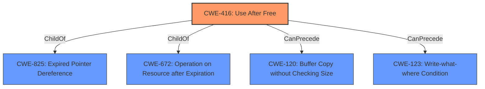

# Analysis for CVE-2022-3654

# Summary
| CWE ID | CWE Name | Confidence | CWE Abstraction Level | CWE Vulnerability Mapping Label | CWE-Vulnerability Mapping Notes |
|---|---|---|---|---|---|
| CWE-416 | Use After Free | 1.0 | Variant | Allowed | Primary CWE |

## Evidence and Confidence

*   **Confidence Score:** 1.0
*   **Evidence Strength:** HIGH

## Relationship Analysis
The primary relationship that influenced the decision was the direct match of the vulnerability description to the definition of CWE-416. The other suggested CWEs were not as directly applicable.

## Vulnerability Chain
The chain of events for this vulnerability is as follows:
1.  **Root Cause:** Use-after-free (CWE-416)
2.  **Weakness:** Heap corruption
3.  **Attack Vector:** Crafted HTML page
4.  **Impact:** Potential arbitrary code execution

## Summary of Analysis
The initial analysis strongly suggests CWE-416 because the vulnerability description explicitly states "**use after free** in Layout in Google Chrome". The "CVE Reference Links Content Summary" also confirms the root cause as "Use-after-free (UAF) in the Layout component. This means that the program is attempting to access a memory location that has already been freed."

The graph relationships confirm that CWE-416 is a variant-level CWE, making it an appropriate choice. The allowed usage further validates the selection.

Other CWEs were considered but deemed less appropriate:

*   CWE-843 (Access of Resource Using Incompatible Type ('Type Confusion')): While type confusion can lead to memory corruption, the primary issue is the use of freed memory, not necessarily accessing it with an incompatible type.
*   CWE-366 (Race Condition within a Thread): Race conditions can lead to UAF, but the description doesn't explicitly mention a race condition.
*   CWE-911 (Improper Update of Reference Count): This CWE is about reference counting issues, which is not mentioned in the description.
*   CWE-122 (Heap-based Buffer Overflow): The vulnerability description mentions heap corruption, but the root cause is UAF, not a buffer overflow.
*   CWE-451 (User Interface (UI) Misrepresentation of Critical Information): This CWE is unrelated to memory management issues.
*   CWE-123 (Write-what-where Condition): This is a potential impact of UAF, but not the root cause.
*   CWE-356 (Product UI does not Warn User of Unsafe Actions): This is not related to the vulnerability.
*   CWE-415 (Double Free): The vulnerability is UAF, not a double free.
*   CWE-404 (Improper Resource Shutdown or Release): While UAF involves improper resource management, the specific issue is using memory after it's freed, not just failing to release it.

The selected CWE-416 is at the optimal level of specificity because it directly describes the root cause of the vulnerability. The evidence is strong, and the mapping guidance supports the choice.