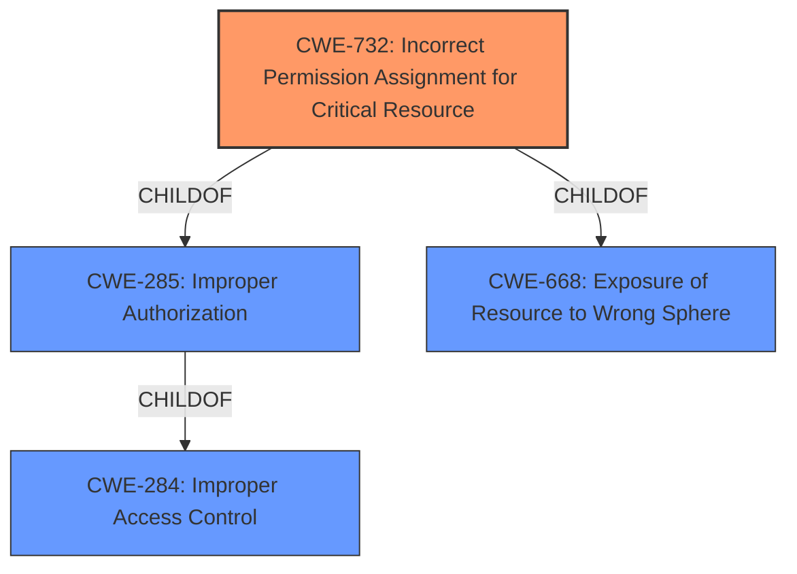

# Analysis Report for CVE-2022-36565

# Vulnerability Analysis Report: CVE-2022-36565

## Description


## Analysis (with Relationship Data)

# Summary
| CWE ID | CWE Name | Confidence | CWE Abstraction Level | CWE Vulnerability Mapping Label | CWE-Vulnerability Mapping Notes |
|---|---|---|---|---|---|
| CWE-732 | Incorrect Permission Assignment for Critical Resource | 0.9 | Class | Allowed-with-Review | Primary CWE |
| CWE-284 | Improper Access Control | 0.5 | Pillar | Discouraged | Secondary Candidate |

## Evidence and Confidence

*   **Confidence Score:** 0.9
*   **Evidence Strength:** HIGH

## Relationship Analysis
The primary relationship that influenced the decision was the parent-child relationship between CWE-284 (Improper Access Control) and CWE-732 (Incorrect Permission Assignment for Critical Resource). CWE-732 is a child of both CWE-285 (Improper Authorization) and CWE-668 (Exposure of Resource to Wrong Sphere) and CWE-285 is a child of CWE-284. Given the specific nature of the vulnerability involving **incorrect access control** leading to the ability to overwrite binaries, CWE-732 was deemed a more precise classification than its parent, CWE-284. While CWE-284 broadly covers access control issues, CWE-732 directly addresses the scenario of misconfigured permissions on critical resources.



## Vulnerability Chain
The chain of events for this vulnerability begins with the **incorrect access control** on the installation directory. This initial weakness leads to the ability for authenticated attackers to overwrite binaries in the directory, ultimately resulting in the execution of arbitrary code. The root cause is CWE-732 (Incorrect Permission Assignment for Critical Resource), and the impact is the ability to execute arbitrary code.

## Summary of Analysis
The initial assessment identified that the **incorrect access control** in the install directory is the root cause, as stated in the "Vulnerability Description Key Phrases".

The vulnerability description explicitly states "**Incorrect access control** in the install directory (C:\Wamp64) of Wamp v3.2.6 and below allows authenticated attackers to execute arbitrary code via overwriting binaries located in the directory." This directly supports the classification of CWE-732, which describes a scenario where permissions for critical resources are misconfigured, allowing unintended actors to modify them.

CWE-732 is preferred over the more general CWE-284 because it provides a more specific description of the vulnerability. The MITRE mapping guidance for CWE-284 advises against its use due to its high-level nature and suggests considering more specific descendants.

CWE-427 (Uncontrolled Search Path Element), CWE-22 (Improper Limitation of a Pathname to a Restricted Directory ('Path Traversal')), and CWE-59 (Improper Link Resolution Before File Access ('Link Following')) were considered but deemed less relevant. While an attacker *could* potentially leverage an uncontrolled search path or path traversal techniques to exploit the **incorrect access control**, the primary weakness lies in the initial misconfiguration of permissions, not in the exploitation of path-related vulnerabilities. Similarly, link following is not the direct cause of this vulnerability.

The decision to classify this vulnerability as CWE-732 is based on the evidence provided, the relationship analysis, and the MITRE mapping guidance. It represents the most accurate and specific classification for the root cause of this vulnerability.


## CWE Relationship Analysis

Current CWEs represent these abstraction levels: .


### Vulnerability Chain Analysis

**Chain starting from CWE-668:**
- 668 (Exposure of Resource to Wrong Sphere) - ROOT


**Chain starting from CWE-427:**
- 427 (Uncontrolled Search Path Element) - ROOT


### CWE Relationship Diagram

```mermaid
graph TD
    classDef primary fill:#f96,stroke:#333,stroke-width:2px
    classDef secondary fill:#69f,stroke:#333
    classDef tertiary fill:#9e9,stroke:#333
```


*Report generated on 2025-03-31 11:39:04*
