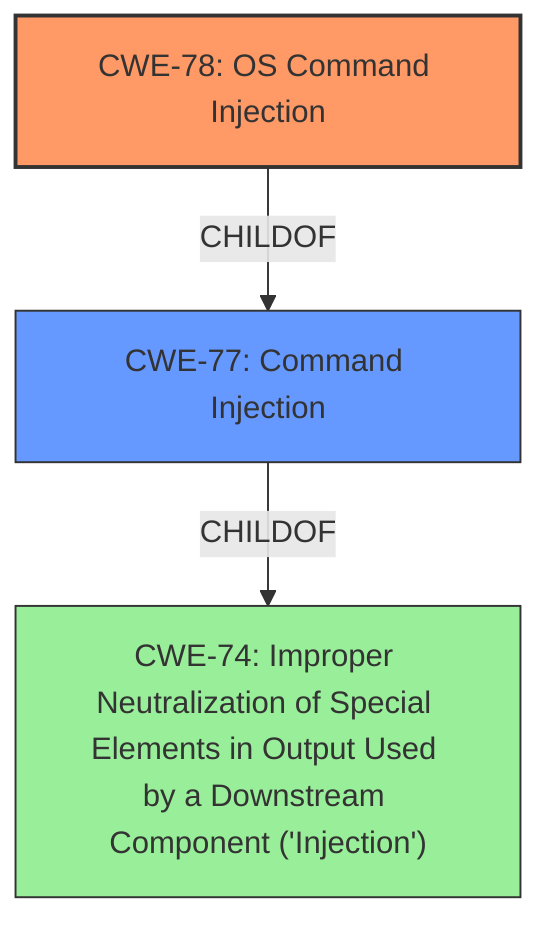

# Enhanced Analysis for CVE-2022-36566

# Summary
| CWE ID | CWE Name | Confidence | CWE Abstraction Level | CWE Vulnerability Mapping Label | CWE-Vulnerability Mapping Notes |
|---|---|---|---|---|---|
| CWE-78 | Improper Neutralization of Special Elements used in an OS Command ('OS Command Injection') | 1.0 | Base | Allowed | Primary CWE |
| CWE-77 | Improper Neutralization of Special Elements used in a Command ('Command Injection') | 0.7 | Class | Allowed-with-Review | Secondary Candidate |

## Evidence and Confidence

*   **Confidence Score:** 0.9
*   **Evidence Strength:** HIGH

## Relationship Analysis
The primary CWE is CWE-78, which is a Base level CWE, representing the specific case of OS command injection. It is a child of the more general CWE-77.



## Vulnerability Chain
The chain starts with reading values from a YAML file without proper sanitization, leading to OS command injection via `os.system`, and culminating in remote code execution.

## Summary of Analysis
The analysis concludes that **CWE-78** is the most appropriate primary CWE, due to the vulnerability involving **command injection** directly into an OS command. This aligns with the evidence presented in the vulnerability description and CVE reference summary, which explicitly mentions the lack of sanitization leading to OS command execution.

The decision is based on direct evidence from the "CVE Reference Links Content Summary" section: "The vulnerability stems from the application reading values from a YAML file and directly concatenating them into an `os.system` call. This allows an attacker to inject arbitrary OS commands through the YAML configuration."

While CWE-77 is a parent of CWE-78, the specificity of OS command execution makes CWE-78 the more accurate choice.

Relevant CWE Information:

# Enhanced Context (25 CWEs)
The following CWEs were identified as potentially relevant to this vulnerability:

## CWE-74: Improper Neutralization of Special Elements in Output Used by a Downstream Component ('Injection')
**Abstraction Level**: Class
**Similarity Score**: 0.77
**Source**: dense

**Description**:
The product constructs all or part of a command, data structure, or record using externally-influenced input from an upstream component, but it does not neutralize or incorrectly neutralizes special elements that could modify how it is parsed or interpreted when it is sent to a downstream component.

**Mapping Guidance**:
- Usage: Discouraged
- Rationale: CWE-74 is high-level and often misused when lower-level weaknesses are more appropriate.

## CWE-78: Improper Neutralization of Special Elements used in an OS Command ('OS Command Injection')
**Abstraction Level**: base
**Similarity Score**: 5.03
**Source**: graph

**Description**:
CWE-78: Improper Neutralization of Special Elements used in an OS Command ('OS Command Injection')

**Mapping Guidance**:
- Usage: Allowed
- Rationale: This CWE entry is at the Base level of abstraction, which is a preferred level of abstraction for mapping to the root causes of vulnerabilities.

**Relationships**:
- CANFOLLOW -> CWE-184
- CANALSOBE -> CWE-88
- CHILDOF -> CWE-77
- CHILDOF -> CWE-77
- CHILDOF -> CWE-74

## CWE-77: Improper Neutralization of Special Elements used in a Command ('Command Injection')
**Abstraction:** Class
**Status:** Draft

### Description
The product constructs all or part of a command using externally-influenced input from an upstream component, but it does not neutralize or incorrectly neutralizes special elements that could modify the intended command when it is sent to a downstream component.

### Mapping Guidance
**Usage:** Allowed-with-Review
**Rationale:** CWE-77 is often misused when OS command injection (CWE-78) was intended instead [REF-1287].
**Suggested Alternatives:**
- CWE-78: OS Command Injection

**CWE-78** *Improper Neutralization of Special Elements used in an OS Command ('OS Command Injection')* is the primary CWE because the **command injection** occurs specifically within the context of an operating system command. The **weakness** allows an attacker to execute arbitrary OS commands. This aligns perfectly with the description of CWE-78.

**CWE-77** *Improper Neutralization of Special Elements used in a Command ('Command Injection')* is a secondary candidate. Although the vulnerability involves **command injection**, the fact that it's specifically an OS command makes CWE-78 a better fit. CWE-77 is a broader category that encompasses other types of command injection. The mapping guidance even suggests using CWE-78 when appropriate.

CWE-74 *Improper Neutralization of Special Elements in Output Used by a Downstream Component ('Injection')* was not used because it is too high-level and the vulnerability is more specifically related to command injection. The mapping guidance discourages its use when lower-level weaknesses are more appropriate.


## CWE Relationship Analysis

Current CWEs represent these abstraction levels: .


### Vulnerability Chain Analysis

**Chain starting from CWE-184:**
- 184 (Incomplete List of Disallowed Inputs) - ROOT


**Chain starting from CWE-78:**
- 78 (Improper Neutralization of Special Elements used in an OS Command ('OS Command Injection')) - ROOT


### CWE Relationship Diagram

```mermaid
graph TD
    classDef primary fill:#f96,stroke:#333,stroke-width:2px
    classDef secondary fill:#69f,stroke:#333
    classDef tertiary fill:#9e9,stroke:#333
```