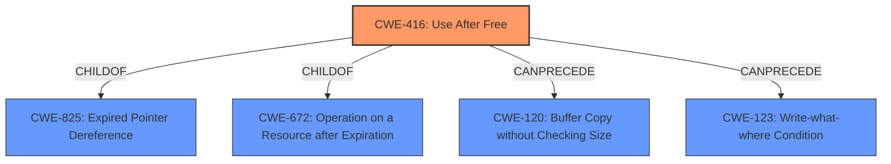

# Analysis Report for CVE-2022-3659

# Vulnerability Analysis Report: CVE-2022-3659

## Description


## Analysis (with Relationship Data)

# Summary
| CWE ID | CWE Name | Confidence | CWE Abstraction Level | CWE Vulnerability Mapping Label | CWE-Vulnerability Mapping Notes |
|---|---|---|---|---|---|
| CWE-416 | Use After Free | 1.0 | Variant | Allowed | Primary CWE |

## Evidence and Confidence

*   **Confidence Score:** 1.0
*   **Evidence Strength:** HIGH

## Relationship Analysis
The primary CWE is CWE-416 **Use After Free** which is a variant. The retriever results also point to race conditions, but the root cause is **use after free**. The relationships show:
*   CWE-416 is a ChildOf CWE-825 (Expired Pointer Dereference) and CWE-672 (Operation on a Resource after Expiration)
*   CWE-416 CanPrecede CWE-120 (Buffer Copy without Checking Size) and CWE-123 (Write-what-where Condition).



## Vulnerability Chain
The vulnerability chain starts with a **use after free** (CWE-416), which can lead to **heap corruption**.

## Summary of Analysis
The vulnerability description clearly states a **use after free** vulnerability exists. The key phrases also highlight this. The CVE Reference Links Content Summary reiterates the **use after free** as the root cause. The retriever results also list **Use After Free** as the top result.
The CWE-416 description states "The product reuses or references memory after it has been freed.". This aligns with the vulnerability description.
The CWE-416 is at the Variant level of abstraction which is the preferred level.
Other CWEs such as race conditions were considered but are not the root cause.
# Relevant CWE Information:
## CWE-416: Use After Free
**Abstraction:** Variant
**Status:** Stable

### Description
The product reuses or references memory after it has been freed. At some point afterward, the memory may be allocated again and saved in another pointer, while the original pointer references a location somewhere within the new allocation. Any operations using the original pointer are no longer valid because the memory "belongs" to the code that operates on the new pointer.

### Mapping Guidance
**Usage:** Allowed
**Rationale:** This CWE entry is at the Variant level of abstraction, which is a preferred level of abstraction for mapping to the root causes of vulnerabilities.
**Comments:** Carefully read both the name and description to ensure that this mapping is an appropriate fit. Do not try to 'force' a mapping to a lower-level Base/Variant simply to comply with this preferred level of abstraction.
**Reasons:**
- Acceptable-Use


## CWE Relationship Analysis

Current CWEs represent these abstraction levels: .


### Vulnerability Chain Analysis

**Chain starting from CWE-825:**
- 825 (Expired Pointer Dereference) - ROOT


**Chain starting from CWE-672:**
- 672 (Operation on a Resource after Expiration or Release) - ROOT


### CWE Relationship Diagram

```mermaid
graph TD
    classDef primary fill:#f96,stroke:#333,stroke-width:2px
    classDef secondary fill:#69f,stroke:#333
    classDef tertiary fill:#9e9,stroke:#333
```


*Report generated on 2025-03-30 15:17:48*
