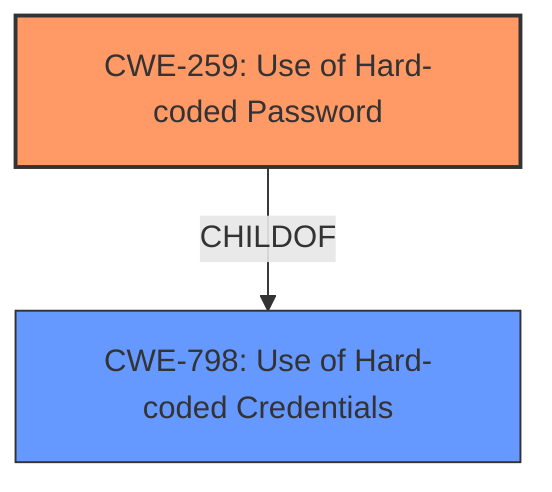

# Raw Analyzer Response for CVE-2022-36610

# Summary
| CWE ID | CWE Name | Confidence | CWE Abstraction Level | CWE Vulnerability Mapping Label | CWE-Vulnerability Mapping Notes |
|---|---|---|---|---|---|
| CWE-259 | Use of Hard-coded Password | 1.0 | Variant | Allowed | Primary CWE |

## Evidence and Confidence

*   **Confidence Score:** 1.0
*   **Evidence Strength:** HIGH

## Relationship Analysis
The primary relationship that influenced the decision was the ChildOf relationship between CWE-259 and CWE-798. CWE-259 is a Variant of CWE-798, which makes it a more specific and appropriate choice given the details of the vulnerability description.

## Vulnerability Chain
The vulnerability chain is straightforward: the root cause is the **hardcoded password** (CWE-259), which allows unauthorized access.

## Summary of Analysis
The initial analysis strongly points to CWE-259 as the most appropriate classification. The vulnerability description explicitly states the presence of a **hardcoded password**, which aligns perfectly with CWE-259's description: "The product contains a hard-coded password, which it uses for its own inbound authentication or for outbound communication to external components." The "Vulnerability Description Key Phrases" section also confirms this with the root cause identified as "**hardcoded password**".

The retriever results also list CWE-259 as the top candidate.

The relationship analysis further reinforces this choice. CWE-259 is a Variant of CWE-798 ("Use of Hard-coded Credentials"). Given that the vulnerability specifically involves a password, the more specific CWE-259 is preferred over the more general CWE-798.

The mapping guidance for CWE-259 states that it's at the Variant level of abstraction, which is a preferred level. The usage is "Allowed."

Based on the direct evidence from the vulnerability description, the retriever results, and the relationship analysis, CWE-259 is the most accurate and specific classification.

CWE-321 ("Use of Hard-coded Cryptographic Key") was considered but not used because the vulnerability description specifically mentions a password, not a cryptographic key. While both are credentials, CWE-259 is the more precise fit. CWE-798 ("Use of Hard-coded Credentials") was also considered, but since the vulnerability specifically involves a hardcoded password, CWE-259 is the more specific and appropriate choice.