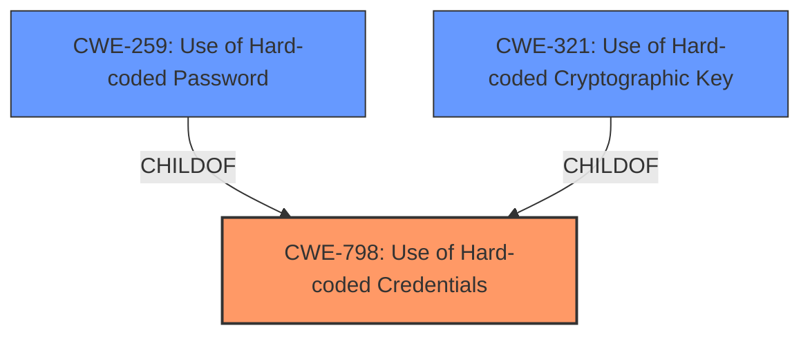

# Analysis Report for CVE-2022-36615

# Vulnerability Analysis Report: CVE-2022-36615

## Description


## Analysis (with Relationship Data)

# Summary
| CWE ID | CWE Name | Confidence | CWE Abstraction Level | CWE Vulnerability Mapping Label | CWE-Vulnerability Mapping Notes |
|---|---|---|---|---|---|
| CWE-798 | Use of Hard-coded Credentials | 1.0 | Base | Allowed | Primary CWE |
| CWE-259 | Use of Hard-coded Password | 0.8 | Variant | Allowed | Secondary Candidate |
| CWE-321 | Use of Hard-coded Cryptographic Key | 0.6 | Variant | Allowed | Secondary Candidate |

## Evidence and Confidence

*   **Confidence Score:** 0.9
*   **Evidence Strength:** HIGH

## Relationship Analysis
The primary CWE is CWE-798 **[CWE-798: Use of Hard-coded Credentials]**, which is a Base level CWE. CWE-259 **[CWE-259: Use of Hard-coded Password]** and CWE-321 **[CWE-321: Use of Hard-coded Cryptographic Key]** are variants (more specific) of CWE-798. If the **hardcoded credential** was known to be a cryptographic key, then CWE-321 would be the best choice. Since the finding is a **hardcoded password**, CWE-259 would be a better fit than CWE-798. However, since the vulnerability description says that the **hardcoded password** is for root, it is acting as a credential. Therefore, CWE-798 is the best fit.



## Vulnerability Chain
The chain of weaknesses is: **hardcoded password** (CWE-798) leading to potential unauthorized access.

## Summary of Analysis
The initial analysis correctly identified CWE-798 **[CWE-798: Use of Hard-coded Credentials]** as a strong candidate, given the prevalence of this CWE in similar CVE descriptions. The description states that a TOTOLINK A3000RU V4.1.2cu.5185_B20201128 was discovered to contain a **hardcoded password** for root at /etc/shadow.sample.

The retriever results also support CWE-798 **[CWE-798: Use of Hard-coded Credentials]**, CWE-259 **[CWE-259: Use of Hard-coded Password]**, and CWE-321 **[CWE-321: Use of Hard-coded Cryptographic Key]**.

CWE-798 **[CWE-798: Use of Hard-coded Credentials]** is at the Base level of abstraction, and the mapping guidance allows its use. The description of CWE-798 matches the vulnerability, since the product contains **hard-coded credentials**.

CWE-259 **[CWE-259: Use of Hard-coded Password]** is a Variant of CWE-798 **[CWE-798: Use of Hard-coded Credentials]**, specifically when the credential is a password. The vulnerability description states that there is a **hardcoded password**, making this a strong secondary candidate.

CWE-321 **[CWE-321: Use of Hard-coded Cryptographic Key]** is a Variant of CWE-798 **[CWE-798: Use of Hard-coded Credentials]**, specifically when the credential is a cryptographic key. Since the vulnerability description does not state that the **hardcoded password** is used as a cryptographic key, this CWE is less likely, but still possible.

Other CWEs Considered:

*   CWE-1393 **[CWE-1393: Use of Default Password]** - While related, this CWE focuses on the use of default passwords, not necessarily hard-coded ones. The vulnerability description specifically mentions a **hardcoded password**, making CWE-798 **[CWE-798: Use of Hard-coded Credentials]** a more accurate fit.

*   CWE-78 **[CWE-78: Improper Neutralization of Special Elements used in an OS Command ('OS Command Injection')]** - This CWE is related to OS command injection, which is not relevant to this vulnerability.

*   CWE-184 **[CWE-184: Incomplete List of Disallowed Inputs]** - This CWE is related to incomplete lists of disallowed inputs, which is not relevant to this vulnerability.


## CWE Relationship Analysis

Current CWEs represent these abstraction levels: .


### Vulnerability Chain Analysis

**Chain starting from CWE-321:**
- 321 (Use of Hard-coded Cryptographic Key) - ROOT


**Chain starting from CWE-184:**
- 184 (Incomplete List of Disallowed Inputs) - ROOT


### CWE Relationship Diagram

```mermaid
graph TD
    classDef primary fill:#f96,stroke:#333,stroke-width:2px
    classDef secondary fill:#69f,stroke:#333
    classDef tertiary fill:#9e9,stroke:#333
```


*Report generated on 2025-03-30 23:07:50*
