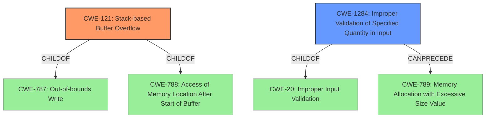

# Raw Analyzer Response for CVE-2022-36620

# Summary
| CWE ID  | CWE Name                                                                 | Confidence | CWE Abstraction Level | CWE Vulnerability Mapping Label | CWE-Vulnerability Mapping Notes |
| :-------- | :----------------------------------------------------------------------- | :--------- | :-------------------- | :------------------------------ | :------------------------------ |
| CWE-121   | Stack-based Buffer Overflow                                              | 1.0        | Variant               | Primary                         | Allowed                       |
| CWE-1284  | Improper Validation of Specified Quantity in Input                       | 0.7        | Base                  | Secondary                       | Allowed                       |

## Evidence and Confidence

*   **Confidence Score:** 0.85
*   **Evidence Strength:** HIGH

## Relationship Analysis
The primary CWE is CWE-121, a **Variant** of CWE-787 (ChildOf), and CWE-788 (ChildOf). The secondary CWE is CWE-1284 a **Base** CWE. CWE-1284 is a child of CWE-20 and it CanPrecede CWE-789 (Memory Allocation with Excessive Size Value). The **Variant** level of CWE-121 is a better fit than its parents.

## Vulnerability Chain
The vulnerability chain starts with **improper validation of the `netmask` parameter** (CWE-1284), leading to a **stack-based buffer overflow** (CWE-121) when the content is copied into a stack buffer without size checks. The lack of input validation enables the overflow, which can then lead to denial of service or potentially arbitrary code execution.

## Summary of Analysis
The primary weakness is a **stack-based buffer overflow** (CWE-121) in the `/goform/addRouting` endpoint, due to the `netmask` parameter being copied into a stack buffer without any size checks. The "CVE Reference Links Content Summary" clearly states: "A stack buffer overflow vulnerability exists in the `/goform/addRouting` endpoint. The `netmask` parameter's content is copied into a stack buffer without any size checks." This aligns directly with the definition of CWE-121. The "Vulnerability Description Key Phrases" also indicates a **stack overflow**.

The secondary weakness is the **improper validation of input** (CWE-1284), specifically the `netmask` parameter. The "CVE Reference Links Content Summary" mentions "Lack of input validation". This means the size of the `netmask` parameter isn't validated before being copied to the buffer.

CWE-190 (Integer Overflow or Wraparound) was considered due to its high retriever score, but it doesn't fit the vulnerability description as there is no indication of integer manipulation or calculation errors.

CWE-120 (Buffer Copy without Checking Size of Input ('Classic Buffer Overflow')) was also considered, but CWE-121 (Stack-based Buffer Overflow) is a more precise **Variant** that specifies the location of the buffer overflow (stack).

The selection of CWE-121 and CWE-1284 is based on the evidence provided in the vulnerability description and the CVE reference summary, which clearly indicates a **stack-based buffer overflow** due to **missing input validation**. These CWEs are at the appropriate level of specificity (Variant and Base, respectively) and accurately represent the root cause of the vulnerability.

Relevant CWE Information:

# Enhanced Context (25 CWEs)
The following CWEs were identified as potentially relevant to this vulnerability:

## CWE-798: Use of Hard-coded Credentials
**Abstraction Level**: Base
**Similarity Score**: 0.76
**Source**: dense

**Description**:
The product contains hard-coded credentials, such as a password or cryptographic key.

**Mapping Guidance**:
- Usage: Allowed
- Rationale: This CWE entry is at the Base level of abstraction, which is a preferred level of abstraction for mapping to the root causes of vulnerabilities.

## CWE-1391: Use of Weak Credentials
**Abstraction Level**: Class
**Similarity Score**: 0.75
**Source**: dense

**Description**:
The product uses weak credentials (such as a default key or hard-coded password) that can be calculated, derived, reused, or guessed by an attacker.

**Mapping Guidance**:
- Usage: Allowed-with-Review
- Rationale: This CWE entry is a Class and might have Base-level children that would be more appropriate

## CWE-74: Improper Neutralization of Special Elements in Output Used by a Downstream Component ('Injection')
**Abstraction Level**: Class
**Similarity Score**: 0.75
**Source**: dense

**Description**:
The product constructs all or part of a command, data structure, or record using externally-influenced input from an upstream component, but it does not neutralize or incorrectly neutralizes special elements that could modify how it is parsed or interpreted when it is sent to a downstream component.

**Mapping Guidance**:
- Usage: Discouraged
- Rationale: CWE-74 is high-level and often misused when lower-level weaknesses are more appropriate.

## CWE-41: Improper Resolution of Path Equivalence
**Abstraction Level**: Base
**Similarity Score**: 0.74
**Source**: dense

**Description**:
The product is vulnerable to file system contents disclosure through path equivalence. Path equivalence involves the use of special characters in file and directory names. The associated manipulations are intended to generate multiple names for the same object.

**Mapping Guidance**:
- Usage: Allowed
- Rationale: This CWE entry is at the Base level of abstraction, which is a preferred level of abstraction for mapping to the root causes of vulnerabilities.

## CWE-119: Improper Restriction of Operations within the Bounds of a Memory Buffer
**Abstraction Level**: Class
**Similarity Score**: 0.74
**Source**: dense

**Description**:
The product performs operations on a memory buffer, but it reads from or writes to a memory location outside the buffer's intended boundary. This may result in read or write operations on unexpected memory locations that could be linked to other variables, data structures, or internal program data.

**Mapping Guidance**:
- Usage: Discouraged
- Rationale: CWE-119 is commonly misused in low-information vulnerability reports when lower-level CWEs could be used instead, or when more details about the vulnerability are available.

## CWE-653: Improper Isolation or Compartmentalization
**Abstraction Level**: Class
**Similarity Score**: 0.74
**Source**: dense

**Description**:
The product does not properly compartmentalize or isolate functionality, processes, or resources that require different privilege levels, rights, or permissions.

**Mapping Guidance**:
- Usage: Allowed
- Rationale: This CWE entry is at the Base level of abstraction, which is a preferred level of abstraction for mapping to the root causes of vulnerabilities.

## CWE-134: Use of Externally-Controlled Format String
**Abstraction Level**: Base
**Similarity Score**: 0.74
**Source**: dense

**Description**:
The product uses a function that accepts a format string as an argument, but the format string originates from an external source.

**Mapping Guidance**:
- Usage: Allowed
- Rationale: This CWE entry is at the Base level of abstraction, which is a preferred level of abstraction for mapping to the root causes of vulnerabilities.

## CWE-131: Incorrect Calculation of Buffer Size
**Abstraction Level**: Base
**Similarity Score**: 0.74
**Source**: dense

**Description**:
The product does not correctly calculate the size to be used when allocating a buffer, which could lead to a buffer overflow.

**Mapping Guidance**:
- Usage: Allowed
- Rationale: This CWE entry is at the Base level of abstraction, which is a preferred level of abstraction for mapping to the root causes of vulnerabilities.

## CWE-754: Improper Check for Unusual or Exceptional Conditions
**Abstraction Level**: Class
**Similarity Score**: 0.73
**Source**: dense

**Description**:
The product