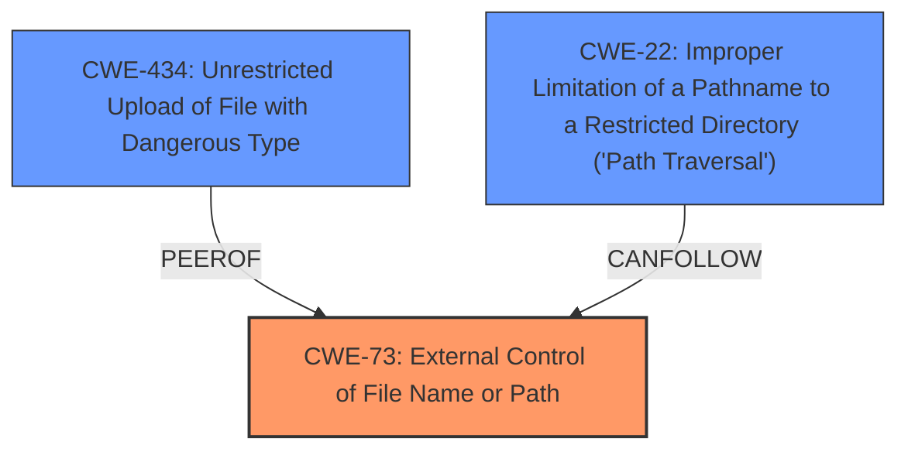

# Analysis for CVE-2022-36687

# Summary
| CWE ID | CWE Name | Confidence | CWE Abstraction Level | CWE Vulnerability Mapping Label | CWE-Vulnerability Mapping Notes |
|---|---|---|---|---|---|
| CWE-73 | External Control of File Name or Path | 0.9 | Base | Allowed | Primary CWE |
| CWE-434 | Unrestricted Upload of File with Dangerous Type | 0.7 | Base | Allowed | Secondary Candidate |
| CWE-22 | Improper Limitation of a Pathname to a Restricted Directory ('Path Traversal') | 0.6 | Base | Allowed | Secondary Candidate |

## Evidence and Confidence

*   **Confidence Score:** 0.9
*   **Evidence Strength:** HIGH

## Relationship Analysis
The primary CWE is CWE-73, which captures the core issue of external control over file paths. CWE-434 and CWE-22 are related but less directly applicable. CWE-434 is typically associated with file uploads, which is not the primary attack vector here, although dangerous file deletion could be considered an unrestricted action. CWE-22 describes path traversal, which is a specific technique that could be used to exploit CWE-73, but the vulnerability described does not require path traversal.

## Vulnerability Chain
The chain of events is as follows:
1.  The application **fails to validate** user-supplied input for a file path (CWE-73).
2.  This allows an attacker to specify an arbitrary file.
3.  The application then **deletes** the file at the specified path.

The root cause is CWE-73 (External Control of File Name or Path), as the application trusts the user-supplied file path without proper validation. The impact is arbitrary file deletion, which can lead to data loss or denial of service.

## Summary of Analysis
The initial analysis focused on the **arbitrary file deletion** vulnerability described in the "Vulnerability Description." The "CVE Reference Links Content Summary" provides evidence that the **root cause** is the lack of input validation on the `path` parameter, allowing an attacker to specify any file for deletion.

The primary CWE selection is CWE-73 (External Control of File Name or Path). This CWE directly addresses the **root cause**, where the application **fails to properly validate** a user-supplied file path before using it in a file deletion operation. The evidence for this is the description of the `delete_img` function, which "allows an attacker to specify an arbitrary file path, which the function will then delete, **without proper validation** or sanitization of the input."

Other CWEs were considered but deemed less appropriate:
*   CWE-434 (Unrestricted Upload of File with Dangerous Type): While the vulnerability involves deleting a file, it's not directly related to file upload functionality. The core issue is the lack of validation on the file path, not the type of file being uploaded.
*   CWE-22 (Improper Limitation of a Pathname to a Restricted Directory ('Path Traversal')): Path traversal is a technique that could be used to exploit the vulnerability, but it's not the fundamental weakness. The application is vulnerable even if the attacker specifies an absolute path to a file within the intended directory.
*   CWE-78 (Improper Neutralization of Special Elements used in an OS Command ('OS Command Injection')): This is not OS command injection since it is deleting a file.

The selected CWEs are at the optimal level of specificity because they directly address the **root cause** of the vulnerability (CWE-73) and potential methods of exploitation (CWE-22).