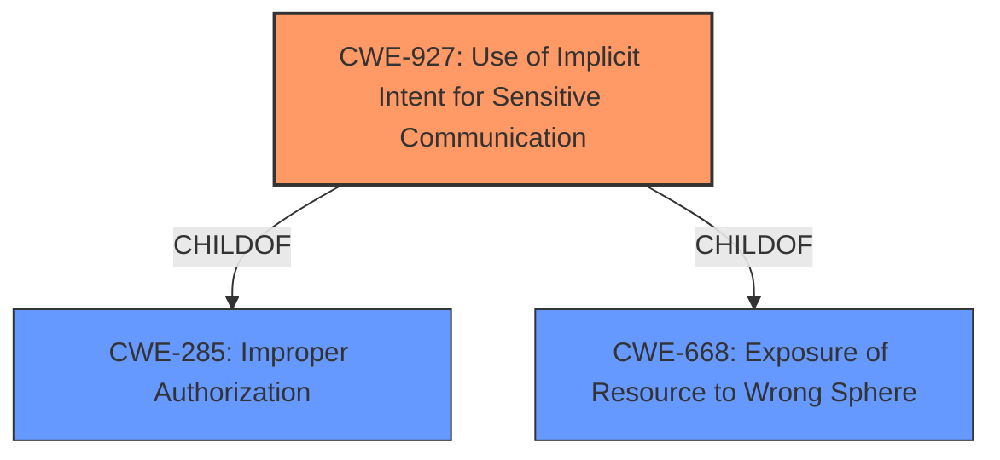

# Enhanced Analysis for CVE-2022-36830

# Summary
| CWE ID | CWE Name | Confidence | CWE Abstraction Level | CWE Vulnerability Mapping Label | CWE-Vulnerability Mapping Notes |
|---|---|---|---|---|---|
| CWE-927 | Use of Implicit Intent for Sensitive Communication | 0.9 | Variant | Allowed | Primary CWE |
| CWE-285 | Improper Authorization | 0.6 | Class | Discouraged | Secondary CWE |

## Evidence and Confidence

*   **Confidence Score:** 0.75
*   **Evidence Strength:** MEDIUM

## Relationship Analysis
The primary CWE, CWE-927, is a variant of CWE-285 and CWE-668. The relationship shows that CWE-927 is a more specific case of improper authorization when using implicit intents. Selecting CWE-927 provides a more precise classification of the vulnerability than using the broader CWE-285.



## Vulnerability Chain
The vulnerability chain starts with the use of an implicit intent in the `cancelAlarmManager`, leading to **PendingIntent hijacking**, which results in unauthorized access to files.

## Summary of Analysis
The initial analysis identified CWE-927 as the primary candidate due to the use of implicit intents. The vulnerability description explicitly mentions "implicit intent" as the vector, which aligns perfectly with CWE-927. The "CVE Reference Links Content Summary" provides supporting evidence by highlighting the root cause as an "improper access control, leading to sensitive information exposure". While CWE-285 is a parent, CWE-927 offers a more specific characterization of the weakness related to implicit intents. Therefore, the final selection focuses on CWE-927 as the primary CWE, supplemented by CWE-285 to capture the broader access control issue. The selection is based on the provided evidence and aligns with the recommended level of specificity.

Relevant CWE Information:

# Enhanced Context (25 CWEs)

## CWE-280: Improper Handling of Insufficient Permissions or Privileges
CWE-280 was not selected because the vulnerability involves improper use of implicit intents rather than direct permission issues.

## CWE-1220: Insufficient Granularity of Access Control
CWE-1220 was not selected because the description doesn't specifically point to granularity issues but more broadly to the incorrect usage of implicit intents.

## CWE-345: Insufficient Verification of Data Authenticity
CWE-345 was not selected because the vulnerability doesn't emphasize data authenticity as the core issue, but rather the improper use of intents and subsequent file access.

## CWE-274: Improper Handling of Insufficient Privileges
CWE-274 was not selected because the description doesn't focus on privilege handling but rather on hijacking and unauthorized access.

## CWE-807: Reliance on Untrusted Inputs in a Security Decision
CWE-807 was not selected because the core of the vulnerability is not about relying on untrusted inputs for security decisions, but rather about the improper use of intents.

## CWE-941: Incorrectly Specified Destination in a Communication Channel
CWE-941 was not selected because the vulnerability is not about specifying an incorrect destination but about the inherent risks of implicit intents.

## CWE-668: Exposure of Resource to Wrong Sphere
CWE-668 was not selected as primary because, although related, CWE-927 gives more context to the vulnerability.

## CWE-639: Authorization Bypass Through User-Controlled Key
CWE-639 was not selected because the description doesn't involve user-controlled keys, but rather the general authorization bypass through intent hijacking.

## CWE-799: Improper Control of Interaction Frequency
CWE-799 was not selected because the vulnerability doesn't focus on interaction frequency but rather on unauthorized access via intent hijacking.

## CWE-754: Improper Check for Unusual or Exceptional Conditions
CWE-754 was not selected because the description doesn't emphasize checking for unusual conditions, but rather the general authorization bypass.

## CWE-427: Uncontrolled Search Path Element
CWE-427 was not selected because the vulnerability description does not refer to search path issues.

## CWE-927: Use of Implicit Intent for Sensitive Communication
CWE-927 was selected as the primary CWE because the vulnerability description explicitly mentions "implicit intent" and the dangers associated with it. The CWE's description aligns perfectly with the vulnerability, focusing on the risks of using implicit intents for sensitive data transmission.

## CWE-863: Incorrect Authorization
CWE-863 was not selected because the description does not have any information on incorrect authoriation being the cause.

## CWE-285: Improper Authorization
CWE-285 was selected as a secondary CWE because the exploitation of the implicit intent leads to unauthorized access to files, which is a manifestation of a broader authorization issue.

## CWE-639: Authorization Bypass Through User-Controlled Key
CWE-639 was not selected because the description doesn't mention any keys.

## CWE-386: Symbolic Name not Mapping to Correct Object
CWE-386 was not selected because the description does not refer to mapping issues.

## CWE-426: Untrusted Search Path
CWE-426 was not selected because the description does not refer to search path issues.

## CWE-427: Uncontrolled Search Path Element
CWE-427 was not selected because the description does not refer to search path issues.

## CWE-367: Time-of-check Time-of-use (TOCTOU) Race Condition
CWE-367 was not selected because the vulnerability description does not refer to race conditions.

## CWE-98: Improper Control of Filename for Include/Require Statement in PHP Program ('PHP Remote File Inclusion')
CWE-98 was not selected because the vulnerability description does not refer to PHP programs.

## CWE-94: Improper Control of Generation of Code ('Code Injection')
CWE-94 was not selected because the vulnerability description does not refer to code injection.

## CWE-322: Key Exchange without Entity Authentication
CWE-322 was not selected because the vulnerability description does not refer to key exchange.

## CWE-942: Permissive Cross-domain Policy with Untrusted Domains
CWE-942 was not selected because the vulnerability description does not refer to cross-domain policies.

## CWE-350: Reliance on Reverse DNS Resolution for a Security-Critical Action
CWE-350 was not selected because the vulnerability description does not refer to DNS resolution.

## CWE-486: Comparison of Classes by Name
CWE-486 was not selected because the vulnerability description does not refer to comparison of classes.


## CWE Relationship Analysis

Current CWEs represent these abstraction levels: .


### Vulnerability Chain Analysis

**Chain starting from CWE-942:**
- 942 (Permissive Cross-domain Policy with Untrusted Domains) - ROOT


**Chain starting from CWE-807:**
- 807 (Reliance on Untrusted Inputs in a Security Decision) - ROOT


### CWE Relationship Diagram

```mermaid
graph TD
    classDef primary fill:#f96,stroke:#333,stroke-width:2px
    classDef secondary fill:#69f,stroke:#333
    classDef tertiary fill:#9e9,stroke:#333
```