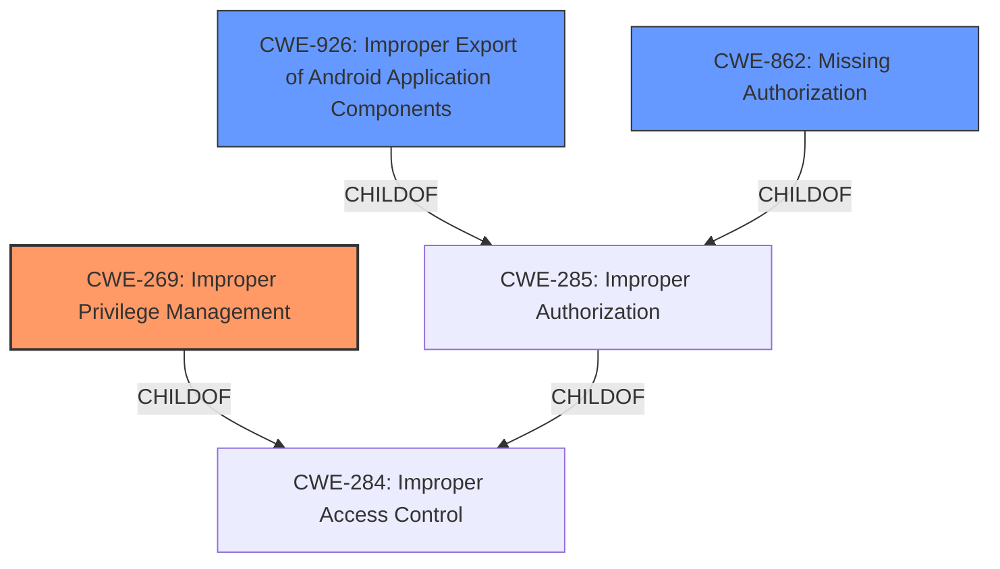

# Enhanced Analysis for CVE-2022-36833

# Summary
| CWE ID    | CWE Name                                             | Confidence | CWE Abstraction Level | CWE Vulnerability Mapping Label | CWE-Vulnerability Mapping Notes |
| :-------- | :--------------------------------------------------- | :--------- | :-------------------- | :------------------------------ | :------------------------------ |
| CWE-269   | Improper Privilege Management                        | 0.85       | Class                 | Primary                         | Discouraged                    |
| CWE-926   | Improper Export of Android Application Components    | 0.70       | Variant               | Secondary                       | Allowed                        |
| CWE-862   | Missing Authorization                              | 0.60       | Class                 | Secondary                       | Allowed-with-Review           |

## Evidence and Confidence

*   **Confidence Score:** 0.75
*   **Evidence Strength:** HIGH

## Relationship Analysis
The primary relationship influencing the CWE selection is the hierarchical structure, specifically the parent-child relationship between CWE-284 (Improper Access Control) and its children, CWE-269 (Improper Privilege Management), CWE-862 (Missing Authorization), and CWE-926 (Improper Export of Android Application Components).

CWE-269 is a class-level CWE that directly reflects the **Improper Privilege Management** **rootcause** mentioned in the vulnerability description.

CWE-862 and CWE-926 were considered as secondary CWEs that can further characterize the vulnerability, and both are children of the parent class CWE-285 (Improper Authorization).



## Vulnerability Chain
The vulnerability chain starts with the **Improper Privilege Management** (**ROOTCAUSE**), which allows a local attacker to execute hidden developer functions by changing the package name (**WEAKNESS**). The chain can be described as follows:

1.  **Root Cause:** **Improper Privilege Management** (CWE-269) - The application does not properly manage privileges.
2.  **Weakness:** The game optimizing service does not properly validate the package name.
3.  **Impact:** Execution of hidden function for developer by changing package name

## Summary of Analysis
The initial assessment focused on identifying the **rootcause** of the vulnerability. The vulnerability description explicitly mentions **"Improper Privilege Management,"** which strongly suggests CWE-269. The CVE Reference Links Content Summary section further reinforces this by stating that the **root cause of the vulnerability** is **Improper Privilege Management**.

The graph relationships, particularly the child-of relationships under CWE-284 (Improper Access Control), helped refine the selection. While CWE-284 is a high-level pillar, its children, such as CWE-269, CWE-862, and CWE-926, offer more specific classifications.

The final decision was to prioritize CWE-269 as the primary CWE due to its direct match with the **rootcause** mentioned in the vulnerability description. CWE-926 was selected because the attacker was able to execute hidden functions by "changing package name". CWE-862 was considered as a secondary CWE since the application is missing an authorization check.

The selected CWEs are at an appropriate level of specificity. CWE-269 is a class-level CWE, which provides a general description of the privilege management issue. CWE-926 is a variant-level CWE, offering a more specific description of the **weakness** related to Android application components.

Relevant CWE Information:

# Enhanced Context (25 CWEs)
The following CWEs were identified as potentially relevant to this vulnerability:

## CWE-404: Improper Resource Shutdown or Release
**Abstraction Level**: Class
**Similarity Score**: 0.76
**Source**: dense

**Description**:
The product does not release or incorrectly releases a resource before it is made available for re-use.

**Mapping Guidance**:
- Usage: Allowed-with-Review
- Rationale: This CWE entry is a Class and might have Base-level children that would be more appropriate

*This CWE was not selected since the vulnerability is not about failing to release a resource.*

## CWE-664: Improper Control of a Resource Through its Lifetime
**Abstraction Level**: Pillar
**Similarity Score**: 0.76
**Source**: dense

**Description**:
The product does not maintain or incorrectly maintains control over a resource throughout its lifetime of creation, use, and release.

**Mapping Guidance**:
- Usage: Discouraged
- Rationale: This CWE entry is high-level when lower-level children are available.

*This CWE was not selected since the vulnerability is not about failing to maintain control of a resource.*

## CWE-405: Asymmetric Resource Consumption (Amplification)
**Abstraction Level**: Class
**Similarity Score**: 0.76
**Source**: dense

**Description**:
The product does not properly control situations in which an adversary can cause the product to consume or produce excessive resources without requiring the adversary to invest equivalent work or otherwise prove authorization, i.e., the adversary's influence is "asymmetric."

**Mapping Guidance**:
- Usage: Allowed-with-Review
- Rationale: This CWE entry is a Class and might have Base-level children that would be more appropriate

*This CWE was not selected since the vulnerability is not about asymmetric resource consumption.*

## CWE-668: Exposure of Resource to Wrong Sphere
**Abstraction Level**: Class
**Similarity Score**: 0.75
**Source**: dense

**Description**:
The product exposes a resource to the wrong control sphere, providing unintended actors with inappropriate access to the resource.

**Mapping Guidance**:
- Usage: Discouraged
- Rationale: CWE-668 is high-level and is often misused as a catch-all when lower-level CWE IDs might be applicable. It is sometimes used for low-information vulnerability reports [REF-1287]. It is a level-1 Class (i.e., a child of a Pillar). It is not useful for trend analysis.

*This CWE was not selected since the vulnerability is better characterized by other, more specific CWEs.*

## CWE-1220: Insufficient Granularity of Access Control
**Abstraction Level**: Base
**Similarity Score**: 0.74
**Source**: dense

**Description**:
The product implements access controls via a policy or other feature with the intention to disable or restrict accesses (reads and/or writes) to assets in a system from untrusted agents. However, implemented access controls lack required granularity, which renders the control policy too broad because it allows accesses from unauthorized agents to the security-sensitive assets.

**Mapping Guidance**:
- Usage: Allowed
- Rationale: This CWE entry is at the Base level of abstraction, which is a preferred level of abstraction for mapping to the root causes of vulnerabilities.

*This CWE was not selected since the **rootcause** is **Improper Privilege Management**, which is a different access control issue.

## CWE-274: Improper Handling of Insufficient Privileges
**Abstraction Level**: Base
**Similarity Score**: 0.74
**Source**: dense

**Description**:
The product does not handle or incorrectly handles when it has insufficient privileges to perform an operation, leading to resultant weaknesses.

**Mapping Guidance**:
- Usage: Discouraged
- Rationale: This CWE entry could be deprecated in a future version of CWE.

*This CWE was not selected since the **rootcause** is **Improper Privilege Management**, which is a different access control issue.

## CWE-667: Improper Locking
**Abstraction Level**: Class
**Similarity Score**: 0.74
**Source**: dense

**Description**:
The product does not properly acquire or release a lock on a resource, leading to unexpected resource state changes and behaviors.

**Mapping Guidance**:
- Usage: Allowed-with-Review
- Rationale: This CWE entry is a Class and might have Base-level children that would be more appropriate

*This CWE was not selected since the vulnerability is not about improper locking.*

## CWE-653: Improper Isolation or Compartmentalization
**Abstraction Level**: Class
**Similarity Score**: 0.74
**Source**: dense

**Description**:
The product does not properly compartmentalize or isolate functionality, processes, or resources that require different privilege levels, rights, or permissions.

**


## CWE Relationship Analysis

Current CWEs represent these abstraction levels: .


### Vulnerability Chain Analysis

**Chain starting from CWE-862:**
- 862 (Missing Authorization) - ROOT


**Chain starting from CWE-405:**
- 405 (Asymmetric Resource Consumption (Amplification)) - ROOT


### CWE Relationship Diagram

```mermaid
graph TD
    classDef primary fill:#f96,stroke:#333,stroke-width:2px
    classDef secondary fill:#69f,stroke:#333
    classDef tertiary fill:#9e9,stroke:#333
```